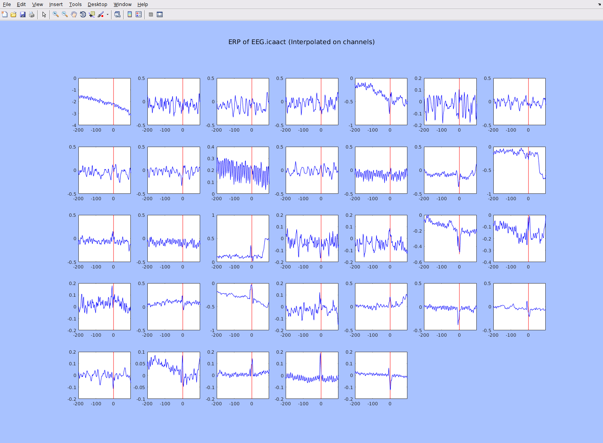

To view the plugin source code, please visit the plugin's [GitHub repository](https://github.com/sccn/ARfitStudio).

What is ARfitStudio?
-------------------

First of all, ARfit is a collection of Matlab modules developed by Tapio
Schneider and Arnold Neumaier for estimating parameters of multivariate
autoregressive (AR) models, diagnostic checking of fitted AR models, and
analyzing eigenmodes of fitted AR models. This plugin, ARfitStudio, uses
it so that one can interactively clean TMS-induced short-burst (5-10 ms)
artifacts and so on. The nature of the artifact does not matter (could
be spikes by artifact, could be zeros, NaNs, etc), as long as the
artifact duration is short and they are correctly marked. It has
strength on the following points.

-   To perform quick (e.g. smart epoching & integration to continuous
    data using mcolon(); before and after correction comparison with one
    click, etc) and intuitive (e.g. training, correction, and blending
    windows overlaid on grand-median ERPs) correction of spiky
    artifacts.
-   Immediately usable after importing the continuous data; it is the
    very first stage of the preprocess pipeline.

This plugin is dependent on ARfit and mcolon. ARfit can be installed by
installing SIFT from EEGLAB plugin manager. To use mcolon(), users
should compile the mex file.

<http://www.mathworks.com/matlabcentral/fileexchange/174-arfit>
<http://www.mathworks.com/matlabcentral/fileexchange/29854-multiple-colon/content/mcolonFolder/mcolon.m>

Why ARfitStudio?
---------------

If there are spike artifacts with high amplitude, we cannot filter the
data (because spikes spread in the time domain). In certain situation,
it is more important to make them harmless for the sake of data process,
rather than recovering the underlying signals (the latter is often
impossible). This plugin provides a solution for it.

How it works
------------

It learns autoregressive model from the training period (green), which
is the past of the spike, to make a prediction to replace problematic
spike data points (red). For smooth connection, one can also set
optional blending period (light magenta) during which predicted signal
and original signals are gradually mixed with a linear slope. Thus,
*this plugin replaces the bad data points using the past information*
(therefore temporal interpolation). It does NOT recover the signal under
the noise. One can select multiple markers for correction. In the main
plot, grand-median ERPs for all the channels are shown. To save the
result, just save the EEG dataset (do not check 'restore the last data'
for this!)

Screenshots
-----------

Data by courtesy of Michael Borich

If you want to use ICA for the final analysis
---------------------------------------------

Because this ARfit-based interpolation is performed for the same time
points across channels, ICA cannot decompose this period. As a result,
you'll see strange spikes in IC activations (i.e., EEG.icaact) during
the correction windows. In the plots below, I show 1) ERP of IC
activation for 33ch with ARfitStudio applied on channels (left), 2) the
same but ARfitStudio applied on ICs (right). The noise was originally
present within -/+10 ms relative to latency zero.

Performing ARfit-interpolation for ICA properly is complicated.

1.  Import data.
2.  Perform ARfitStudio on channels.
3.  Preprocess the data (high-pass filter, CleanLine plugin,
    clean_rawdata plugin, average referencing, AMICA plugin, DIPFIT
    plugin, fitTwoDipoles plugin). Note that you need to exclude the
    interpolated data from ICA process (those have no multivariate
    property across channels, so not decomposable).
4.  Perform ARfitStudio on IC activations.
5.  Backproject interpolated IC activation to reconstruct channel data.

Note that the ARfitStudio is used twice, and the first application is
purposed only for various filters, not even for ICA. In this way, you
can obtain both clean channel signals and IC activations. For detail,
see 'batchDemoForICA.m' included in the download package. I recommend
you take a look because there are several cumbersome steps you have to
go through.

Note for batch users (03/11/2019 updated)
-----------------------------------------

If one wants to run the process as a batch,

1.  Use EEGLAB function pop_epoch() to crop out peri-event data points.
    Note all the negative latencies will be used as a learning period
    for ARfit.
2.  Use arfit2interpolate(). Note that the last input
    'last_n_pointsToBlend' does NOT specify the additional length to
    the data points to the main interpolation window (as the GUI
    operation indicates), but it actually specifies the last data points
    of the main interpolation window. For example, outputData =
    arfit2interpolate(EEG.data, \[80 95\], 5) means, \[80:90\] for 100%
    interpolation, and \[91:95\] is blended with \[83% 67% 50% 33% 17%\]
    interpolated data blended with \[17% 33% 50% 67% 83%\] of the
    original data, respectively.
3.  Use putBackEpoch2Continuous() to re-construct the corrected, epoched
    data to the continuous data.

Reference
---------

A. Neumaier and T. Schneider, 2001: Estimation of parameters and
eigenmodes of multivariate autoregressive models. ACM Trans. Math.
Softw., 27, 27-57.

T. Schneider and A. Neumaier, 2001: Algorithm 808: ARfit – A Matlab
package for the estimation of parameters and eigenmodes of multivariate
autoregressive models. ACM Trans. Math. Softw., 27, 58-65.

Authors: Makoto Miyakoshi and Tim Mullen. SCCN, INC, UCSD
