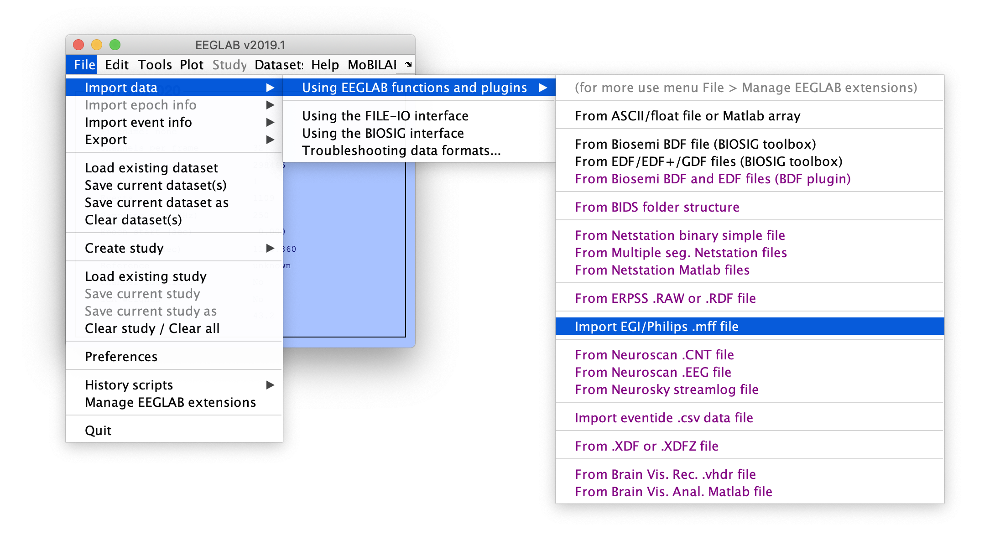
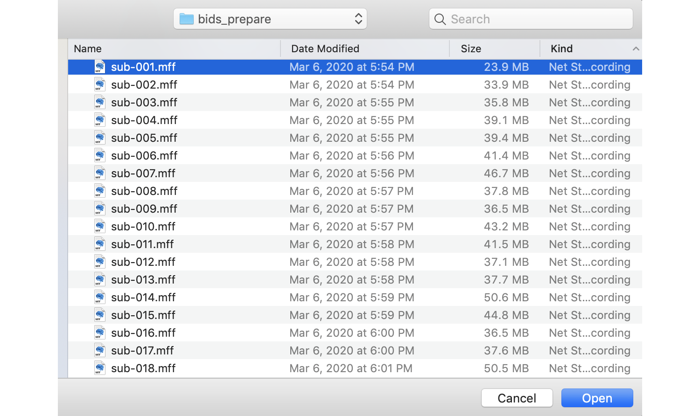

Select EEGLAB menu item **File > Import data > Using EEGLAB functions and plugins > From EGI/Phillips .mff file** as shown below.

If the MFFmatlabio plugin has not be installed, EEGLAB will prompt you to install it (see also [plugin installation](Plugin-installation)). After this, MFFmatlabio will prompt an interface to select an MFF ressource as shown below.

