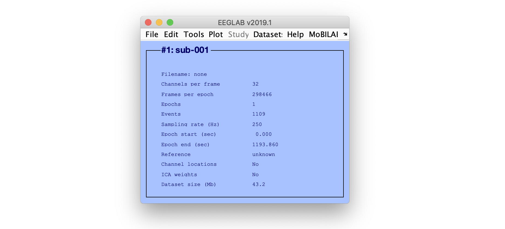

Select EEGLAB menu item **File > Import data > Using EEGLAB functions and plugins > From EGI/Phillips .mff file** as shown below.

If the MFFmatlabio plugin has not be installed, EEGLAB will prompt you to install it (see also [plugin installation](Plugin-installation)). After this, MFFmatlabio will prompt an interface to select an MFF ressource as shown below.

Select a file and press **Open**. The import function will then prompt you about which MFF field or key should be mapped to EEGLAB data type. The selection will depend on your experiment and how you are collecting information during raw data collection. The field MFF event **Code** usually contains relevant information that may be used for EEGLAB type. Note that a combination of fields or keys may be selected. If you select more than one field, the import function will concatenate the field for each event.

Once you press OK, the import function will import the data and show the result in the main EEGLAB graphic interface.

You may then use EEGLAB as you would with any other dataset. Refer to the [EEGLAB tutorial](https://sccn.ucsd.edu/wiki/EEGLAB_Wiki) for more information.

