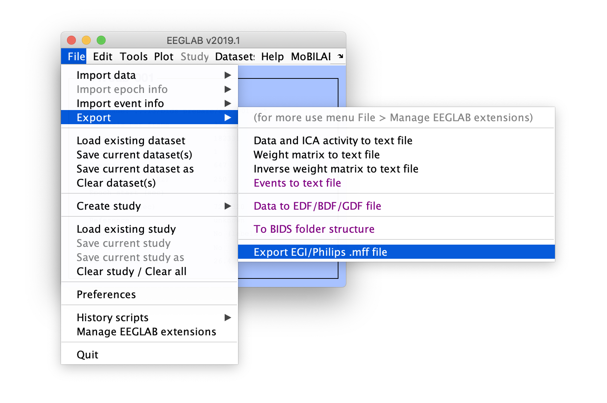
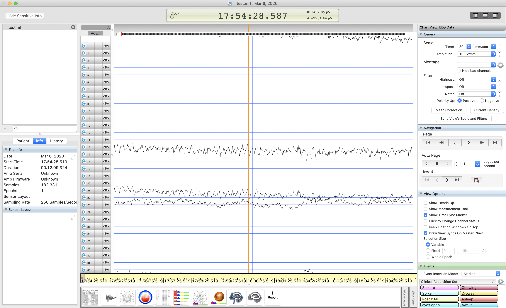

Note that this section assumes that you have an EEGLAB dataset loaded in EEGLAB.

To export data files to MFF format, use menu item **File > Export data > Export Phillips/EGI .mff file**.

Then enter a file name to export.

Once the file has been exported, it can imported using Netstation as shown below.

