In this tutorial, we will see how to export a collection of .mff files to BIDS.

First the [bids-matlab-tools](https://github.com/sccn/bids-matlab-tools) plugin of EEGLAB must be installed. This can be done from the EEGLAB plugin manager (EEGLAB menu item "File > Manage EEGLAB extensions"). 

Once the plugin has been installed, an EEGLAB study must be created. We will be using [this collection](xxxxx) of 20 MFF files (the final BIDS exported version that contain all documentation about this experiment is available on [Openneuro](xxxx)).

After downloading the files above (the version of the files before conversion to BIDS, we need to import them in EEGLAB and create a STUDY).

Use EEGLAB menu item **File > Import data > Using EEGLAB functions and plugins > From EGI/Phillips .mff file**. Select a collection of files as shown below. Note that selecting a collection of file is only possible when they are in the same folder.

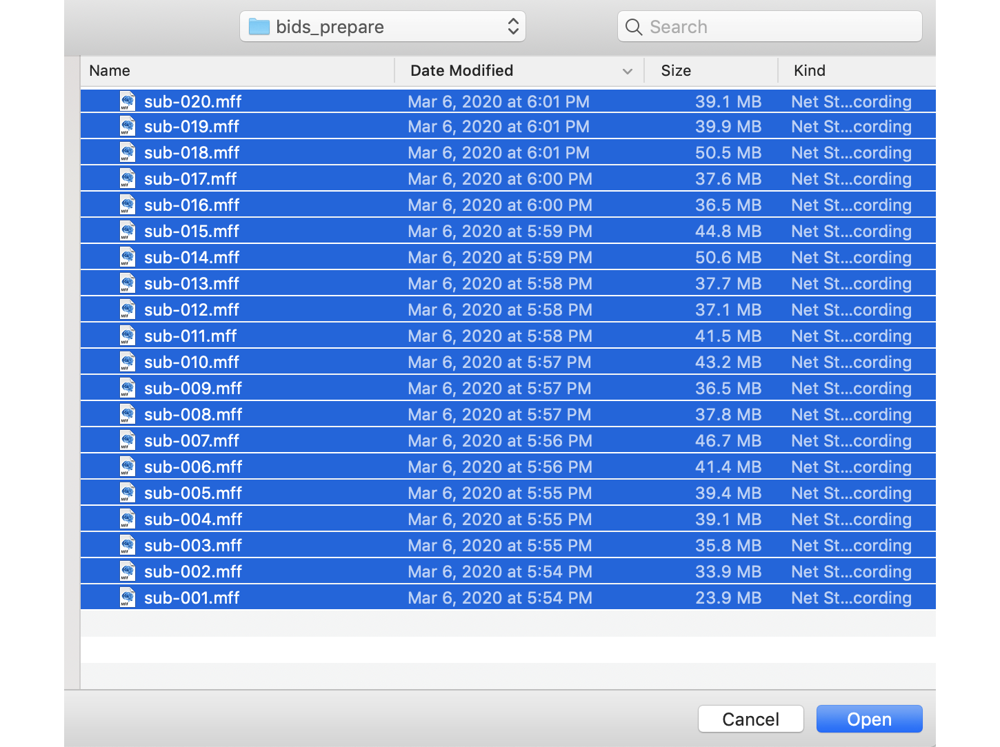

Because more than one file is being selected, the import function will then ask you if you want to automatically save datasets. Answer "Yes" to that question, otherwise you will not be able to create a valid EEGLAB STUDY using these datasets.

A second shown below pops up to ask how to map the MFF fields to the EEGLAB type field. See also [plugin import](2.-Import-MFF-in-EEGLAB) for more information.

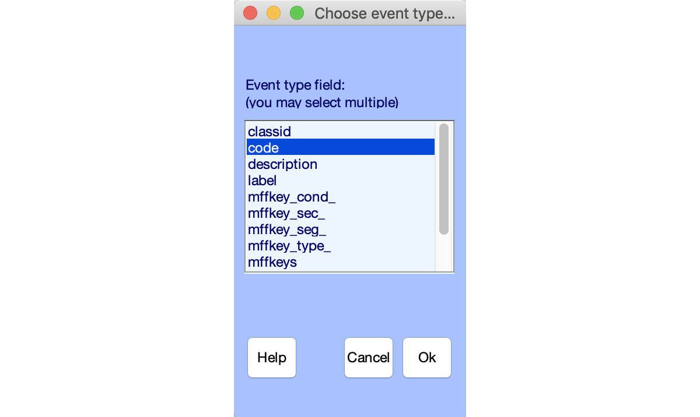

Then the EEGLAB main interface shows the first dataset imported as shown below.

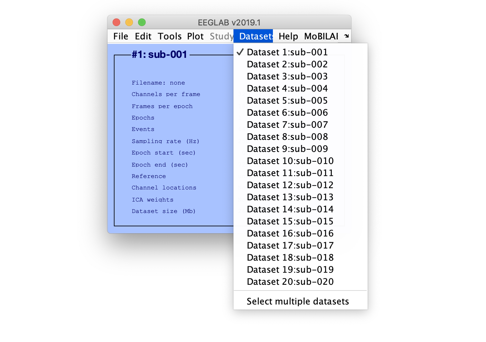

The second step is to create a STUDY using all imported datasets. For this, select EEGLAB menu item **File > Create STUDY > Using all loaded datasets** as shown below.

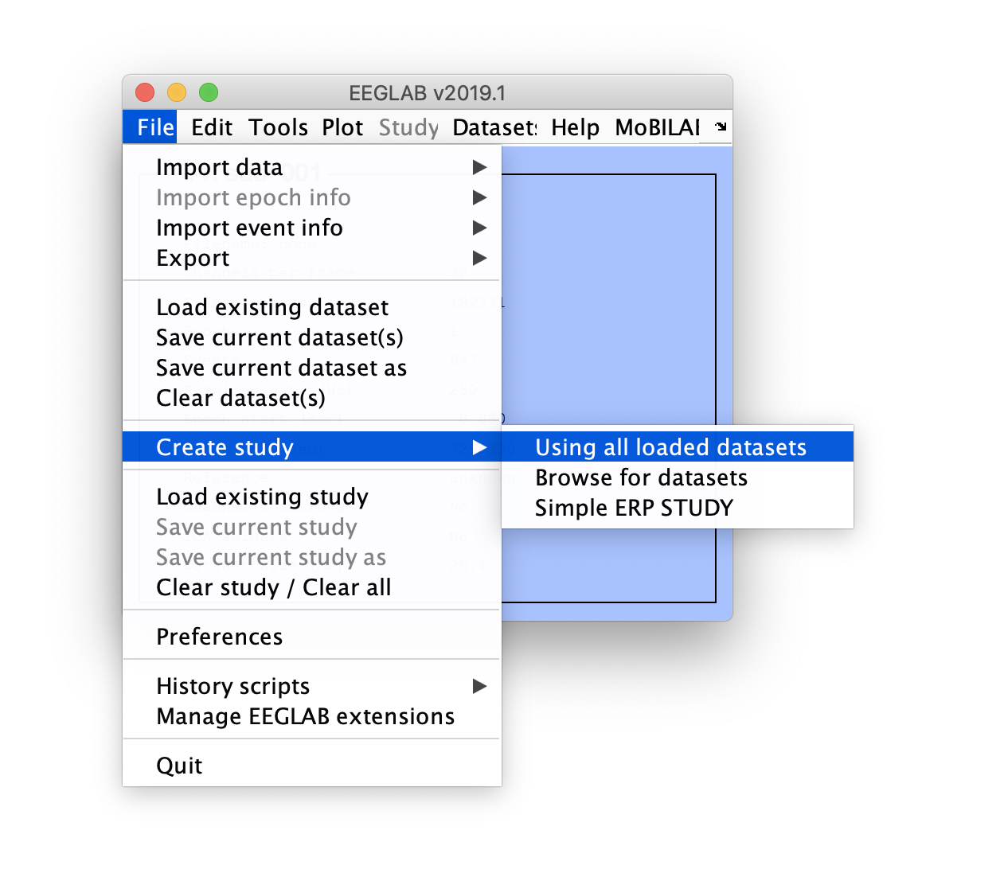

If you have not set up memory options to retain at most one dataset in memory, the following warning message may appear. Simply press OK.

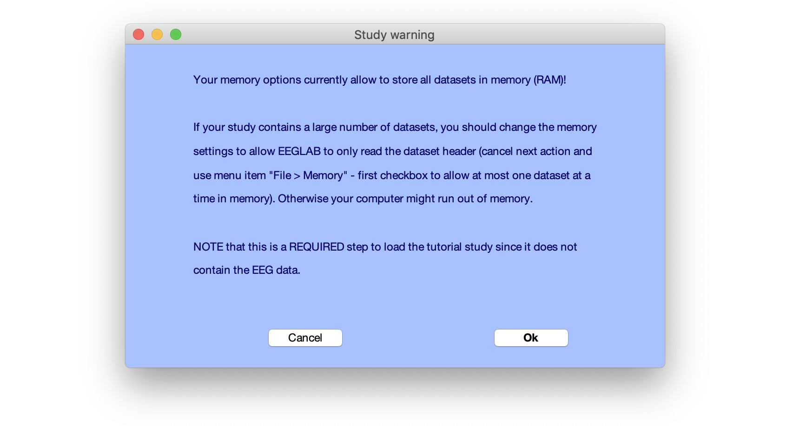

The following interface will pop up. In this interface, you must enter an ID for each participant if it is not already present (if you fail to enter an ID for each participant, the STUDY interface will ask you to do so). When you are done, press **OK**. Note that if your datasets are missing channel labels, EEGLAB may ask you if you automatically want to create channel labels (answer yes to that question).

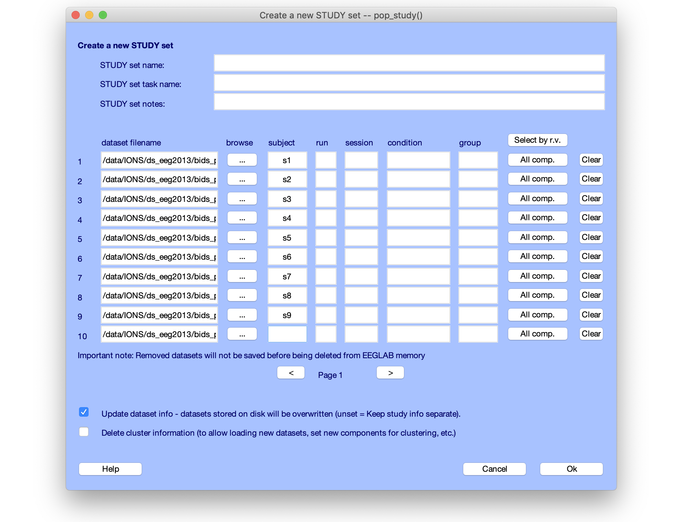

Once the EEGLAB STUDY has been created, the EEGLAB interface will be updated as shown below.

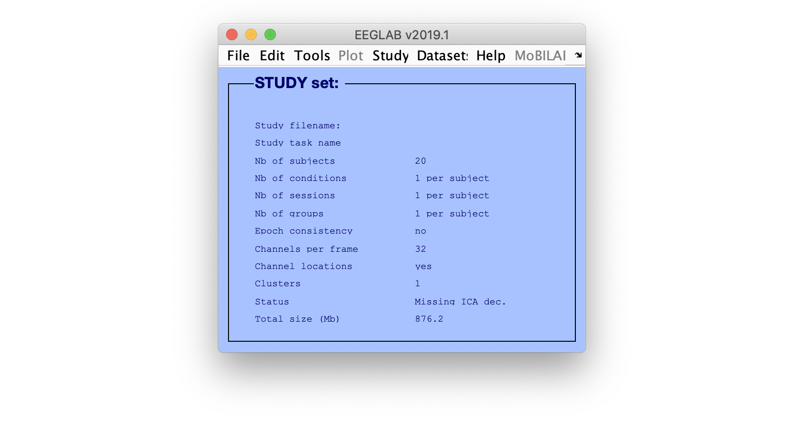

Exporting STUDY to BIDS require that you install the [bids-matlab-tools](https://github.com/sccn/bids-matlab-tools) plugin of EEGLAB. Use the EEGLAB plugin manager (menu item **File > Plugin manager**) to do so. You may then export this STUDY to BIDS using menu item **File > Export > To BIDS folder structure** as shown below.

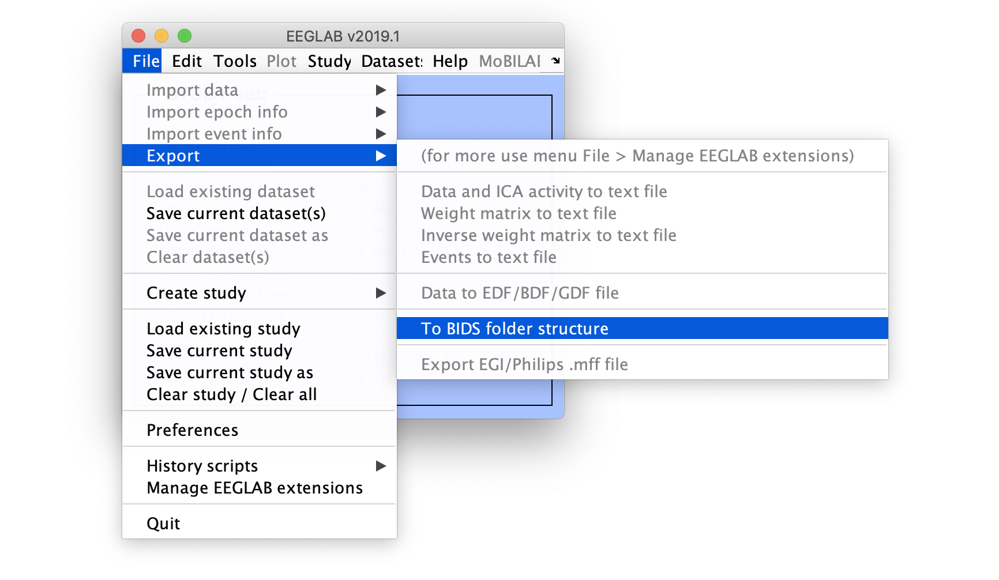

The BIDS interface shown below will pop up. The first input box will indicate the name of the folder to export BIDS data to, then the name of the study, reference and link, authors, distribution license information, README and CHANGE comments. You may enter a description of the experiment in the README section, and a list of authors. These are information which will generate warning messages if you do not include them. Press **OK** when done.

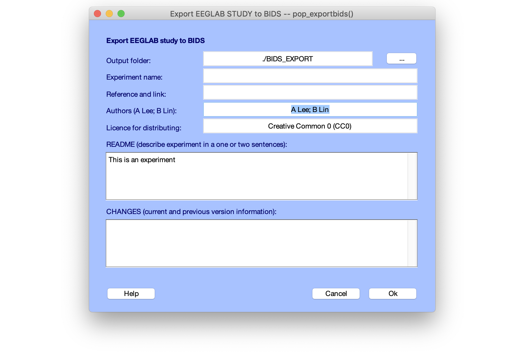

Once the data has been exported, it can be validated using the online BIDS validator. This validator does not upload the data, simply scan the files and check for problem. This is the [validator home page](https://bids-standard.github.io/bids-validator/) below.

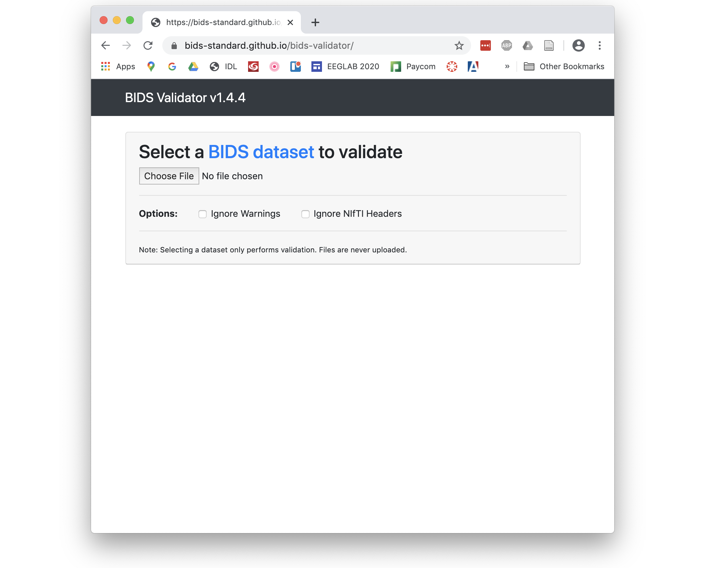

Select the folder where the data was exported and press OK. The validator will check all the data files and indicate if it encounters problems with the data. 

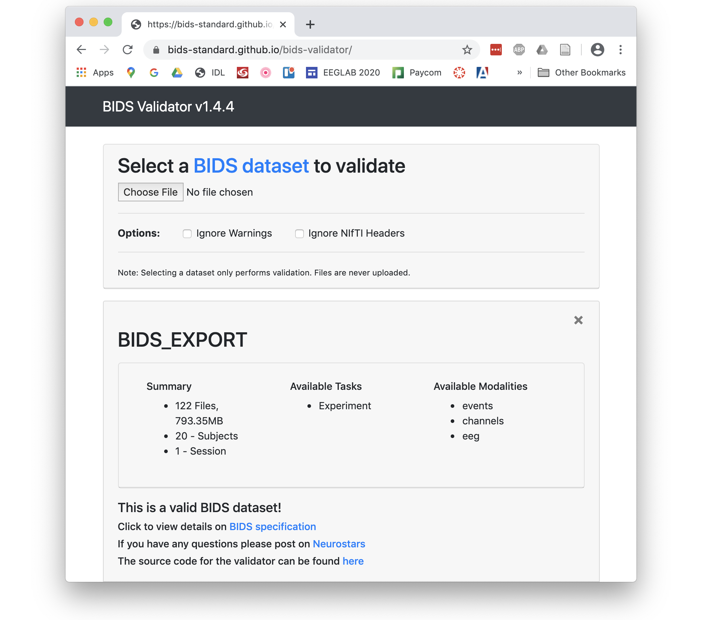

There is much more concerning the generation of BIDS compliant datasets such as individual dataset information, event and channel information that can be fine tuned. These topics are addressed in the [bids-matlab-tools](https://github.com/sccn/bids-matlab-tools) plugin of EEGLAB.