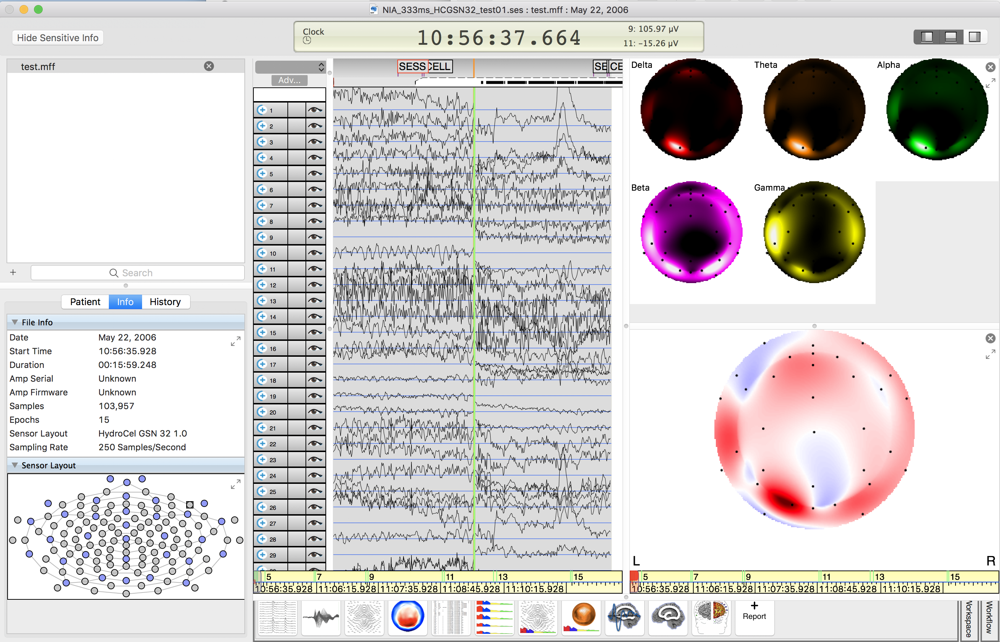

MFFMatlabIO is now the default import program for MFF files in FieldTrip.

First download the latest version of [FieldTrip](http://www.fieldtriptoolbox.org/download)

Then, download the [MFF test file](NIA_333ms_HCGSN32_test01.mff.zip "MFF file") and unzip it. Start a Matlab session. 

Make sure that the FieldTrip main folder is in your path and that the folder _NIA_333ms_HCGSN32_test01.mff_ (which you have downloaded above) is in your current Matlab path. On the Matlab command line type

```matlab
hdr = ft_read_header(fullfile(pwd, 'NIA_333ms_HCGSN32_test01.mff'));
events = ft_read_event(fullfile(pwd, 'NIA_333ms_HCGSN32_test01.mff'), 'header', hdr);
data = ft_read_data(fullfile(pwd, 'NIA_333ms_HCGSN32_test01.mff'), 'header', hdr);
```

Plot and check the data

```matlab
figure; plot(data(:,1:1000)' + repmat([1:size(data,1)]*100, [1000 1]));
```


Writing the data back to MFF format

```matlab
ft_write_data(fullfile(pwd, 'test.mff'), data, 'header', hdr, 'event', events, 'dataformat', 'mff');
```

Import back into Netstation

