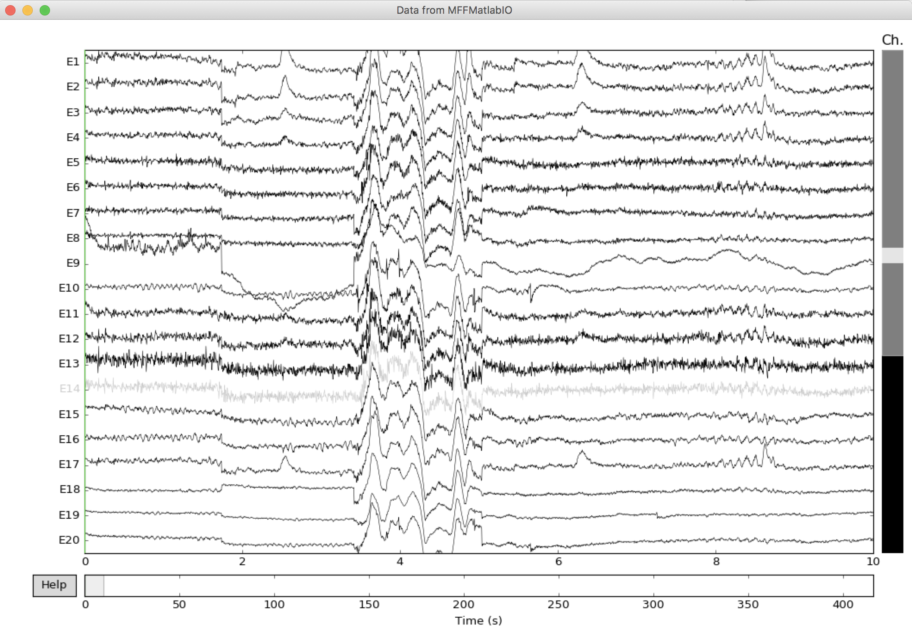

The test below were performed using Python 3.6 but might also work on 2.7. The script below assumes that Python and the pip package are already installed.

First install [Octave](https://www.gnu.org/software/octave/download.html) on your computer. We recommend version 4.4 or later. Second install the Oct2py and MNE librairies as shown below. Then, download the [MFF test file](NIA_333ms_HCGSN32_test01.mff.zip "MFF file") and unzip it.

```bash
pip install oct2py
pip install mne
```

Start Python and type the following

```python
# add necessary librairies
from oct2py import octave
import mne

# add the path to the mffmatlabio plugin - change this line based on your local path
octave.addpath('/matlab/eeglab/plugins/mffmatlabio')

# note that you should start python in the same folder as this MFF file
EEG = octave.mff_import('NIA_333ms_HCGSN32_test01.mff')

# create MNE structures
ch_names = EEG.chanlocs['labels'].tolist();
info = mne.create_info(ch_names=ch_names[0], sfreq=EEG.srate, ch_types='eeg')
raw = mne.io.RawArray(EEG.data, info)

# plot data
raw.plot(scalings={'eeg': 'auto'}, title='Data from MFFMatlabIO')
```

The plot below will pop up. Extracting event annotation from the will require a little bit more work.


