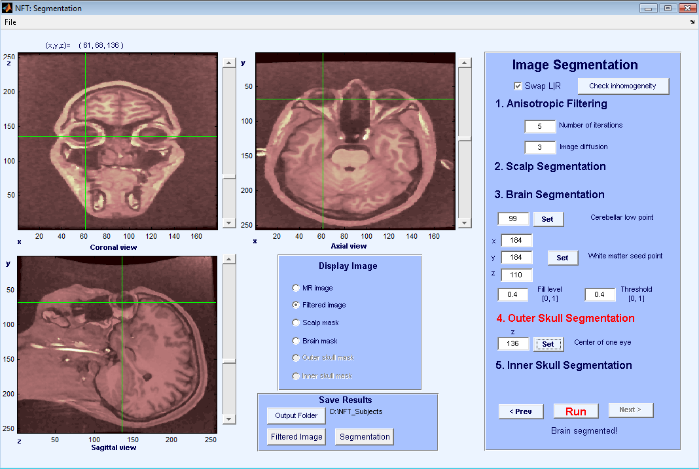
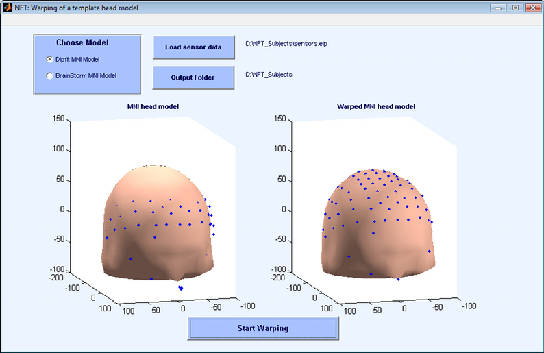

The steps of head modeling are segmentation, mesh generation, and
co-registration of electrode locations with scalp surface. User may also
generate a source space to be used in the solution of the inverse
problem. Figure 2 shows the steps of head modeling using MR images.

Each step in realistic head modeling is implemented as a separate GUI
module reachable from the main menu. These modules are described in the
following sub-sections.

Segmentation
------------

The first step in segmentation is to load the MR image. The input of the
segmentation module is a 3-D sagittal T1-weighted MR image. The image
format has to be in analyze format and the voxel size need to be 1×1×1
mm. To prepare the image for this toolbox, one may use Freesurfer
software (http://surfer.nmr.mgh.harvard.edu/) to perform the following
operations:

1.  Inhomogeneity correction:
    mri_nu_correct.mni --i input_volume --o output_volume --n 2

2.  Conversion of the input volume to 1 mm volume data:
    mri_convert -i input_volume --conform_size 1 --o output_volume

3.  Orient the image:
    mri_convert -i input_volume --out_orientation PSR -ot format
    -o output_volume

4.  Save in analyze format:
    mri_convert -it analyze -i output_file_name.img -ot file_type
    -o input_volume

When the image is loaded, slices are shown in sagittal, axial, and
coronal orientations and it is possible to select slices easily by using
the scroll bars or clicking on the images (Figure 3). The Display image
panel allows the user to select which image to display on the image
panels. The available choices are the MR volume, the filtered volume or
various stages of segmentation.

 .....

The panel on the right of the segmentation GUI shows the segmentation
steps that will be performed on the volume in order:

1.  Anisotropic filtering.

2.  Scalp segmentation.

3.  Brain segmentation.

4.  Outer skull segmentation.

5.  Inner skull segmentation.

The current step is highlighted in red. Pressing the Run button executes
the segmentation step. It is possible to repeat a given step, changing
parameters and observing the output. Pressing the Next button proceeds
to the next step. Below is a discussion of each segmentation step:

### Anisotropic filtering

The purpose of anisotropic filtering is to enhance the image quality.
This filter increases the SNR of the image while preserving the edges.
The inputs to the anisotropic filtering are the number of iterations and
image diffusion. The default values of 5 and 3 work well for most MR
images. As the values increase, the image starts to get blurred. The
output of anisotropic filtering can be observed by selecting “Filtered
Image” from the Display Image panel.

### Scalp segmentation

The next step is scalp segmentation, separating the background from the
image. There are no user inputs to scalp segmentation. An automatic
thresholding algorithm is applied, and the result can be observed by
selecting “Scalp Mask”.

### Brain segmentation

The brain segmentation uses the watershed segmentation algorithm, which
selects connected voxels starting from a seed point. To prevent the
algorithm from overflowing the brain region, the lowest point of
cerebellum has to be selected by the user. This point has to be marked
on the image panels using coronal and saggital views of the slices. Once
the cursor is at the lowest point of cerebellum, pressing Set + selects
the point. Figure 4 shows cursor locations for setting the lowest point
for cerebellum. Another input for brain segmentation is a seed point on
the white matter, any point can be used as long as it is on the white
matter (Figure 5). Pressing the Set + button fetches the cursor
coordinates for the seed. The other inputs are the parameters of the
watershed segmentation algorithm, and the default values work for most
images. The result of Brain segmentation can be seen by selecting “Brain
Mask”.

 ......

### Outer skull segmentation

For outer skull segmentation, seed points for the eye lobes are selected
by the user. Once a slice is selected where the eyes are clearly seen on
the axial view (Figure 6), Set + is pressed to select that slice. During
outer skull segmentation, an image window will pop-up for the user to
click on both eye lobes. Figure 7 shows the matlab figure that pops-up
to click on eye lobes. Once the eyes are selected the outer skull is
segmented and can be seen by “Outer skull mask”.

### Inner skull segmentation

Inner skull segmentation does not require any user input. After the
inner skull is segmented, the outer skull and scalp are checked for
intersections or very thin areas. These masks are corrected if there are
any intersecting regions or too close regions which won’t be suitalbe
for BEM modeling.

The outputs of the segmentation module are filtered MR images and scalp,
skull, CSF and brain masks. It is possible to save the results during
any stage of segmentation in Matlab data format. The filtered MR images
are saved in Matlab format with double presicion, and the name would be
Subject_name_filtered_images.mat. The masks are saved in structure
format of Matlab, where the name would be Subject_name_segments.mat.
When loaded in Matlab, the structure will look like as follows:

    Segm =

             scalpmask: [256x258x257 logical]
             brainmask: [256x258x257 logical]
        outerskullmask: [256x258x257 logical]
        innerskullmask: [256x258x257 logical]

Mesh Generation
---------------

The second step in realistic head modeling is mesh generation. The mesh
generation module uses the results of the segmentation and outputs the
BEM mesh of the head. If the module is invoked from the Main Menu, it
will use the Subject Name and Subject Folder selected in the Main Menu
for segmentation files. The output folder is set to the Subject folder,
and the mesh name is set to the Subject Name. It is possible to change
the output folder and load a different segmentation which makes it
possible to use the module as a standalone mesh generation tool.

The mesh generation module generates either 3-layer or 4-layer meshes.
The number of layers is selected by the user. A three layer mesh has the
scalp, skull and the brain regions separated by the scalp, skull and CSF
surfaces. The CSF and the brain is considered as a single region. A four
layer mesh models scalp, skull, CSF and brain regions, with an
additional surface that separates the CSF and the brain.

The interface of Mesh Generation is shown in Figure 8. The generated
mesh file is suitable to be used directly by the BEM solver. The format
of the mesh file is given in [Appendix A](/NFT_Appendix_A "wikilink").
The mesh generation process is described below.

 .....

Mesh Generation module creates triangular meshes that fits the
boundaries of the segmentation. The aim is to approximate the geometry
while keeping the number of triangles small enough to prevent running
out of resources in the BEM solver. The approach taken by the mesh
generation module is to start with a very fine mesh of the surface
boundary, and gradually coarsen it, making sure the topology is correct
and the quality of the elements is high at each step.

For this purpose, three external programs and various Matlab functions
are used. The external programs are Adaptive Skeleton Climbing (ASC)
(http://www.cse.cuhk.edu.hk/ttwong/papers/asc/asc.html) for
triangulation, Qslim (http://mgarland.org/software/qslim.html) for mesh
coarsening, and Showmesh for smoothing and topology correction.
Functions written in MATLAB drive this process and also do local mesh
refinement. The aim of local mesh refinement is to make sure that the
distance between meshes is not too small compared with edge length of
the neighboring elements. For this purpose, the elements with long edges
are refined if the edge length is larger than the local distance of two
neighboring meshes multiplied by the user specified LMR ratio. It is
suggested to apply LMR with a ratio of 2.

During mesh generation the status of the program is written at the
bottom of the window and a progress bar shows the progress of the
program.

Source Space Generation
-----------------------

Source space is a set of dipole sources placed within the brain volume.
The source spaces are used to generate Lead Field Matrices (LFM) which
is a matrix that maps dipole source strengths to electrode potentials.

The Forward Modeling Toolbox contains an option to generate a simple
source space consisting of a regular grid. The grid is generated by
placing three orthogonal dipoles at each grid location inside the brain
volume. The user inputs are the spacing between the dipoles and the
minimum distance of a dipole to brain mesh. The spacing determines the
minimum distance between two dipoles. The default value of spacing is 8
mm, and the minimum distance of a dipole to brain mesh is 2 mm. These
default parameters result in about 6000-7000 dipoles for an average
adult human brain. The user interface of this module is shown in Figure
9. The output file is saved in the Output folder set in the Main window
as sourcespace.dip in ascii format. It is a matrix of number of dipoles
by 6, in each row the x, y, z position and direction of dipoles are
given.

A LFM using a regular grid source space can be used in single dipole
parametric inverse problem solution to find a coarse estimate of the
dipole position.

 ..... 

Co-registration of electrode locations
--------------------------------------

The BEM mesh is generated from the 3D MR volume, and uses the same
coordinate system as the volume. When working with EEG recordings, the
electrode coordinates, measured by a digitizer, must be mapped to the
mesh coordinates. This step is called the co-registration of electrode
locations.

The input to the Electrode co-registration module is the electrode
locations. The scalp mesh of the subject is loaded automatically, and
the electrodes are co-registered to the scalp mesh. The co-registration
is done in two steps. First the user manually co-registers the sensors
pressing the Initial co-registration button. This starts EEGLAB’s
co-registration function and a coarse registration is done to bring the
sensors to the mesh coordinate system. The second step is the Complete
co-registration. This step starts from the initial co-registration and
automatically finds the best translation and rotation parameters by
minimizing the total distance between the sensors and scalp surface.

The interface of co-registration is shown in Figure 10. At the end of
each registration step, a figure pops up to show the registered
electrodes on the scalp surface. It is possible to save either the
initial or the complete registration. The outputs of the program are
registered electrodes and index of the electrodes in the scalp mesh
region.

Note that the outputs of segmentation, mesh generation, and source space
are subject specific. The Subject Name is used in output files for these
stages. On the other hand, the electrodes must be registered each time
the electrode positions change. Therefore, the co-registration output is
specific to a session. The result of electrode co-registration is saved
as Session_Name_Subject_Name_headsensors.sens in ASCII format.

 .... 

Head Modeling using Template Warping
------------------------------------

When the MR images of the subject is not available, a frequently used
approach is to use a template head mesh, and map the electrodes to this
template for source localization. The MNI brain, which is created by the
Montreal Neurological Institute (MNI) by averaging the head MRIs of 305
normal subjects, is frequently used for this purpose.

An alternative approach suggested by Darvas et al \[1\] is to warp a
template mesh to fit the sensor locations. The toolbox implements this
functionality to generate subject specific head models when no MR images
are available. This results in more realistic head models compared with
using a template mesh, and mapping electrodes to it. The template model
that is used in this toolbox is a 3-layer BEM mesh extracted from the
MNI brain.

The warping is computed based on fiducials: the nasion and left and
right preauricular points. Using these 3 points, another point is
calculated on the top of the head on both the template model and
subject’s electrode locations. Using these 4 points, the sensor
locations and head model are brought into same coordinate system. After
this initial co-registration, 19 landmarks on both the head model and
sensors are located. These landmarks are used to find the warping
parameters. The warping method is a non-rigid thin plate spline method.
After finding the warping for scalp, all the surfaces and the source
space are warped using the same warping parameters.

The inputs of the warping module are the fiducials and the electrode
locations (obtained from a digitizer). The outputs are the warped mesh,
warped source space, indices of the electrodes on the mesh, fitted
electrode locations and the warping parameters in case a user wants to
warp back the localized sources to the template model. Note that the
number of warped electrodes may be lower, since the MNI head is not a
whole head model, and some electrodes may fall out of the template mesh.

In Figure 11 the interface for warping module is shown.

 ..... 

------------------------------------------------------------------------

References

\[1\] F. Darvas, J.J. Ermer, J.C. Mosher, R.M. Leahy, Generic head
models for atlas-based EEG source analysis, Human Brain Mapping, vol.
27(2), 2005, pp 129-143.