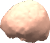
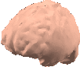
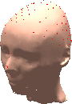
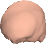

In this section, two head modeling examples are presented. Both of these
examples use the same subject. The first example generates a realistic
head model using the MR image of the subject. The second example warps
the template head model to 141 digitized electrode locations. Mesh
generation and electrode registration results are given for both of
these examples. The computational cost of each modeling stage and sizes
of the resulting output files are also given.

Head Model Generation
---------------------

For the first example, a four-layer mesh is generated for the subject
through segmentation and mesh generation steps. The mesh consists of
scalp, skull, csf, and brain layers for a total of 16016 nodes and 32024
elements. The individual layers can be seen in Figure 13.

(a) 
 ...
(b)
 ...
(c) 
 ... 
(d)

Figure 13: BEM model of the scalp, skull, csf and the brain obtained
from an MR image. (a) scalp mesh, (b) skull mesh, (c) CSF mesh, (d)
brain mesh.

After mesh generation, the electrodes and the realistic mesh is
co-registered. The result of co-registration can be seed in Figure 14.

The second example assumes that the only available subject data is the
141 digitized electrode locations. For warping the template MNI mesh is
used, which has three layers and 3000 nodes and 5988 elements. This is
the standard mesh that is also used by other BEM solvers in the
literature. The results of warping can be seen in Figure 15.

(a)
 ...
(b) 
 ... 
(c)
 ...
(d) 

Figure 15: BEM model of the scalp, skull, the brain obtained by warping
a template head model to electrode locations. (a) scalp mesh, (b) skull
mesh, (c) brain mesh, (d) electrode locations.

Note that the realistic model, and the warped model are two different
models for the same experiment. Since the MNI head only contains the
half of the head above the mouth, some electrodes had to be discarded.
While the realistic model represents the real geometry of the head much
better than the warped model, the warped model itself is an improvement
over the template MNI head itself.

Computational Complexity
------------------------

The computational cost of using a realistic head model is related to the
size of the BEM matrices, which depend on the mesh. The aim of this
section is to give an idea about how long different stages of the head
modeling and forward problem solution takes.

The realistic model generated using MR image consists of 4 layers and
has 16016 number of nodes, and 32024 number of faces in total. Local
mesh refinement is done using LMR ratio of 2. The number of faces for
each surface is as follows: Scalp:6944, Skull:7084, Csf: 9298,
Brain:8698 elements.

Table 1 shows the computation times for realistic head modeling and
forward model generation when head model is obtained using MR images.
Table 2 shows the computation times for forward model generation when
the head model is obtained by warping a template head model. Warping of
a template head model and source space generation takes only seconds,
therefore, these are not given in the tables. The computations are done
on a 64-bit Opteron processor.

| Process                                         | Time       |
|-------------------------------------------------|------------|
| Segmentation                                    | 25 minutes |
| Mesh Generation                                 | 38 minutes |
| Co-registration                                 | 25 minutes |
| Generation of BEM matrices (16016 nodes)        | 2 hours    |
| Calculation of transfer matrix (141 sensors)    | 3.2 hours  |
| Calculation of Lead Field Matrix (6075 dipoles) | 1 hour     |
|                                                 |            |

| Process                                          | Time       |
|--------------------------------------------------|------------|
| Generation of BEM matrices (6006 nodes)          | 19 minutes |
| Calculation of transfer matrix (135 sensors)     | 15 minutes |
| Calculation of Lead Field Matrix (10131 dipoles) | 30 minutes |
|                                                  |            |

The transfer matrix computation and lead-field generation steps may be
executed on multiple processors if the MATLAB Parallel Processing
Toolbox is available. We have measured a 2.6x speed-up by generating the
transfer matrix on a quad-core instead of a single core processor.

Output Folder
-------------

The toolbox uses the Subject folder to save the generated meshes and
matrices. The names of the output files are derived from the subject and
session names. This section lists the contents of output folders and
size of the files for the two examples discussed above.

Table 3 shows the contents of the output folder when Subject Name is
SubjectA and session name is Session1 for the example given in Table 1.
Table 4 shows for the case given in Table 2, when the subject name is
entered as SubjectB and session name as Session1.

| File                               | Size      |
|------------------------------------|-----------|
| SubjectA_segments.mat              | 0.4 MB    |
| SubjectA_filtered.mat              | 84 MB     |
| SubjectA.bei                       | 67 bytes  |
| SubjectA.bec                       | 1.2 MB    |
| SubjectA.bee                       | 0.7 MB    |
| SubjectA.model                     | 473 bytes |
| SubjectA.cmt                       | 2.9 GB    |
| SubjectA.dmt                       | 844 MB    |
| SubjectA.imt                       | 939 MB    |
| sourcespace.dip                    | 581 KB    |
| Session1_SubjectA_headsensors.sens | 6.9 KB    |
| Session1_SubjectA_sensorindex.mat  | 2.2 KB    |
| Session1.session                   | 4.8 KB    |
| Session1.tmte                      | 53.9 MB   |
| Session1_LFM.mat                   | 6.3 MB    |
|                                    |           |

|                                    |           |
|------------------------------------|-----------|
| SubjectB.bei                       | 52 bytes  |
| SubjectB.bec                       | 381 KB    |
| SubjectB.bee                       | 240 KB    |
| SubjectB_warping                   | 2.3 KB    |
| SubjectB.model                     | 381 bytes |
| SubjectB.cmt                       | 432.1 MB  |
| SubjectB.dmt                       | 136.6 MB  |
| SubjectB.imt                       | 46.3 MB   |
| sourcespace.dip                    | 959 KB    |
| Session1_SubjectB_headsensors.sens | 6.4 KB    |
| Session1_SubjectB_sensorindex.mat  | 2.1 KB    |
| Session1.session                   | 7.6 KB    |
| Session1.tmte                      | 32.7 MB   |
| Session1_LFM.mat                   | 16.9 MB   |
|                                    |           |
