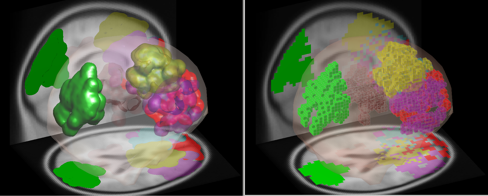
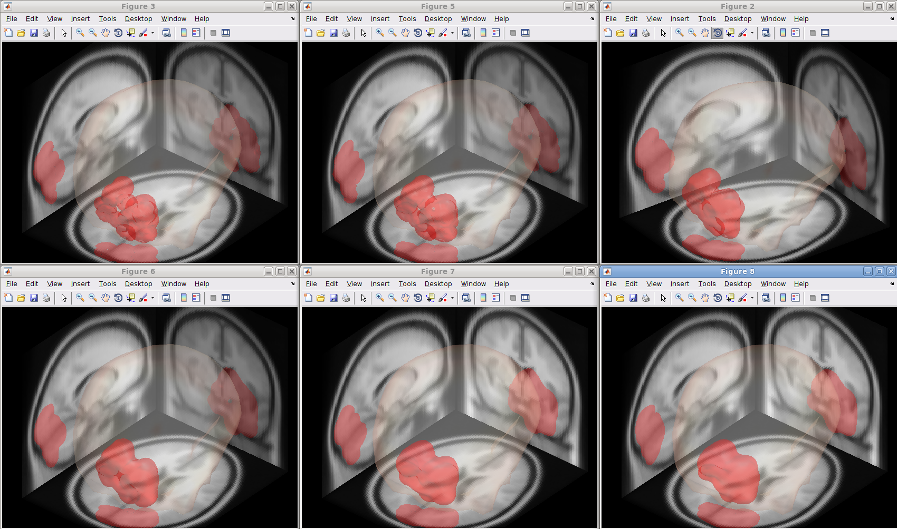

To view the plugin source code, please visit the plugin's [GitHub repository](https://github.com/sccn/NIMA).

The NIMA EEGLAB plugin
-------------------------------------------------------------

NIMA stands for Nima's Images from Measure-projection Analysis. Measure
Projection Toolbox (MPT) is a published method (Bigdely-Shamlo et al.,
2013), and for his wiki page see [this
link](https://sccn.ucsd.edu/wiki/MPT). MPT's nice visualization
functions are stripped and re-wrapped into a stand-alone dipole
visualizer that does not have dependency on MPT. As a GUI, a menu item
appears under STUDY tab. The main function, nimasImagesfromMpA() can be
used also as a stand-alone command line function.

What you can do with the optional inputs (12/07/2018 updated)
-------------------------------------------------------------

-   Specifying the colors and Alpha values separately for each
    blob/voxel clusters.
-   Specifying which MRI image and blob/voxel-cluster projections to
    show.

GUI, Blobs, and Voxels
----------------------
GUI image can be seen in the screenshot below. This visualization works
on 3-D Gaussian-blurred dipole locations, called (probabilistic) *dipole
density*, which requires two parameters to determine the spatial
spreading, namely full-width half-maximum (FWHM) in mm and number of
sigma to truncate the Gaussian (can be specified as optional input,
default 3 sigma; sigma == FWHM/2.355). Also, users are requested to
determine the spatial resolution by determining isometric voxel size,
which could be from 2 mm to 8 mm by increment of 1 mm. The final
visualization can be made either using blob or voxels, and the
transparency can be specified as Alpha (0-1 as invisible-solid). As an
optional input, the order and the RGB triplets of the color assignment
for the selected clusters can be specified as 'blobColor', \[1 0 0; 0 1
0; 0 0 1\] which will give you R, G, B for the specified three clusters
in this order. In the screenshot below, compare scalp topographies, blob
images, and voxel images of Cluster 5, 6, 16. My colleague told me the
voxel image reminds him of Minecraft.

Comparison with std_dipoleDensity()
-----------------------------------

std_dipoleDensity() currently allows up to 5 clusters to be plotted in
one head space. Compared with this function, images from NIMA can embody
transparency and more fine-tuned spatial resolution.

Voxel Size Comparison for Blob Images
-------------------------------------

FWHM = 8 mm, number of sigma to truncate Gaussian = 3. From top left to
right, Voxel Size = 2 mm, 3 mm, 4 mm. From bottom left to right, 5 mm, 6
mm, and 7 mm.

Voxel Size Comparison for Voxel Images
--------------------------------------

FWHM = 8 mm, number of sigma to truncate Gaussian = 3. From top left to
right, Voxel Size = 2 mm, 3 mm, 4 mm. From bottom left to right, 5 mm, 6
mm, and 7 mm.

FWHM Size Comparison
--------------------

Number of sigma to truncate Gaussian = 3. From top left to right, FWHM =
8 mm, 12 mm, 16 mm. From bottom left to right, 20 mm, 24 mm, and 28 mm.

Alpha Comparison
----------------

FWHM = 8 mm, number of sigma to truncate Gaussian = 3. Top row, voxel
plot. Bottom row, blob plot. From left to right, Alpha = 0.1, 0.3, 0.5,
0.7, 0.9.

