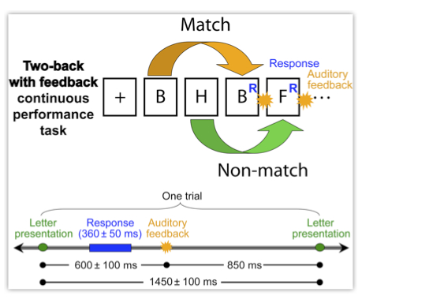
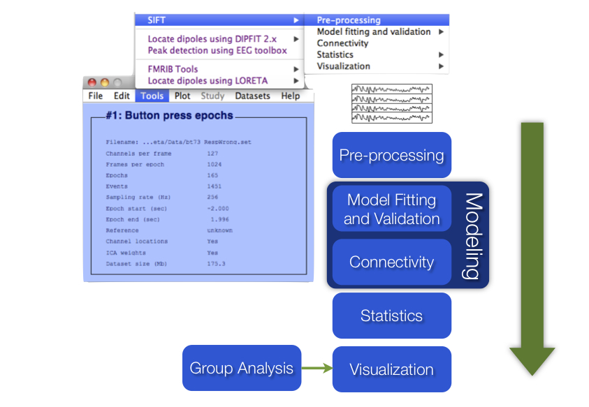

This section provides a demonstration of the use of SIFT to estimate and
visualize source-domain information flow dynamics in an EEG dataset. To
get the most of this tutorial you may want to download the toolbox and
sample data and follow along with the step-by-step instructions. The
toolbox is demonstrated through hands-on examples primarily using SIFT’s
Graphical User Interface (GUI). Theory boxes provide additional
information and suggestions at some stages of the SIFT pipeline.

In order to make the most use of SIFT’s functionality, it is important
to first separate your data into sources – e.g. using EEGLAB’s built-in
Independent Component Analysis (ICA) routines. To make use of the
advanced network visualization tools, these sources should also be
localized in 3D space e.g. using dipole fitting (**`pop_dipfit()`**).
Detailed information on performing an ICA decomposition and source
localization can be found in the EEGLAB wiki. In this example we will be
using two datasets from a single subject performing a [two-back with
feedback continuous performance task](https://sccn.ucsd.edu/eeglab/download/SIFT_SampleData.zip) depicted in the figure below (Onton and
Makeig, 2007). Here the subject is presented with a continuous stream of
letters, separated by \~1500 ms, and instructed to press a button with
the right thumb if the current letter matches the one presented twice
earlier in the sequence and press with the left thumb if the letter is
not a match. Correct and erroneous responses are followed by an auditory
“beep” or “boop” sound. Data is collected using a 64-channel Biosemi
system with a sampling rate of 256 Hz. The data is common-average
re-referenced and zero-phase high-pass filtered at 0.1 Hz. The datasets
we are analyzing are segregated into correct (RespCorr) and incorrect
(RespWrong) responses, time-locked to the button press and separated
into maximally independent components using Infomax ICA (Bell and
Sejnowski, 1995). These sources are localized using a single or
dual-symmetric equivalent-current dipole model using a four-shell
spherical head model co-registered to the subjects’ electrode locations
by warping the electrode locations to the model head sphere using tools
from the EEGLAB dipfit plug-in.

*Figure caption. Two-back with feedback CPT (Onton and
Makeig, 2007).*

In this exercise, we will be analyzing the information flow between several
of these anatomically localized sources of brain activity during correct
responses and error commission.

The SIFT
sub-menu options correspond to SIFT’s five main modules: Pre-Processing,
Model Fitting and Validation, Connectivity Analysis, Statistics, and
Visualization.

*Figure caption. SIFT Data processing pipeline*
