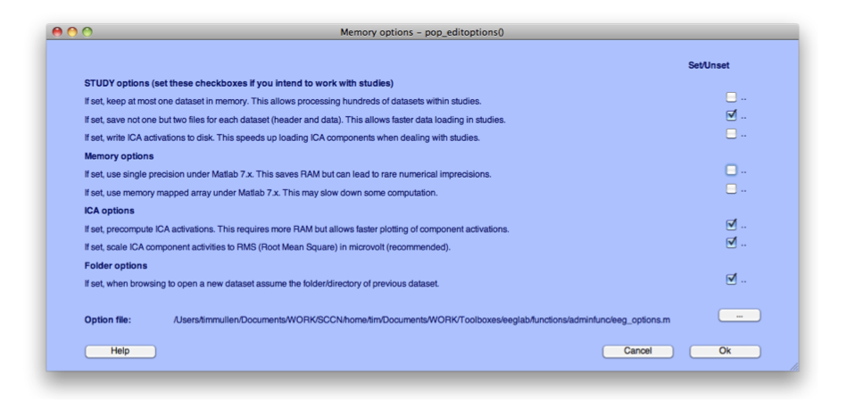

First start up EEGLAB from the MATLAB® command-prompt:


``` matlab
 eeglab
```


Before we load any data, we need to make sure we have the right memory
options set. From the EEGLAB menu select **File > Memory and other options**. Make sure your memory options are set as in the figure below. In particular, the first checkbox must be unchecked.




*Figure caption. Memory options for EEGLAB.*

Now let’s load our sample datasets in EEGLAB. We will first load the
*RespWrong.set* file and then *RespCorr.set* located in the
**SIFT-path/Data/** folder (click on [Chapter 1. Downloads](Chapter-1.-Downloads) to download the data).


*Figure caption. Load RespWrong.set then RespCorr.set*

We must now select the length of data epoch to process. The original data epochs are from -2 to 2 seconds, but we will only process the data from -1 to 1.25 seconds (mostly to speed up computation). To do so, use EEGLAB menu item **Edit > Select data** and enter "-1 1.25" in the time range edit box. Press OK and overwrite the current dataset. You must repeat this procedure for each dataset individually.
 


*Figure caption. Selecting shorter epochs*

It is now necessary to select which components to process. To do so, use 
EEGLAB menu item **Tools > Remove components from data** and enter the following list of components to keep "**8 11 13 19 20 23 38 39**" in the edit box. These components have been preselected because they are the most interesting. If you are processing your own dataset, you must select components to study. Note that SIFT can usually only analyze up to 9 components when using Partial coherence and Granger causality measures that factor out the contribution of indirect interactions. If you are not using such measures, you may use more components. Note also that SIFT does allow selecting components from the command line -- since we are using a GUI approach, we will be selecting components at this stage. Press **OK** then **Accept**, and select the checkbox to overwrite the current dataset.


*Figure caption. Selecting components of interest*

Once the components have been selected, you may overwrite the parent dataset. You must repeat this procedure for each of the two datasets (the components' indices are the same since the two datasets have the same ICA decomposition).

Now select both datasets from the **Datasets > Select multiple datasets** menu. This will enable SIFT to process these
datasets in sequence, and visualize differences in connectivity between
conditions.


*Figure caption. Select both datasets in EEGLAB*

Note that the “ICA weights” field in the dataset description is set to
“Yes” indicating we have ICA decompositions for both these datasets.
Source separation (and localization for advanced visualization) is
currently a prerequisite for the GUI-based SIFT data-processing
pipeline, although it is possible to apply low-level SIFT command-line
routines to analyze the connectivity of channel data.


