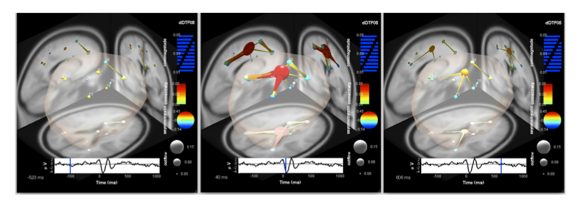

Once we’ve computed our connectivity estimates, and potentially computed
some statistics, we will want to visualize the results. SIFT currently
provides two visualization programs for exploring results for a
single dataset or a cohort of datasets: an Interactive Time-Frequency
Grid, and an Interactive BrainMovie3D. For the next several sections, let’s start by
visualizing the results for each condition separately. Let’s begin by
selecting only the *RespWrong* dataset as shown in the figure below.


*Figure caption. Select only the RespWrong dataset to continue.*

## 6.1. Interactive Time-Frequency Grid

Bring up the Interactive Time-Frequency Grid Options GUI by selecting menu item
**SIFT > Visualization > Time-FrequencyGrid**. This can also be achieved from the command line:

``` matlab
 pop_vis_TimeFreqGrid(EEG);
```

This should generate the GUI seen in the figure below. This GUI has
substantially more options than we’ve previously seen, and we will only
briefly introduce them here. Help text for each option can be obtained
by expanding the Help Pane at the bottom of the PropertyGrid. The first
step to creating a Time-Frequency Grid is to design the grid layout. We
can plot time-frequency images of different VAR-based measures on the
upper triangle, lower triangle, or diagonal of the grid. This is
achieved by setting the **MatrixLayout** property to ***Partial*** and
selecting the measures to plot on the various grid components. Next we
should decide which **FrequenciesToPlot**. Usually we want to visualize
a subset of all frequencies, to make interesting details more salient.
We can also control how the color map is saturated, using a priori color
limits or adaptive ones based on percentiles of the data. Picking a good
color scaling is important for visual inspection of the data. If source
localization has been performed we can set **SourceMarginPlot** to
***dipole*** to plot the anatomical locations of the sources on the
column and row margins. If source locations are not available, but ICA
has been performed, we can set this property to ***topoplot*** to
instead plot the scalp maps of the ICs on the margins. We can provide a
**Baseline** window (in seconds) for computing event-related measures.
We can also perform statistical **Thresholding** or use simple
percentile or absolute thresholds to establish significance. If the
threshold is constant, contours can be plotted around significant
regions by enabling **PlotContour**. Finally, we can customize a wide
variety of display options, including placement of event and frequency
markers, labels and title strings, font colors and sizes, and more.


For this example, make sure your options are set as in the figure and table below:

<table>
<tbody>
<tr class="odd">
<td><p>Option</p></td>
<td><p>Value</p></td>
<td><p>Description</p></td>
</tr>
<tr class="even">
<td><p><strong>MatrixLayout</strong></p></td>
<td><p><strong>Partial</strong></p></td>
<td></td>
</tr>
<tr class="odd">
<td><blockquote>
<p><strong>UpperTriangle</strong></p>
</blockquote></td>
<td><p><strong>dDTF08</strong></p></td>
<td><p>Put the dDTF08 on the upper triangle</p></td>
</tr>
<tr class="even">
<td><blockquote>
<p><strong>LowerTriangle</strong></p>
</blockquote></td>
<td><p><strong>dDTF08</strong></p></td>
<td><p>Put the dDTF08 on the lower triangle</p></td>
</tr>
<tr class="odd">
<td><blockquote>
<p><strong>Diagonal</strong></p>
</blockquote></td>
<td><p><strong>S</strong></p></td>
<td><p>Put the power spectra on the diagonal</p></td>
</tr>
</tbody>
</table>


*Figure caption. Interactive Time-Frequency Grid
option GUI generated by `pop_vis_TimeFrequencyGrid()`.Almost every
aspect of the grid is customizable, and only the most commonly-used
options are represented in the GUI.*


Click **OK** to continue and generate the Time-Frequency Grid. After a
few seconds, you should see a figure similar to the figure below. 


*Figure caption. Time-Frequency Grid.*

Here we have
plotted an array of time-frequency images, where frequency is on the
y-axis and time on the x-axis. On the upper and lower triangle of the
grid (above and below the red-bordered diagonal) we have the dDTF
(conditional GC) between each pair of sources. Information flows from
columns to rows. Thus the time-frequency (TF) image at (row,col) = (3,1)
shows information flow at different times and frequencies from the
source above column 1 (IC8) to the source on the left of row 3 (IC13).
Note that we have vertical red lines indicating events of interest (here
the time of the button-press event) and horizontal gray lines denoting
our frequencies of interest **(FrequencyMarkers)**. On the diagonal, we
have plotted the event-related spectral perturbation (ERSP). Because we
provided a baseline, each pixel shows the information flow or spectrum
relative to the baseline window. Red denotes more information flow than
in the baseline, while blue denotes less. The anatomical dipole
locations for each source are rendered on the margins. Clicking on this
will expand an interactive 3D MRI plot (dipplot). Clicking on any
time-frequency image generates a figure with more detail regarding the
interaction between the respective sources.


Note the large bursts of information flow and spectral power in the
theta (3-7 Hz) and delta (2-3 Hz) bands around, and just after, the
erroneous button press. This suggests some kind of transient network
synchronization occurring around the time when the button press is made
in error. As a side note, observe that, although spectral power often
increases with information flow/granger-causality, it does not
*necessarily* do so. Consider IC 38 (7th row and column). It shows very
little change in ERSP (cell (7,7)) around the button press, but appears
to exhibit changes in information flow with ICs 8 (row 1) and 13 (row 3). As a
rule, spectral power modulation and phase synchronization/information
flow can occur independently of each other – one does not imply the
other. Merely observing two regions concomitantly increase their
spectral amplitude does not necessarily suggest that they are
communicating. Conversely, observing a lack of event-related spectral
power modulation in some putative components of a brain network does not
mean it is not critically participating in the network.


To explore one of these interactions further, let’s go ahead and click
on cell (3,1), which corresponds to IC8 to IC13. Clicking on cell (3,1) should generate an image similar to that in
the figure below. Here we can explore the interaction between these two
processes in greater detail. On the top panel of we have the dDTF flow
from IC8 to IC13 (the plot mentions IC1 and IC3, but IC1 is 8, which is the first component in our list and IC3 is component 13 which was the 3rd in our list) and on the bottom panel we have thefeedback flow (IC13 to IC8). Note that you can use the parameter to rename components. 


*Figure Caption. Interactive Time-Frequency Grid.*

Many more options may be used. Unfortunately, in recent versions of MATLAB, the GUI may crash or return an error after pressing OK. Therefore, using the command line to set different options is preferable. Below is the same command used to plot the figure above, but changing the color limit. We are also adding a baseline from -1 to -0.25 seconds. This subtracts the average connectivity in the pre-event baseline window (1 sec to ¼ sec before the button-press event) from each measured value. We will also use simple thresholding and a percentile threshold of 97.5% on the 3rd dimension of the connectivity matrix. This is not as rigorous as computing statistics, but it allows us to get an idea of what might be significant. We will also associate the proper labels to each of the 8 components. Refer to the GUI for the different parameters and associated help messages/descriptions. 


```matlab
vis_TimeFreqGrid('EEG', EEG(1), 'Conn', EEG(1).CAT.Conn, 'MatrixLayout', ...
       {'Partial', 'UpperTriangle', 'dDTF08' 'LowerTriangle', 'dDTF08' 'Diagonal' 'S' 'AllColorLimits' 99.9  }, ...
       'baseline', [-1 -0.25], 'Thresholding', {'Simple', 'PercentileThreshold', [97.5 3]}, ...
       'nodelabels', { 'IC8' 'IC11' 'IC13' 'IC19' 'IC20' 'IC23' 'IC38' 'IC39' });
```


*Figure Caption. Interactive Time-Frequency Grid.*

Again, let's select the cell (3,1). On the left marginals, the column-envelope of the matrix is visible (maximum and minimum dDTF
across time), while on the bottom marginal, we have the row-envelope
(maximum and minimum of the dDTF across frequency). The envelopes of the
two-sided thresholds (using the percentile
threshold) are plotted as green-black lines on the marginals. Values
between the threshold lines are considered non-significant and masked in
the time-frequency plot. The purple shaded region on the time-marginal
indicates our baseline window. Every part of the image is expandable.


*Figure caption. Expansion of the Time-Frequency Grid
cell (3,1) corresponding to IC8 to IC13.*

As with the Time-Frequency Grid, each element of the Time-Frequency Cell
is also interactively expandable. On the top panel, we have the
dDTF flow from IC8 to IC13 and on the bottom panel we havethe feedback flow (IC13 to IC8). The envelopes of the time-frequency matrix are plotted on the marginal. Here, two-sided thresholds for statistical significance are plotted as
green-black lines on the marginal. The purple-shaded region denotes the
baseline interval [-1 -0.25] sec. Clicking on the source anatomical
images will generate interactive dipole plots of the sources.

By examining this time-frequency image, we can see that there is a
significant flow of information from IC8 to IC13 in the theta band
around the time of the erroneous button press. There is also a slightly
delayed and damped feedback from IC13 to IC8. This emphasizes the points made in section 4.5. regarding the importance of
using an asymmetric measure that can separate feedforward and feedback
influences in closed-loop systems. Note that the early information flow
is highly peaked around 5 Hz theta-band, while we see later information
flow around 250-600 ms, shifting to the delta-band (2-3 Hz). This is
precisely in line with several observations regarding the functional
role in error processing (the so-called Error-Related Negativity (ERN)
seen reported in ERP literature) and electrophysiology of the cortical
area to which IC8 is localized (Anterior Cingulate Cortex (ACC))
(Holroyd and Coles, 2002; Yordanova et al., 2004; Luu et al., 2004;
Roger et al., 2010).

Returning to our Time-Frequency Grid, and turning our
attention to the first column, we note that IC8 (ACC) appears to be
exerting a disproportionate amount of theta-band causal influence on the
rest of the network around the time of the erroneous button press. IC8
appears to be some kind of hub, synchronizing and communicating with
multiple other brain areas when the error is being committed. In order
to examine the full network behavior in more detail, let’s generate a 3D
BrainMovie.

## 6.2. Interactive Causal BrainMovie3D

The Interactive Causal BrainMovie3D (Mullen and Delorme et al, 2010;
Delorme, 2005) is a way of visualizing brain network activity across
time, frequency and anatomical location in the form of an anatomically
localized directed graph. Directed graphs (graphical models) are
powerful constructs for representing causal network structure (Pearl,
2000; Eichler, 2006a). Graph-theoretic measures are being increasing
used to study brain network organization (Bullmore and Sporns, 2009).
The BrainMovie3D provides a way to interactively explore multiple
dimensions of source-domain network dynamics and graph structure in an
intuitive and aesthetically pleasing manner.


To begin, let’s bring up the BrainMovie3D GUI by selecting **SIFT > Visualization > Causal BrainMovie3D** (if you experience problems with the GUI, use the command line calls at the end of this section). The command-line analogue is

```matlab
 pop_vis_causalBrainMovie3D(EEG);
```


You should now be presented with a control panel similar to that shown
below. This GUI has the most options of any thus far, and we
will, again, only explore a small subset of the options for this
example. The Help Pane (and some adventurous exploration) should allow
the user to deduce the function of many of the remaining options.


One of the interesting features of the BrainMovie is the ability to
modulate the color and size of nodes based on graph-theoretic measures
such as inflow/outflow, indegree/outdegree, causal flow, causal density,
asymmetry ratio, and other such quantities (Seth, 2005; Bullmore and
Sporns, 2009). This is achieved through the **NodeColorMapping**, and
**NodeSizeMapping** properties. Below is a list of definition that will be useful when we look at Brainmovies.

<table>
<tbody>
<tr class="odd">
<td><p>Measure</p></td>
<td><p>Description</p></td>
</tr>
<tr class="even">
<td><p><strong>Outflow</strong></p></td>
<td><p>Sum connectivity strengths over outgoing edges</p></td>
</tr>
<tr class="odd">
<td><p><strong>Inflow</strong></p></td>
<td><p>Sum connectivity strength over incoming edges</p></td>
</tr>
<tr class="even">
<td><p><strong>Casual Flow</strong></p></td>
<td><p><em>Outflow</em> - <em>Inflow</em></p></td>
</tr>
<tr class="odd">
<td><p><strong>Outdegree</strong></p></td>
<td><p>Number of significant outgoing edges</p></td>
</tr>
<tr class="even">
<td><p><strong>Indegree</strong></p></td>
<td><p>Number of significant incoming edges</p></td>
</tr>
<tr class="odd">
<td><p><strong>Casual Degree</strong></p></td>
<td><p><em>Outdegree</em> - <em>Indegree</em></p></td>
</tr>
<tr class="even">
<td><p><strong>Asymmetry Ratio</strong></p></td>
<td><p><br /><br /><em>AR</em> = -1 indicates all connectivity related to that node is inflowing (a causal sink)<br />
<em>AR</em> = +1 indicates all connectivity related to that node is outflowing (a causal source)<br />
<em>AR</em> = 0 indicates either balanced flow or no significant flow</p></td>
</tr>
</tbody>
</table>


Below is a list of options we have used
to generate the plots on this page. Let’s begin by starting with the default options and setting the
remaining options as shown in the GUI and the table below:


<table>
<tbody>
<tr class="odd">
<td><p>Option</p></td>
<td><p>Value</p></td>
<td><p>Description</p></td>
</tr>
<tr class="even">
<td><p><strong>ConnectivityMethod</strong></p></td>
<td><p><strong>dDTF08</strong></p></td>
<td><p>Which connectivity measure to use</p></td>
</tr>
<tr class="odd">
<td><p><strong>FrequenciesToCollapse</strong></p></td>
<td><p><strong>4:7</strong></p></td>
<td><p>Collapse frequencies across the theta range</p></td>
</tr>
<tr class="even">
<td><p><strong>FreqCollapseMethod</strong></p></td>
<td><p><strong>Integrate</strong></p></td>
<td><p>Which method to use to collapse frequencies?<br />
<em>Integrate</em>: integrate over the selected frequencies<br />
<em>Mean</em>: take the mean over frequencies<br />
<em>Max</em>: take the maximum<br />
<em>Peak</em>: return the peak value over frequencies (a monotonically increasing or decreasing sequence does not have a peak)</p></td>
</tr>
<tr class="odd">
<td><p><strong>EdgeColorMapping</strong></p></td>
<td><p><strong>Connectivity</strong></p></td>
<td><p>The color of the edges will be mapped to connectivity strength (amount of information flow along that edge). Red = high connectivity, Green = low connectivity.</p></td>
</tr>
<tr class="even">
<td><p><strong>EdgeSizeMapping</strong></p></td>
<td><p><strong>ConnMagnitude</strong></p></td>
<td><p>The size of edges of the graph (connecting “arrows”) will be mapped to connectivity magnitude (absolute value of connectivity strength, useful if there are negative values as with event-related (baselined) or between-condition analysis)</p></td>
</tr>
<tr class="odd">
<td><p><strong>NodeColorMapping</strong></p></td>
<td><p><strong>AsymmetryRatio</strong></p></td>
<td><p>The color of a node (source) will be mapped to the asymmetry ratio of connectivity for that source. Red = causal source, Blue = causal sink. Green = balanced flow</p></td>
</tr>
<tr class="even">
<td><p><strong>NodeSizeMapping</strong></p></td>
<td><p><strong>Outflow</strong></p></td>
<td><p>The size of a node will be mapped to the amount of information outflow from the source</p></td>
</tr>
<tr class="odd">
<td><p><strong>FooterPanelDisplaySpec</strong></p></td>
<td><p><strong>ICA_ERPenvelope</strong></p></td>
<td><p>This configures the footer panel at the bottom of the brainmovie. Here, we have chosen to display the ERP envelope of some back-projected components</p></td>
</tr>
<tr class="even">
<td><blockquote>
<p><strong>icaenvelopevars</strong></p>
</blockquote></td>
<td><p><strong>1</strong></p></td>
<td><p>Backproject the ERP of IC8 (ACC), which is the first component on the list</p></td>
</tr>
<tr class="odd">
<td><blockquote>
<p><strong>backprojectedchans</strong></p>
</blockquote></td>
<td><p><strong>B1;</strong></p></td>
<td><p>… and compute the envelope only for channel B1 (FCz)</p></td>
</tr>
<tr class="even">
<td><p><strong>RotationPath3d</strong></p></td>
<td><p><strong>automatic</strong></p></td>
<td><p>This creates an automatic rotation of the brainmovie when we create the final movie</p></td>
</tr>
<tr class="odd">
<td><p><strong>ProjectGraphOnMRI</strong></p></td>
<td><p><strong>on</strong></p></td>
<td><p>This projects the 3D directed graph onto the 2D anatomical slices</p></td>
</tr>
<tr class="even">
<td><p><strong>Thresholding</strong></p></td>
<td></td>
<td><p>If statistics are available, we can use them, otherwise, we get a rough sense of significance by applying simple percentile thresholding</p></td>
</tr>
<tr class="odd">
<td><p><strong>PercentileThreshold</strong></p></td>
<td><p><strong>0.05</strong></p></td>
<td><p>We will only render the top 5% of all connections across all time</p></td>
</tr>
</tbody>
</table>


A useful feature of the Control Panel is that we can **Preview frames**
from the brainmovie before committing to render the movie. You can also
save these preview frames, allowing an easy way to create a network image
for any desired time point. Now that we have configured our options, go
ahead and click on the scrollbar in the **Preview BrainMovie** panel. It
may take a second or two for the brainmovie to render, so be patient and
don’t click multiple times in rapid succession. If you have graphics
problems, try setting the **UseOpenGL** option to **off**. 


*Figure caption. The Interactive BrainMovie3D Control Panel.*

If you
move the slider to approximately -0.2 seconds (200 ms before the button
press) you should see a figure similar to the figure below. We are looking at a
3D rendering of the brain of this subject derived from MRI images. To be
precise, here we have coregistered (warped) this subject’s electrode
montage to the 4-shell spherical head model corresponding to the
Montreal Neurological Institute (MNI) average brain. This accounts for
the low-resolution of the MRIs (and much of the error in the dipole
localization). If individual MRIs are available for the subject, an
individualized head model can be constructed. The outline of the
cerebral spinal fluid (CSF) is rendered translucently
(**RenderCorticalSurface** option) to show us the outline of the
cortical surface. As described in the section above, node and edge color
and size are modulated by one or more network or graph-theoretic
measures. Since we have mapped outflow to **NodeColor** and **AsymmetryRatio**
to **NodeSize** we can immediately see that IC8 (big red ball in center) is
a causal source hub here, driving many other brain areas in the theta
frequency band. Note the backprojected ERP from IC8 at the bottom of the
screen shows a sharp negativity around 40 ms followed by a late positive
complex at around 350-400 ms. This is the well-known ERN potential known
to be associated with error-processing. Try scrolling to the time point
corresponding to the negative peak of the ERN (40 ms) and see what
happens to the network (particularly IC 8). Try rotating the graph to
examine it from different angles. Try scrolling through various stages
of the epoch and exploring different mappings for node and edge color
and size.


*Figure caption. A frame of the interactive BrainMovie3D at -0.2 seconds (-200 ms) relative to the event.*

When you are ready, specify an output folder and format using **OutputFormat > ImageOutputDirectory** and click **MakeMovie!** All frames of the movie will now be rendered and saved to disk.
This may take a while, so you might want to pull out that Yoga mat again
(you can also choose a narrower **MovieTimeRange** if you don’t want to
wait around). If you selected **BrainMovieOption > Visibility = *On*** then you should see each frame rendered on your
display. Setting visibility to **off** will replace the on-screen rendering
with a progress bar, speeding up the movie-making process.


Now that we’ve made our movie let’s take a look at some of our frames.
The figure below shows three of these frames, corresponding to the start (-523
ms), middle (40 ms), and end (606 ms) of our button-press task. Note
that at the start of the epoch, the network is initially quiescent, with
some weak communication between sources in or near anterior rostral ACC
(RCZa; IC 11) and supplementary motor area (SMA/preSMA; IC 38).


Moving to the time just following the button-press event (center frame), we see that now IC8, located in posterior ACC (RCZp/CCZ), has become a
central causal hub, exerting significant influence on several areas of
the network, but particularly the posterior parietal cortex (IC13) and RCZa.
There is some bidirectional flow, but the flux is largely outward from
IC8, as indicated by the red hue of the node (indicating a large positive
asymmetry ratio). Note that this corresponds precisely to the negative
peak of the ERN. However, we *are not* modeling dependencies in the
event-locked ERN itself (which is an ERP and subtracted during ensemble
normalization) but rather in the ongoing oscillations *underlying* the
ERN complex.


Moving to the end of the epoch, around 606 ms, we see that the network
has almost returned to its initial decoupled state, and examining the
last frames of the movie will reveal the complete decoupling of IC 8 from
the rest of the network. This panel seems to implicate RCZp/CCZ as some
sort of causal hub in a cortical network for error processing. As noted
in earlier in this page, this is entirely consistent with the theoretical (and
partly experimentally verified) role of RCZp/CCZ in error processing.



*Figure caption. Three frames of a causal
BrainMovie3D shows transient theta information flow during error
commission. The frames correspond to -523 ms (left), 40 ms (center),
and 606 ms (right) relative to the button press (0 ms).*

To save movies, we recommend downloading the **Brainmovie** EEGLAB plugin, as the Brainmovie function of SIFT only supports outdated movie formats. The upgraded *brainmovie3d_causal* function of the brainmovie plugin will shadow the same function in SIFT (which is OK) and a warning message will appear on the command line.

As for other SIFT graphic interfaces, depending on the MATLAB version you are using, changing some options may cause the GUI to crash. In this case, we recommend using the command line. For example, this will generate a movie with automatic rotation and save it in an MP4 file (requires the recently updated **Brainmovie** EEGLAB plugin mentioned above).

```matlab
pop_vis_causalBrainMovie3D(EEG(1), 'nogui', 'BrainMovieOptions', ...
                    {'outputFormat' {'MovieOutputFilename' 'mymovie.mp4'} ...
                    'rotationpath3d' {'AngleFactor' 1 'PhaseFactor' 0.75}});
```

It is left as an exercise to the reader to do the following:

1.  Try creating brainmovies for other frequency bands (e.g., delta).
    What is different between the evolution of the delta-band cortical
    network and the theta-band network? You can even have Brainmovie find the peaks over some frequency range (e.g., 2-9 Hz) and map the
    peak frequency onto edge color to color-code different
    frequency-specific sub-networks (Hint: examine the
    **FreqCollapseMethod** and **EdgeColorMapping** properties).

2.  Select both *RespWrong* and *RespCorr* datasets and create
    TimeFrequencyGrid images and BrainMovies for the between-condition
    differences (if more than one dataset is selected TimeFrequencyGrid
    and BrainMovie3D automatically assume you want to examine the
    between-condition difference). Is there more theta-band information
    flow from RCZp during error commission than during correct button
    presses? What about the delta band?


