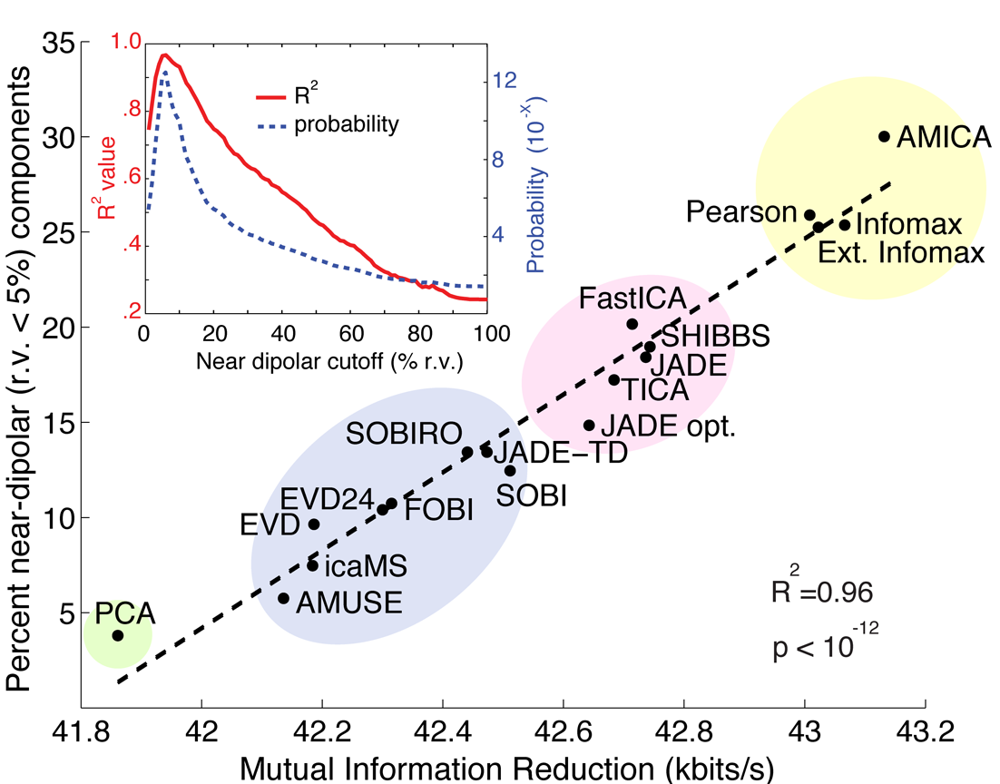
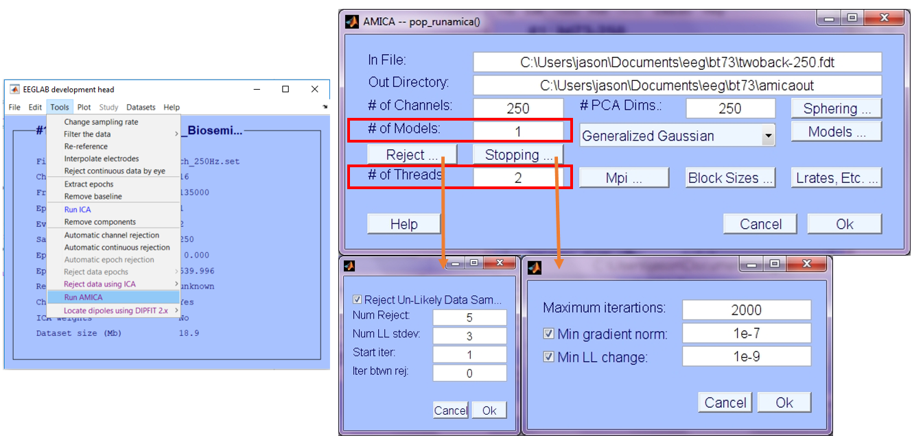
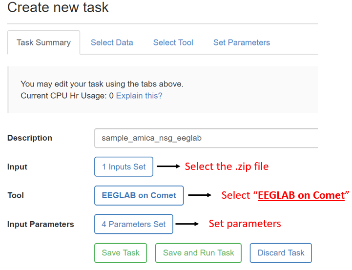
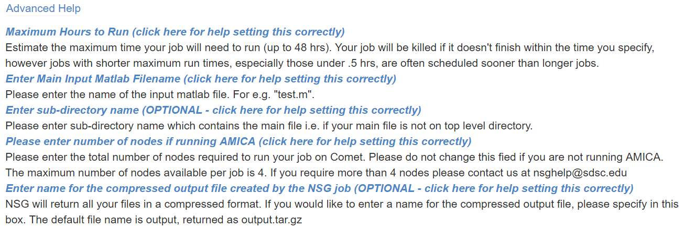
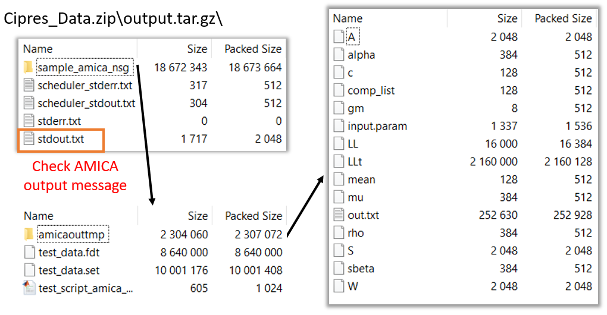

AMICA is developed by Jason Palmer ([Palmer, ICASSP,
2008](https://sccn.ucsd.edu/~jason/icassp08.pdf), [Palmer, Tech Report,
2012](https://sccn.ucsd.edu/~jason/amica_a.pdf)). Its applications to
EEG data are further validated in [Delorme, Plos One,
2012](https://journals.plos.org/plosone/article?id=10.1371/journal.pone.0030135),
and [Hsu, NeuroImage,
2018](https://sccn.ucsd.edu/~scott/pdf/Hsu18_AMICA.pdf). This tutorial
is mainly written and maintained by Sheng-Hsiou (Shawn) Hsu with links
to Jason's original sources, hoping to provide up-to-date information
and detailed instructions on AMICA.

\(c\) Jason Palmer, University of California San Diego, 2015.

Introduction
------------

Adaptive Mixture Independent Component Analysis (AMICA) is a binary
program (for Linux, Mac, and Windows) that performs an independent
component analysis (ICA) decomposition on input data, potentially with
multiple ICA models. It can be run standalone, or from MATLAB. Key
features of AMICA include:

1.  **Adaptive Source Densities**: the source density models are adapted
    using a mixture of Generalized Gaussian density model, resulting in
    extremely good fit between the density model and the actual density
    of the source being estimated
2.  **Multiple / Mixture Models**: AMICA allows multiple ICA models to
    be learned simultaneously, automatically segmenting the data into
    regions of local stationarity, and returning a set of components for
    each model. AMICA can also be set to share components between models
    to increase estimation efficiency
3.  **Data Likelihood (Model Probability)**: likelihood of each model
    for given and new data is available, allowing rejection of unlikely
    data, as well as classification of new data
4.  **Parallel Implementation**: program can use multiple cores in
    single workstations (using portable OpenMP code), as well as
    multiple nodes in a cluster (using portable MPI code). All binaries
    allow multi-core (SMP) execution. Only the Linux version currently
    supports clusters (we use the freely available Rocks / Sun Grid
    Engine)

#### AMICA Mathematical Explanation

For an explanation of how AMICA works, see this
[page](Amica-Mathematical-Explanation).

#### AMICA software releases

-   [AMICA on Github](https://github.com/japalmer29/amica) (contains the
    latest version)
-   [AMICA plugin for EEGLAB: direct
    download](http://sccn.ucsd.edu/eeglab/plugins/amica1.5.1.zip)
    (contains the latest stable version)

#### AMICA tutorials

-   [AMICA tutorial slides for EEGLAB
    workshop](https://sccn.ucsd.edu/mediawiki/images/3/3f/EEG_Nonstationarity_and_AMICA.pdf)
-   [A tutorial introduction to AMICA applied to generated example
    data.](https://sccn.ucsd.edu/wiki/Amica)

Why AMICA?
----------

### First reason: AMICA achieves better ICA decomposition than other ICA approaches

With a complex model that has more parameters to learn, AMICA can
achieve an (empirically) more accurate ICA decomposition. [Arnauld
Delorme et al. in
2012](https://journals.plos.org/plosone/article?id=10.1371/journal.pone.0030135)
compared several ICA algorithms and showed that AMICA outperformed all
other ICA approaches in terms of obtaining higher mutual information
reduction and more near-dipolar ICs.

This reason itself already makes AMICA attractive. But AMICA has a
capability that has been long-time overlooked – learning a mixture of
ICA models.

### Second reason: Multi-model AMICA for modeling EEG dynamics and brain state changes

[Hsu and Jung,
2017](https://www.researchgate.net/profile/Sheng-Hsiou_Hsu/publication/317671281_Monitoring_alert_and_drowsy_states_by_modeling_EEG_source_nonstationarity/links/59c52eeda6fdccc71914d395/Monitoring-alert-and-drowsy-states-by-modeling-EEG-source-nonstationarity.pdf)
hypothesizes that transitions of brain states involve changes in
cortical networks activities which can be identified by distinct ICA
models. This hypothesis motivates the application of <u>AMICA – with
multiple ICA models – as a data-driven approach to modeling
nonstationary dynamics of continuous and unlabeled data.</u>

Recent studies ([Hsu et al., NeuroImage,
2018](https://www.sciencedirect.com/science/article/pii/S1053811918306888)
and [Hsu et al., BioCAS,
2018](https://ieeexplore.ieee.org/abstract/document/8584715)) apply
multi-model AMICA to modeling EEG dynamics that are associated with
brain state changes. We demonstrate that multi-model AMICA can
characterize EEG dynamics during sleep for automatic staging, assess
transitions between alert and drowsy states in a simulated driving
experiment, and uncover mental state changes during a guided-imagery
meditation / hypnotherapy. Some empirical results are presented in this
section.

We encourage researchers to test the
capability of multi-model AMICA in detecting and modeling different
cognitive or mental states. For more details, we recommend
reading the paper ([Hsu, NeuroImage,
2018](https://www.sciencedirect.com/science/article/pii/S1053811918306888),
[PDF](https://sccn.ucsd.edu/~scott/pdf/Hsu18_AMICA.pdf))

### Third reason: Powered by parallel processing and supercomputer

It is important to point out that AMICA achieves better performance by
requesting more computational resources to learn a more complex model
and thus requiring longer runtime. Fortunately, AMICA’s inventor, Jason
Palmer, derived a Newton-based learning rule and devised a
parallel-processing-enabled, pre-compiled program that makes AMICA
learning process feasible (e.g. can finish in a few hours instead of a
few days).

In 2018, the NIH-funded Neuroscience Gateway (NSG) project aims to
provide researchers (free) access to computing power on supercomputer
clusters to speed up computation-heavy process, including AMICA. With
access to 24 cores per node and potentially to multiple nodes on the
supercomputer, the runtime of AMICA can be significantly reduced. More
details on how to get access to NSG and how to run AMICA on NSG, please
see
[below](https://github.com/japalmer29/amica/wiki/AMICA#how-to-run-amica-option-2-neuroscience-gateway-nsg).

What is AMICA?
--------------

### AMICA in a nutshell:

The figure below gives a schematic overview of the architecture of AMICA
and its models.

AMICA consists of three layers of mixing:

-   *First layer*: mixture of ICA models <m>\\mathbf{A}_1</m>, ... ,
    <m>\\mathbf{A}_H</m> that learn the underlying data clusters, as
    shown in the illustration using simulated data from Laplace and
    uniform distribution.
-   *Second layer*: mixture of independent components (IC)
    <m>\\mathbf{A}_{h1}</m>, ..., <m>\\mathbf{A}_{hN}</m> that
    decompose the data cluster into statistically independent sources'
    activations <m>\\mathbf{s}_{h1}</m>, ..., <m>\\mathbf{s}_{hN}</m>.
-   *Third layer*: mixture of generalized Gaussian distribution
    <m>q(s;\\rho,\\mu,\\beta)</m> that approximate the probability
    distribution of the source activation <m>p(\\mathbf{s})</m>

<!-- -->

-   [A tutorial introduction to AMICA applied to generated example
    data.](https://sccn.ucsd.edu/wiki/Amica)

How to run AMICA? Option 1: AMICA plugin for EEGLAB
---------------------------------------------------

### Download AMICA

You can download the latest AMICA plugin via the EEGLAB extensions
manager from your EEGLAB.

1.  Open EEGLAB GUI
2.  Open File --\> Manage EEGLAB extensions --\> Data processing
    extensions
3.  Install Plugin *AMICA* (Current version 1.5.1, last updated
    Oct. 2018)

Alternatively, you can [download the AMICA plugin
folder](http://sccn.ucsd.edu/eeglab/plugins/amica1.5.1.zip) or [fork the
AMICA repository on Github](https://github.com/japalmer29/amica)
directly and put it under the */eeglab/plugins/* folder. More
instructions on how to download and install EEGLAB plugins can be found
in the [EEGLAB Extensions Wiki
page](https://sccn.ucsd.edu/wiki/EEGLAB_Extensions).

Note: the following sources may not be up-to-date

-   Amica Download on wiki: [Amica Download](Amica-Download)

### Install AMICA

The downloaded *amica1.5.1* package (not *amica1.5*) should contain all
of the compiled binary files for different OS.

-   **Linux/Unix Users**: Plug-and-play! May need to recompile only if
    runs with multiple nodes or threads.
-   **Windows Users**: Install *MPICH2* (32-bit: *mpich2-1.4-win-ia32*
    or 64-bit: *mpich2-1.4-win-x86-64*), which is included in the
    *amica1.5.1* folder. Otherwise they can be downloaded from
    <http://www.mpich.org/static/downloads/1.4/>
-   **Mac Users**: Change the permissions of the binary file
    *amica15mac* to executable. Run "Terminal" from the Go-\>Utilities
    menu, then at the prompt run:

`   cd `<put your eeglab path here>`/eeglab/plugins/amica1.5.1`
`   chmod 777 amica15mac`

For further information, follow [the instruction written by Jason
Palmer](https://sccn.ucsd.edu/~jason/amica_web.html).

### Run AMICA

-   **From EEGLAB GUI**

1.  Tool --\> Run AMICA
2.  Follow the [Amica 1.5 EEGLAB GUI Interface
    Help](https://sccn.ucsd.edu/~jason/amica_help.html) for setting the
    input parameters

-   **Using matlab script**: sample script below:

        EEG = pop_loadset(‘test_data.set');
    
        % define parameters
        numprocs = 1;       % # of nodes (default = 1)
        max_threads = 1;    % # of threads per node
        num_models = 1;     % # of models of mixture ICA
        max_iter = 2000;    % max number of learning steps
    
        % run amica
        outdir = [ pwd filesep 'amicaouttmp' filesep ];
        [weights,sphere,mods] = runamica15(EEG.data, 'num_models',num_models, 'outdir',outdir, ...
            'numprocs', numprocs, 'max_threads', max_threads, 'max_iter',max_iter);
    
        % type “help runamica15()” for a full list and explanation of the parameters

How to run AMICA? Option 2: Neuroscience Gateway (NSG)
------------------------------------------------------

EEGLAB scripts may now be run on high-performance computing resources
via the freely available [Neuroscience Gateway
Portal](https://www.nsgportal.org/) to the NSF-sponsored [Comet
supercomputer](https://ucsdnews.ucsd.edu/pressrelease/sdsc_to_double_comet_supercomputers_graphic_processor_count/)
of the [San Diego Supercomputer Center](https://sdsc.edu/). NSG accounts
are free and are not limited to US users, but the portal may only be
used for non-commercial purposes. You can visit [EEGLAB on
NSG](https://github.com/sccn/nsgportal/wiki) page for more
information.

Computationally expensive operations such as AMICA analysis will be
directly benefited with the access to multiple nodes, each with 24
threads / cores, on the Comet supercomputer, which significantly reduces
the runtime of AMICA and the expense of local computing resources.

### Through NSG website

1\. **Create an NSG account and login:** Follow the [instructions -
EEGLAB on
NSG](https://github.com/sccn/nsgportal/wiki)

2\. **Prepare a MATLAB script that runs AMICA:** You can also include
EEGLAB preprocessing steps and post-analyses. A sample code below:

    %% test_script_amica.m
    % add eeglab to path
    eeglab; close;
    
    % load dataset
    filepath = [ pwd filesep ];
    filename = 'test_data.set';
    EEG = pop_loadset(filename, filepath);
    
    % define parameters
    numprocs = 1;       % # of nodes (1-4: default 1)
    max_threads = 24;   % # of threads (1-24: default = 24)
    num_models = 1;     % # of models of mixture ICA
    max_iter = 2000;    % max number of learning steps
    
    % run amica on NSG
    outdir = [ pwd filesep 'amicaouttmp' filesep ];
    runamica15(EEG.data, 'num_models',num_models, 'outdir',outdir, ...
        'numprocs', numprocs, 'max_threads', max_threads, 'max_iter',max_iter);

The *runamica15* function will call the binary compiled on Expanse supercomputer that allows for
multi-threads and multi-nodes parallel processing. Comprehensive parameters evaluation haven't been completed yet for AMICA on Expanse. But the parameters recommended for the old Comet system still works on Expanse. Recommend set
*max_threads* to 24 since each submitted job will be assigned a node
which contains 24 cores on Comet. Requesting more than 1 node is made
available by setting *numproc* larger than 1 (max 4 nodes). Be sure to
make the number consistent with the input parameters set while
submitting the job on NSG (see step 4).

 3. **Prepare a data folder:**
make sure you have the following files in the folder: (1) a Matlab
script, which runs AMICA analysis, and (2) EEG data file(s) called in
the script.

4\. **Upload the zipped folder to NSG:**

5\. **Create new task and set input parameters:**

When you click the *set parameters* button, you will see the tab below:

For running AMICA, make sure the number of
nodes matches the *numprocs* in the matlab script because in the
NSG back-end different commands are called for single- vs.
multiple-nodes tasks. It is also advised to set the max hours to be 48
hours to ensure you get the max available computation time. Click the
hyperlink on any of the parameter setting description will lead you to
the below advanced help message:

6\. **Save and run task, view submitted job status, and download the
output file:** See the [EEGLAB on NSG
page](https://github.com/sccn/nsgportal/wiki)
for detailed instructions.

### Through EEGLAB plugin - nsgportal

(Updated 07/15/2019) Now EEGLAB plugin - nsgportal - supports access to
NSG. EEGLAB users can now submit and manage jobs to NSG using EEGLAB GUI
or command line by installing the nsgportal. For more information and
detailed instruction, please visit its [Github
page](https://github.com/sccn/nsgportal/wiki).

Parallel processing capability
------------------------------

The AMICA program is capable of scheduling and running on multiple
threads. In 2018, the NIH-funded Neuroscience Gateway (NSG) project aims
to provide researchers (free) access to computing power on supercomputer
clusters to speed up computation-heavy process, including AMICA. With
access to 24 cores per node and potentially to multiple nodes on the
supercomputer, the runtime of AMICA can be significantly reduced.

### Runtime analysis

AMICA runtime is proportional to the number of data samples (T) and the
total number of parameters to be estimated (M x N^2 + M x N x (4k + 1) +
M), where M is the number of models, N is the number of channels, and K
is the number of generalized Gaussians for estimating the PDFs.

Analysis for the new Expanse supercomputer is still pending. Below is the runtime analysis of AMICA with multiple threads on [Comet,
San Diego Supercomputer Center
(SDSC)](https://www.sdsc.edu/support/user_guides/comet.html):

-   Benchmark data: 30-channel EEG, 1.7 million data samples.
-   AMICA parameters: default
-   Comet computing resources: 24 cores per node. NSG user can access 4
    nodes at max for running AMICA.
-   Comet CPU spec: Intel Xeon E5-2680v3 processors, 2.5 GHz.

Below is the runtime analysis of AMICA on different datasets with
various sizes using 1 node, 24 cores.

How to analyze AMICA results?
-----------------------------

EEGLAB users can use postAMICAutility toolbox (download
[here](http://sccn.ucsd.edu/eeglab/plugins/postAmicaUtility2.01.zip))
for reading and analyzing AMICA output. Please see the [AMICA tutorial
slides for EEGLAB
workshop](https://sccn.ucsd.edu/mediawiki/images/3/3f/EEG_Nonstationarity_and_AMICA.pdf)
pp. 22-25 for a quick overview. Detailed description can be found in
[Hsu, NeuroImage,
2018](https://sccn.ucsd.edu/~scott/pdf/Hsu18_AMICA.pdf).