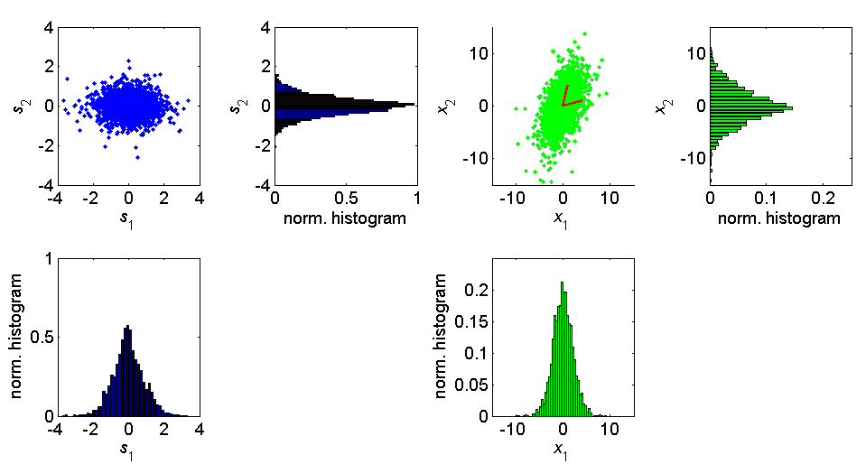
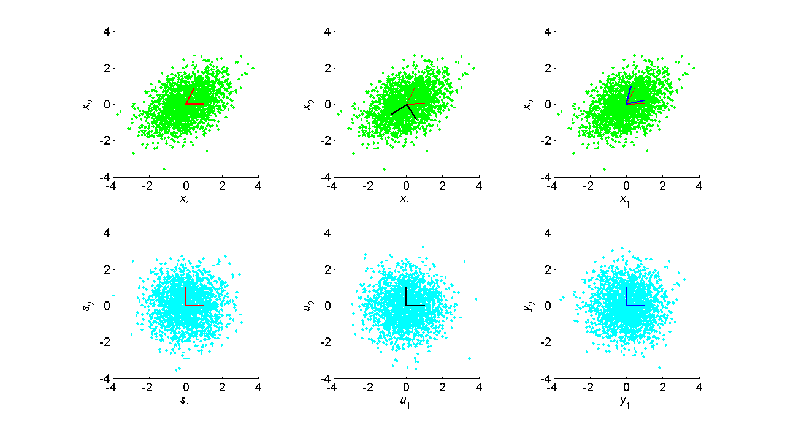
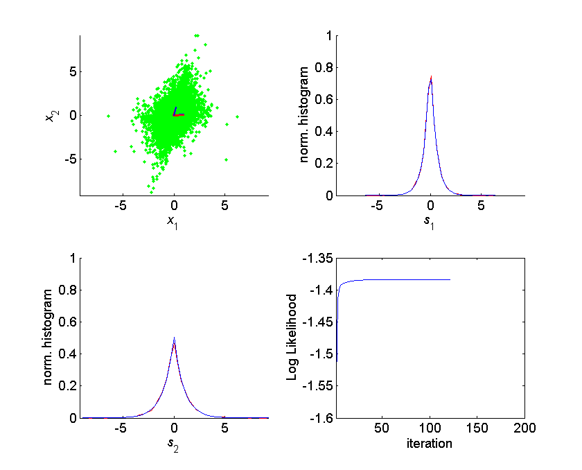
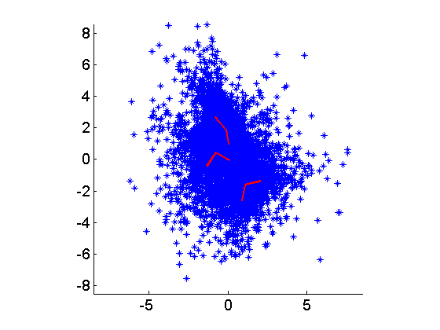

This page is about the Amica algorithm itself. For installation and
application of Amica, refer to this [page](AMICA) instead.

This page provides a tutorial introduction to ICA using the Amica
algorithm and Matlab. <span style="color:#0000FF">For general tutorial
and information on Amica, including how to run Amica and how to analyze
Amica results, [visit this
page](AMICA).</span>

### **Introduction**

<font size=3> We will first illustrate the tools using generated example
data. For this purpose, we provide a matlab function to generate data
from the Generalized Gaussian distribution. A description, as well as
the notation we will use for the Generalized Gaussian density can be
found here:

[Generalized Gaussian Density](Generalized-Gaussian-Probability-Density-Function)

Further mathematical background and detail can be found at the following
pages:

[Linear Representations and Basis
Vectors](Linear-Representations-and-Basis-Vectors)

[Random Variables and Probability Density
Functions](Random-Variables-and-Probability-Density-Functions)

Let us consider first the case of two independent Generalized Gaussian
sources with shape parameter .


In Matlab, using the function gg6.m (available in the Matlab code
section of the above Generalized Gaussian link), we can generate
 of these sources with the command:
`s = gg6(2,2000,[0 0],[1 3],[1.5 1.5]);`

Suppose our basis vectors and source vectors are given by:


In Matlab:

```
A = [1 4 ; 4 1];
x = A*s;
```





Matlab code used to generate this figure is here:
[LT_FIG.m](ICA_FIG.m)

PCA
---

PCA can be used to determine the "principle axes" of a dataset, but it
does not uniquely determine the basis associated with the linear model
of the data,


PCA is only concerned with the second order (variance) characteristics
of the data, specifically the mean, , andcovariance,


For independent sources combined linearly, the covariance matrix is just
(assuming zero mean),


where  is the diagonal matrix of source variances.Thus any basis, , satisfying,


will lead to a covariance matrix of . And sincethe decorrelating matrices are all determined solely based on the
covariance matrix, it is impossible to determine a unique linear basis
from the covariance alone. Matrices, unlike scalar real numbers,
gnerally have an infinite number of "square roots". See
[Linear Representations and Basis Vectors](Linear-Representations-and-Basis-Vectors)
for more information. As shown in that section, PCA can be used to
determine the subspace in which the data resides if it is not full rank.

To further illustrate the non-uniqueness of the PCA basis, consider the
following figure in which  (i.e. Laplacian)sources are combined with the linear matrix,

```
N = 2000;
A = [1 2 ; 4 0.1];
A(:,1)=A(:,1)/norm(A(:,1));
A(:,2)=A(:,2)/norm(A(:,2));
s = gg6(2,N,[0 0],[1 3],[1 1]);
x = A*s;
```

We produce two sets of decorrelated sources, one that simply projects
onto the eigenvectors, and the other which uses the unique symmetric
square root "sphering" matrix (see [Linear Representations and Basis
Vectors](Linear-Representations-and-Basis-Vectors) for more
detail.)

```
[V,D] = eig(x*x'/N);
Di = diag(sqrt(1./diag(D)));
u = Di * V' * x;
y = V * Di * V' * x;
```


Similarly for  sources,
```
s = gg6(2,2000,[0 0],[1 3],[10 10]);
x = A*s;
```


Gaussian sources, unlike non-Gaussian sources, are completely determined
by second order statistics, i.e. mean and covariance. If Gaussian random
variables are uncorrelated, then they are independent as well.
Futhermore, linear combinations or Gaussians are Gaussian. So linearly
mixed Gaussian data is Gaussian with covariance matrix,

```
s = gg6(2,2000,[0 0],[1 3],[2 2]);
x = A*s;
```


And any of the infinite number of root matrices satisfying this equation will yield Gaussian data with identical
statistics to the observed data.





As seen in the bottom row, the joint source density is radially
symmetric, i.e. it "looks" exactly the same in all directions. There is
no additional structure in the data beyond the source variances and the
covariance. To fix a particular solution, constraints must be placed on
the variance of the sources, or the norm of the basis vectors. However,
this generally cannot be done since the ICA model assumes only
independence of the sources. The source or basis vector norm is usually
fixed, which determines the magnitude of the non-fixed variance or norm.

Fortunately, real sources are usually non-Gaussian, so if the ICA model
holds and the sources are independent, then there is a unique basis
representation of the data such that the sources are independent.

Basic ICA
---------

Let's take some two dimensional data following the ICA model.

```
s = gg6(2,2000,[0 0],[1 3],[1 1]);
A = [1 2 ; 4 0.1];
x = A*s;
```

The program amica_ex.m will be used to illustrate ICA using the Amica
algorithm. The output is shown below:





We can also experiment with multimodal sources using the function
ggrandmix0.m:

```
s = ggrandmix0(2,20000,3); % random 2 x 20000 source matrix, with 3 mixtures in each source density
x = A*s;
```


Multiple Models
---------------

In the same way we created complex mixture source densities by combining
a number of Generalized Gaussian constituent densities, we can create a
complex data model by combining multiple ICA models in an ICA mixture
model. The likelihood of the data from a single time point, then is
given by,


where  and <m>\theta_h"> are the mixing matrixand density parameters associated with model .


We can use the program ggmixdat.m to generate random ICA mixture model
data with random Generalized Gaussian sources:

`[x,As,cs] = ggmixdata(2,2000,3,[1 1; 1 1],ones(2,2),2);`

We use the program amica_ex.m to illustate:

`[A,c,LL,Lt,gm,alpha,mu,beta,rho] = amica_ex(x,3,1,200,1,1e-6,1,0,1,As,cs);`





The output is shown below:


Given a mixture model, we can use Bayes' Rule to determine the posterior
probability that model  generated the data at time point. Let <m>M_t"> be the index of the model active at time point. Then for the probability of model <m>h"> given, we have,


A plot of the posterior log likelihood given each model is shown below.
<center>


</center>

</font>
