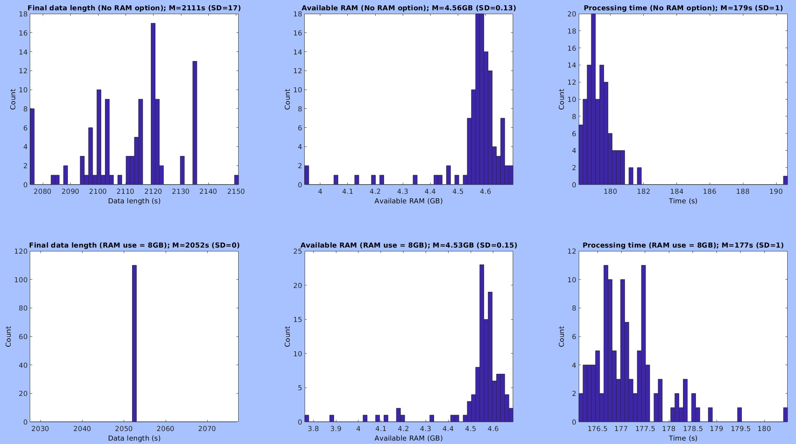

To view the plugin source code, please visit the plugin's [GitHub repository](https://github.com/sccn/clean_rawdata).

Historical Background (01/07/2020 updated)
------------------------------------------

ASR was originally developed by [Christian
Kothe](https://intheon.io/team/#christian-kothe), now Intheon CTO. It
was a part of [BCILAB](https://sccn.ucsd.edu/wiki/BCILAB) for online
data cleaning. See their famous demo
[here](https://www.youtube.com/watch?v=qYC_3SUxE-M). In the spring of
2013, I asked Christian to make the offline version. In response, he
gave me the custom version of his ASR for offline use. I wrapped it up
into an
[clean_rawdata()](https://sccn.ucsd.edu/mediawiki/index.php?title=Plugin_list_all&action=submit)
for EEGLAB plugin. Below is cited from Supplement of [Miyakoshi et al.
(2020)](https://academic.oup.com/cercorcomms/article/1/1/tgaa046/5881803?login=true).

> ...A historical fact is that the offline version of artifact subspace
> reconstruction (ASR) implemented in clean_rawdata() plugin, which is
> now validated by multiple studies (Mullen et al. 2015; Chang et al.
> 2018, 2019; Gabard-Durnam et al. 2018; Blum et al. 2019;
> Plechawska-Wojcik et al. 2019), was specifically developed for this
> project upon our request by the main developer of BCILAB (Kothe and
> Makeig 2013). The original solution was called *Christian-Nima Combo*
> after the developpers, but formally changed into clean_rawdata() on
> June 26, 2013 to be implemented as an plugin for EEGLAB (Delorme and
> Makeig 2004).

How it is organized
-------------------

The core function*clean_artifacts()* consists of five subfunctions,
which form a versatile pipeline for the most upstream preprocessing.

1.  clean_flatlines()-This is to remove a channel that has a dead flat
    line longer than certain length.
2.  clean_drifts()-This is an IIR filter. You have to enter transition
    bandwidth (if you don't know that it is, see [this
    page](https://sccn.ucsd.edu/wiki/Firfilt_FAQ#Q._What_are_passband.2C_stopband.2C_transition_band_width.2C_cutoff_frequency.2C_passband_ripple.2Fringing.2C_and_stopband_ripple.2Fattenuation.3F)).
3.  clean_channels()/clean_channels_nolocs()-This is to reject so-called
    'bad channels'. If channel location data is available, it calculates
    each channel's correlation to its RANSAC reconstruction for each
    window (it mode was specially added later in the spring of 2014). If
    channel location is unavailable, it calculates each channel's
    correlation to all others.
4.  **clean_asr()**-This does the real magic. The documents linked in
    this page will explain the mechanism in detail. In a nutshell, it
    uses a sliding window (default 0.5 s, overlap 50%) to PCA-decompose
    all the channels to identify a 'bad' PCs (defined by a comparison
    against the data's own cleanest part in frequency-enhanced RMS) to
    reject and reconstruct the rejected PC activity from the remaining
    components.
5.  clean_windows()-This performs the final window rejection. If a
    sliding window (default 1.0 s. overlap 66%) finds more than given
    percentage of bad channels even after ASR, the window is rejected.
    By disabling this function, you can keep the data length to be the
    same between before and after the processing, if necessary.

Download
--------

ASR is implemented in an EEGLAB plugin clean_rawdata(), which you can
download and install via EEGLAB plugin manager (from EEGLAB main GUI).
Alternatively, you can download it manually from [this
page](http://sccn.ucsd.edu/eeglab/plugin_uploader/plugin_list_all.php),
unzip it, and locate the folder under eeglab/plugins.

### Download ver 1.10 (old)

clean_rawdata() is no longer maintainned by Makoto Miyakoshi (me). But
there was a report that the newer version re-introduced the problem of
result replicatability. The behavior of the algorithm is identical
except for options such as support for Riemanian geometry. In case
people need to guarantee the result replicatability (I do), I uploaded
my final version here. Use 'availableRAM_GB' option as described below.
[clean_rawdata1.10](files/Mmiyakoshi-clean-rawdata.zip)

Reference (07/09/2020 update)
-----------------------------

-   [Plechawska-Wojcik M, Kaczorowska M, Zapala D. (2019). The artifact
    subspace reconstruction (ASR) for EEG signal correction. A
    comparative study in Information systems architecture and
    technology. proceedings of 39th international conference on
    information systems architecture and technology – ISAT 2018: part II
    (Advances in intelligent systems and computing)
    853:125-135.](https://www.researchgate.net/publication/327272493_The_Artifact_Subspace_Reconstruction_ASR_for_EEG_Signal_Correction_A_Comparative_Study)
    "*The paper presents the results of a comparative study of the
    artifact subspace re-construction (ASR) method and two other popular
    methods dedicated to correct EEG artifacts: independent component
    analysis (ICA) and principal component analysis (PCA).*" However, I
    recommend one should use ASR as a preprocessing for ICA, not as an
    alternative.

<!-- -->

-   [Blum S, Jacobsen NSJ, Bleichner MG, Debener S. (2019) A riemannian
    modification of artifact subspace reconstruction for EEG artifact
    handling. Front Hum Neurosci.
    13:141.](https://www.frontiersin.org/articles/10.3389/fnhum.2019.00141/full)
    *"Compared to ASR, our rASR algorithm performed favorably on all
    three measures. We conclude that rASR is suitable for the offline
    and online correction of multichannel EEG data acquired in
    laboratory and in field conditions."*

<!-- -->

-   [Chang C-Y, Hsu S-H, Pion-Tonachini L, Jung T-P. (2019). Evaluation
    of Artifact Subspace Reconstruction for Automatic Artifact
    Components Removal in Multi-channel EEG Recordings. IEEE Trans
    Biomed Eng. 2019
    Jul 22.](https://ieeexplore.ieee.org/abstract/document/8768041)
    "*...Conclusions: Empirical results show that the optimal ASR
    parameter is between 20 and 30, balancing between removing non-brain
    signals and retaining brain activities.*"

<!-- -->

-   [Chang C-Y, Hsu S-H, Pion-Tonachini L, Jung T-P. (2018). Evaluation
    of Artifact Subspace Reconstruction for Automatic EEG Artifact
    Removal. Conf Proc IEEE Eng Med Biol Soc.
    2018](https://www.researchgate.net/publication/325921646_Evaluation_of_Artifact_Subspace_Reconstruction_for_Automatic_EEG_Artifact_Removal)
    This is the first paper that evaluated the parameter for ASR. Very
    valuable.

<!-- -->

-   [Gabard-Durnam LJ, Mendez Leal AS, Wilkinson CL, and Levin AR (2018)
    The Harvard Automated Processing Pipeline for Electroencephalography
    (HAPPE): Standardized Processing Software for Developmental and
    High-Artifact Data. Frontiers in Neuroscience,
    12:97](https://www.frontiersin.org/articles/10.3389/fnins.2018.00097/full)
    *ASR was used to interpolate artifact “bursts” with variance more
    than 5 standard deviations different from the automatedly detected
    clean data, as in prior work wit the clinical populations (Grummett
    et al., 2014). Data segments postinterpolation were removed with a
    time-window rejection set ting of 0.05 (aggressive segment
    rejection). Data were then submitted to ICA and MARA component
    rejection (as in HAPPE). HAPPE retained more EEG data than the ASR
    approach across all measures. Although ASR was designed for brief
    “bursts” of artifact in otherwise clean data, due to the high degree
    of artifact contamination in the developmental data, the ASR
    approach interpolated an average of 35.7% of the EEG data per file,
    which may constitute a prohibitively high interpolation rate... ASR
    approach performed less successfully than HAPPE across all measures
    in the context of developmental resting-state EEG files.* Thank you
    very much. My comments are addressed below.

<!-- -->

-   [Mullen TR, Kothe CA, Chi YM, Ojeda A, Kerth T, Makeig S, Jung TP,
    Cauwenberghs G. (2015). Real-Time Neuroimaging and Cognitive
    Monitoring Using Wearable Dry EEG. IEEE Trans Biomed Eng. 2015
    Nov;62(11):2553-67. doi: 10.1109/TBME.2015.2481482. Epub 2015
    Sep 23.](https://www.ncbi.nlm.nih.gov/pubmed/26415149) Note that
    this paper does NOT describe ALL the steps of ASR. See also the
    Supplementary Materials below for more details.

<!-- -->

-   [Kothe CA, Makeig S. (2013) BCILAB: a platform for brain-computer
    interface development. J Neural Eng.
    10:056014.](https://pubmed.ncbi.nlm.nih.gov/23985960/) "*bad
    subspace removal*" under "Signal processing algorithms-Artifact
    rejection"

### Does ASR removes signal and noise altogether? (01/07/2020)

Qualitatively speaking, yes, but it is in the sense that no method can
separate noise from signal perfectly. Thus I do not mean, as the English
saying goes, ASR 'throws the baby out with the bathwater.' The reality
is that much more noise is rejected than signal (otherwise what is the
point?) However, to demonstrate it with quantitative evidence requires a
well-designed simulation study. I attempted it, the report of which can
be found in the Section 5 of the Supplementary Materials for [Miyakoshi
et al.
(2020)](https://academic.oup.com/cercorcomms/article/1/1/tgaa046/5881803?login=true).
I concluded that under the conditions I defined there, ASR+ICA approach
gives advantage of 7-13 dB of SNR gain. If you are interested in, please
check out the article.

Comments to the HAPPE paper, and how to choose the critical parameters
----------------------------------------------------------------------

1\) The SD threshold used was too aggressive: According to [Chang et al.
(2018)](https://www.researchgate.net/publication/325921646_Evaluation_of_Artifact_Subspace_Reconstruction_for_Automatic_EEG_Artifact_Removal),
if SD = 5 is used, as they did, then 90% of data points will be modified
and 80% of the original variance will be lost, according to this paper.
You don't want to do this. The same paper concluded that threshold SD =
10-100 is recommended. Important note: here, the definition of SD is

1.  choosing data's cleanest part
2.  apply a custom frequency equalization filter that has a profile of
    inverse of EEG power spectral density (PSD) to 'exaggerate'
    non-brain-like power
3.  Calculate RMS of the data
4.  z-score the data

Because the distribution of the finally obtained z-scores is so tight,
which means the cleanest part of data is too clean compared with noisy
part of the same data, we need to use somewhat unusual cutoff values of
SD=10 or 20. We once had discussion over this issue with Christian. He
suggested we may want to use a different metric here, because SD=10 or
20 is unusually high, which indicates inappropriate use of the current
metric. Indeed, in our unpublished data of cleaning method comparison
conducted by Nima Bigdely-Shamlo (who developed [Measure
Projection](https://github.com/bigdelys/measure_projection),
[PREP](https://www.frontiersin.org/articles/10.3389/fninf.2015.00016/full),
etc.), ASR with SD==20 recorded the best among other 20 methods. So
starting with SD==10 to 20 is recommended.

2\) Too aggressive window rejection: They also used window rejection of
0.05, which is also very aggressive.

3\) After all, it was our fault--ASR has been there for years without
being explained well (and still not! There are \>30 main and optional
parameters to explore), not to mention how to optimize the parameters
based on empirical testing. The poor choices of the critical parameters
shown in the HAPPE paper was unfortunate but understandable. Hopefully,
we learn from Chiyuan's paper [Chang et al.
(2018)](https://www.researchgate.net/publication/325921646_Evaluation_of_Artifact_Subspace_Reconstruction_for_Automatic_EEG_Artifact_Removal),
which was published shortly after the HAPPE paper, to use ASR and
related functions reasonably.

Supplementary Materials
-----------------------

[A power point slides by Christian Kothe](files/ASR.pdf):
This is a nice explanation of the principle by Christian himself.

[The most detailed description of
ASR](files/AsrDescription.pdf): I wrote probably the **most
detailed (but still without all the details) description of ASR** with
great help of my colleagues, Chiyuang Chang and Shawn Hsu. This is one
of supplements from Loo et al. (2019).

[ASR for dummies](files/AsrForDummies_ver21_web.pdf): I
also made a presentation material to explain the principle of ASR using
an analogy.

[My EEGLAB workshop
slides:](files/PreprocessingPipelineAndUtilityTools.pdf)
This is the file I distributed in [the 25th EEGLAB workshop at JAIST
Tokyo satellite, Tokyo](https://eeglab.org/workshops/EEGLAB_2017_Japan.html).

Theoretical justification for using ASR as ICA's preprocessing
--------------------------------------------------------------

An important thing to remember is that

-   ASR == non-stationary method (i.e., it uses sliding window PCA)
-   ICA == stationary method (i.e., only one spatial filter is used
    throughout the recording), and data stationarity (i.e., no glitches
    or bursts) is a required assumption.

In other words,

-   ASR == good at removing occasional large-amplitude noise/artifacts
-   ICA == good at decomposing constant fixed-source
    noise/artifacts/signals

In this way, both methods are complementary to each other. PCA is
certainly too simple to explain EEG. But, if the current goal is to
identify 'occasional large-amplitude noise/artifact' to make ICA work
easier (by increasing data stationarity), it is sufficient.

Version 1.00 update details (updated 03/27/2019)
------------------------------------------------

As mentioned above, clean_rawdata() has been available as a EEGLAB
plugin since 2013. In the spring of 2019, I made a major update.
Important confirmation is that this update did NOT change any core
algorithms, so the results from the calculation will be the \*same\*
given same parameters--but I will give you more detail about the exact
replicatability of the output. The changes made in this update are
twofold:

### The option 'availableRAM_GB' is available to fix the length of final output.

We noticed that even if we use the same parameters, the final results
from clean_rawdata() fluctuated. This is because when ASR is performed,
it determines the number of chunks according to the available amount of
RAM, which is obtained by hlp_memfree(), which calls
getFreePhysicalMemorySize(), under private folder. Because the available
amount of RAM is dynamically calculated literally moment by moment,
every time this function is called, it returns different values. This is
the cause of fluctuating final data length, since different chunking
results in different ASR results, hence different final window rejection
result. Here, I made a simple test shown below to determine if fixing
the available amount of RAM fixes the output data length.

``` matlab
EEG = pop_loadset('filename','asrTestData.set','filepath','/data/projects/makoto/asrTest/'); % 123 ch, 2583s , 250 Hz sampling rate.

% High-pass filter the data.
EEG = pop_firws(EEG, 'fcutoff', 0.5, 'ftype', 'highpass', 'wtype', 'blackman', 'forder', 2750, 'minphase', 0);

% Trim outliers.
EEG = trimOutlier(EEG, -Inf, 1000, 1000, 100); % % 123 ch, 2581s , 250 Hz sampling rate.

resultTable = zeros(110, 6); % Conventional_dataLength, availableRam, processTime, Updated_dataLength, availableRam, processTime
for trialIdx = 1:110

    % ASR with no RAM option.
    currentRam = java.lang.management.ManagementFactory.getOperatingSystemMXBean().getFreePhysicalMemorySize()/(2^30);
    tStart = tic;
    EEG2 = clean_rawdata(EEG, -1, -1, -1, -1, 20, 0.25);
    currentProcessTime = toc(tStart);
    resultTable(trialIdx, 1:3) = [EEG2.pnts, currentRam, currentProcessTime];

    % ASR with 8GB RAM option.
    currentRam = java.lang.management.ManagementFactory.getOperatingSystemMXBean().getFreePhysicalMemorySize()/(2^30);
    tStart = tic;
    EEG2 = clean_rawdata(EEG, -1, -1, -1, -1, 20, 0.25, 'availableRAM_GB', 8);
    currentProcessTime = toc(tStart);
    resultTable(trialIdx, 4:6) = [EEG2.pnts, currentRam, currentProcessTime];
end
```



As shown, fixing the RAM size fixed the length of the output data.
Currently, this is the only way to ensure result replicatability. I
recommend this option is always used.

### All the optional inputs down to *clean_artifacts()* are supported.

Upon a request made by the main EEGLAB developer Arnaud Delorme. One
exception is 'availableRAM_GB' which is delivered to the two functions
in two deeper layers, *asr_calibrate()* and *asr_process()*, via
*clean_asr()*. The list of all 31 optional inputs are shown below. For
detail of each optional input, please refer to the help section of each
function specified.

``` matlab
% Decode all the inputs.
hlp_varargin2struct(varargin,...
    ...
    ... % This section contains 6 basic parameters that corresponds to GUI inputs. The assumption is that users determine these values.
    {'chancorr_crit','ChannelCorrelationCriterion','ChannelCriterion'}, 0.8, ...
    {'line_crit','LineNoiseCriterion'}, 4, ...
    {'burst_crit','BurstCriterion'}, 5, ...
    {'window_crit','WindowCriterion'}, 0.25, ...
    {'highpass_band','Highpass'}, [0.25 0.75], ...
    {'channel_crit_maxbad_time','ChannelCriterionMaxBadTime'}, 0.5, ...
    ...
    ... % This section contains optional inputs for clean_artifacts() (i.e., for the 6 subfunctions). The assumptiion is that the default values are usually used.
    {'burst_crit_refmaxbadchns','BurstCriterionRefMaxBadChns'}, 0.075, ...
    {'burst_crit_reftolerances','BurstCriterionRefTolerances'}, [-3.5 5.5], ...
    {'window_crit_tolerances','WindowCriterionTolerances'},[-3.5 7], ...
    {'flatline_crit','FlatlineCriterion'}, 5,...
    {'nolocs_channel_crit','NoLocsChannelCriterion'}, 0.45, ...
    {'nolocs_channel_crit_excluded','NoLocsChannelCriterionExcluded'}, 0.1, ...
    ...
    ... % This section contains optional inputs for clean_flatlines().
    {'max_allowed_jitter', 'MaxAllowedJitter'}, [], ...
    ...
    ... % This section contains optional inputs for clean_drifts().
    {'attenuation', 'Attenuation'}, [], ...
    ...
    ... % This section contains optional inputs for clean_channels().
    {'clchan_window_len', 'CleanChannelsWindowLength'}, [], ...
    {'num_samples', 'NumSamples'}, [], ...
    {'subset_size', 'SubsetSize'}, [], ...
    ...
    ... % This section contains optional inputs for clean_channels_nolocs().
    {'linenoise_aware', 'LineNoiseAware'}, [], ...
    ...
    ... % This section contains optional inputs for clean_asr().
    {'asr_windowlen','ASR_WindowLength'}, [],...
    {'asr_stepsize','ASR_StepSize'}, [],...
    {'maxdims','MaxDimensions'}, [],...
    {'ref_wndlen','ReferenceWindowLength'}, [], ...
    {'usegpu','UseGPU'}, [],...
    {'availableRAM_GB'}, [],...
    ...
    ... % This section contains optional inputs for clean_windows().
    {'clwin_window_len', 'CleanWindowsWindowLength'}, [], ...
    {'window_overlap', 'WindowOverlap'}, [], ...
    {'max_dropout_fraction', 'MaxDropoutFraction'}, [], ...
    {'min_clean_fraction', 'MinCleanFraction'}, [], ...
    {'truncate_quant', 'TruncateQuantile'}, [], ...
    {'clwin_step_sizes', 'CleanWindowsStepSizes'}, [], ...
    {'shape_range', 'ShapeRange'}, []);
```

### *clean_rawdata()* now stores all the parameters used, including optional inputs, under EEG.etc.clean_rawdata_log

To replicate a result, one needs ALL the input parameters, particularly
'availableRAM_GB'. To make it easier, I decide to make each data set
carry how they are processed with *clean_rawdata()* so that even the
data sets are processed in a batch mode, they can be reproduced without
the original code.

Support
-------

clean_rawdata(), which contains the offline version of ASR, was
developed for a project for a study on chronic tic disorder (PI Sandra
Loo) that was supported by NINDS 80160 and 97484.

Author: Makoto Miyakoshi, Swartz Center for Computational Neuroscience
(SCCN), Institute for Neural Computation, UC San Diego
