To view the plugin source code, please visit the plugin's [GitHub repository](https://github.com/sccn/imat).

# IMAT
Independent Modulator Analysis Toolbox

## What is IMA?
Independent Modulator Analysis (IMA) is a method for decomposing spectral fluctuations of temporally independent EEG sources into ‘spatio-spectrally’ distinct spectral modulator processes. Such processes might might derive from and isolate coordinated multiplicative scaling effects of functionally near-independent modulatory factors, for example the effects of modulations roduced in cortico-subcortical or sensory-cortical loops, or by signalling from brainstem-centered import recognition systems using dopamine, serotonin, noradrenaline, etc. (see schematic figure below from [Onton & Makeig, 2009](https://www.frontiersin.org/articles/10.3389/neuro.09.061.2009/full)). Rather than attempting to decompose the mean power spectrum for a component process to identify narrow-band processes superimposed on a 1/f baseline spectum, IMAT identifies characteristic frequency bands in which spectral power *varies* across time. This allows IMA to find *both* narrow and wide band modes. Also, the identified modes need not be singular. For example, IMA will separate the joint activity of an alpha or mu rhythm and its harmonics from endogenous beta band fluctuations occupying overlapping frequency ranges. IMA is applied to independent component (IC) source processes in the data which can be localized in the brain or to a specific scalp muscle, etc. IMA thereby identifies IC subsets that are co-modulated in a specified IM frequency band; these might be thought of as co-modulation networks with a common influence and susceptibility.

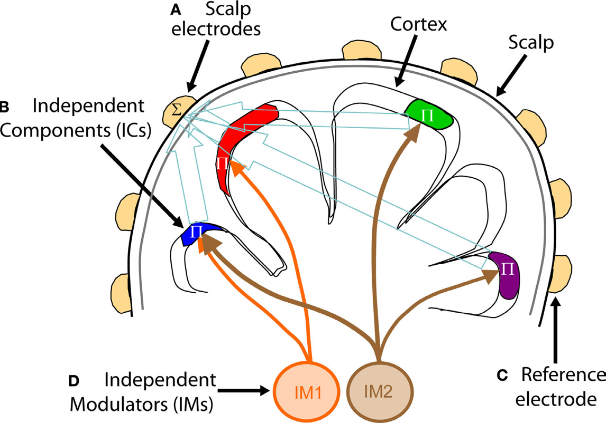  

Many studies of EEG spectral dynamics separate spectrographic data into a set of pre-defined broad or narrow frequency bands, then extract and operate on measures of these bands. Other approaches try to decompose a mean power spectrum itself into wide- and narrow-band portions. However, to better understand the functional roles of local field dynamics contributing to the EEG, as well as individual differences in oscillatory dynamics, more flexible, data-driven models of spectral dynamics are needed.  
 

In the IMA method, multi-channel EEG data are first spatially decomposed using independent component analysis (ICA) into spatially stable, maximally temporally independent component (IC) source processes. Then the temporal fluctuations in the concurrent joint IC log spectrograms are decomposed into independent modulator (IM) processes that are maximally independent *over sources and frequency-weightings* (see schematic figure below from [Onton & Makeig, 2006](https://sccn.ucsd.edu/~julie/HBM2006PosterMini.pdf)). Note again: In IMA decomposition, the independence of the resulting IMs is maximized is **not** across time, but across sources and frequency weights.

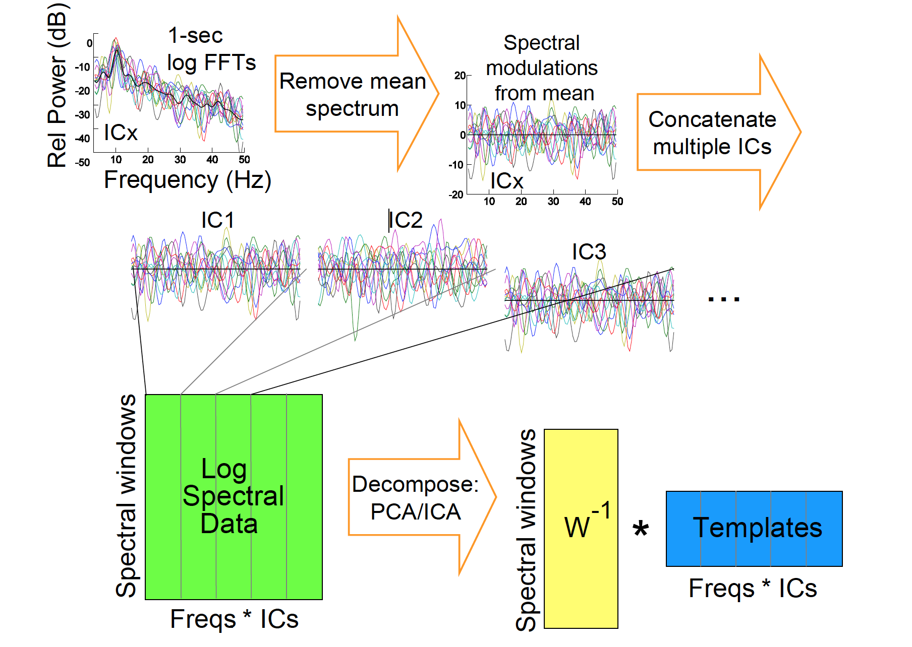 

IMAT has been developed by Johanna Wagner, Ramon Martinez-Cancino, and Scott Makeig based on research by Julie Onton and Scott ([Onton & Makeig, 2009](https://www.frontiersin.org/articles/10.3389/neuro.09.061.2009/full), [Onton & Makeig, 2006](https://sccn.ucsd.edu/~julie/HBM2006PosterMini.pdf)) and Matlab scripts by Julie.

## Installing the IMAT plug-in in EEGLAB
All plug-ins in EEGLAB, including IMAT, can be installed in two ways. To install IMAT:

1. **From the EEGLAB Plug-in Manager:** Launch EEGLAB and select menu item **File > Manage EEGLAB Extensions** in the main EEGLAB window. A plug-in manager window will pop up. Look for and select the IMAT plug-in, then press **Install/Update**.

2. **From the web:** Download the IMAT plug-in zip file either from [this](https://github.com/sccn/imat) GitHub page (select ‘Download Zip‘) or from [this EEGLAB wiki plug-ins page](https://sccn.ucsd.edu/wiki/Plugin_list_all) (select **IMAT**). Decompress the zip file in the plug-ins folder in the main EEGLAB folder (*../eeglab/plugins/*).

Restart EEGLAB. If the installation is successful, a menu item to call IMAT, **Tools > Decompose IC spectograms by IMAT**, will appear in the EEGLAB menu.
 

## Requirements
1. Since IMAT is working on brain sources derived using Independent Component Analysis (ICA) you need to decompose the EEG data into Independent Components (ICs) using ICA decomposition before running IMAT. A description on how to preprocess EEG data and run ICA can be found in the [eeglab Wiki](https://eeglab.org/tutorials/06_RejectArtifacts/RunICA.html#run-ica).
2. For component selection and clustering it is of advantage to also estimate equivalent current dipole models for the brain-based ICs. 
3. For automatic selection of components you need to install the EEGLAB plug-in [IC Label](https://sccn.ucsd.edu/wiki/ICLabel)  
4. For plotting dipole density of clusters you need to install the EEGLAB plug-in Fieldtrip lite.   
5. IMAT can handle either epoched or continuous data. Be aware that for epoched data, the epochs should have length to accomodate at least 3 cycles of the lowest frequency at which IMA is to be computed. 

Please refer to the section above on how to install EEGLAB plug-ins. 

## Single subject analysis

## Running IMAT
Before running IMAT, start EEGLAB and load an EEG dataset.

To run IMAT on the loaded dataset, launch the Run IMA (*pop\_runIMA*) window, either by typing *pop\_runIMA* on the MATLAB command line or by calling it from the EEGLAB menu by selecting **Tools > Decompose spectograms by IMA > Run IMA**,  as highlighted in the figure below.

 
In the resulting window (above right) we can specify:

1. The Independent Components (ICs) on which to run IMA - either a list of components (**IC Indices**) or we can choose to use ICLabel to automatically classify ICs into different types (**ICLabel tags**). IMAT allows you to set individual thresholds for different IC categories in selecting ICs using ICLabel.   
2. Which frequency range in which to compute IMA  (**Freq. limits (Hz)**) 
3. The frequency scale (**Freq scale**) linear of log scale 
4. A factor to regulate dimensionality reduction in the time windows of the spectral data using PCA dimension reduction before ICA decomposition (**pcfac**) - the smaller the *pcfac*, the more dimensions will be retained *ndims = (freqsxICs)/pcfac* where *freqs* is the number of estimated frequencies and *ICs* is the number of ICs (default is 7)
5. Other IMA options (**pop\_runima options**) – e.g., which ICA algorithm to use   (see *pop_runima* help for more details)

**Running IMA from the command line**

*[EEG, IMA] = pop\_runIMA(EEG, 'freqscale', 'log', 'frqlim', [6 120], 'pcfac', 7, 'cycles', [6 0.5], 'selectICs', {'brain'}, 'icatype', 'amica');*

Here we are computing IMA on a single subject's data, selecting ''Brain ICs'' using ICLabel, with parameters for time-frequency decomposition: log frequency scaling, frequency limits: 6 to 120 Hz, wavelet cycles [6 0.5], reducing the dimensions of timewindows
of the time/frequency decomposition using pfac 7, and using AMICA for ICA decomposition.

## The IMA structure
  
*pop\_runIMA* saves the IMA results in an IMA structure, in the same folder as the EEG file it is run on.  

After running IMA (either from the gui or from the command line) type *IMA* in the Matlab command line to display the IMA structure.  
 
Alternatively the IMA file can be loaded using   

*IMA = load([EEG.etc.IMA.filepath '/' EEG.etc.IMA.filename], '-mat');*

**IMA structure**

The IMA structure has the following fields:

             wts: [21×21 double]
             sph: [21×21 double]
         meanpwr: [14×229 double]
         timevec: [1260×1 double]
         freqvec: [1×229 double]
       freqscale: 'log'
         freqlim: [6 120]
            npcs: 21
        complist: [1 2 3 4 5 6 8 9 10 11 17 21 27 38]
           srate: 500
         ntrials: 42
      ntw_trials: 30
         winsize: 0.5000
          eigvec: [1260×21 double]
              pc: [21×3206 double]
        timefreq: [1260×3206 double]
     meanpwrCond: []
     timepntCond: [1×1260 double]
       condition: []
    subjfilename: {'RestEC_S03_ContAMICAdip.set'}
    subjfilepath: {'/Volumes/ExtremeSSD/IMAT_project/IM/PreSTUDY/S03'}

**Detailed description of IMA outputs:**  

*IMA.wts - unmixing weight matrix of the IMA decomposition*  
*IMA.sph - unmixing sphere matrix of the IMA decomposition*  
*IMA.meanpwr - mean power spectra of single ICs*  
*IMA.timevec - vector of latencies*  
*IMA.freqvec - vector of frequencies in Hz*  
*IMA.freqscale - frequency scaling of the computed spectra ('log' or 'linear')*  
*IMA.freqlim - spectral frequency limits*  
*IMA.npcs - number of dimensions left in the spectrograms before IMA decomposition*   
*IMA.complist - independent component indices on which IMA was run on*  
*IMA.srate - original sampling rate of the EEG data used to compute the spectra*  
*IMA.ntrials - number of trials used to compute the time-frequency decomposition*  
*IMA.ntw_trials - number of time windows per trial*  
*IMA.winsize - window length (in sec) for computing spectra in the time-frequency decomposition*
*IMA.eigvec - PC backprojection in time*  
*IMA.pc - PC spectral backprojection*  
*IMA.timefreq - time-frequency decomposition (spectograms for each IC)*  
*IMA.timepntCond - number of time points in time-frequency decomposition*  
*IMA.timevec - vector of latencies in the full length of time-frequency decomposition*  
*IMA.subjfilename - filename of the .ima file*  
*IMA.subjfilepath - filepath of .ima file*  

## Visualizing IMAT results

There are three main plotting functions for visualizing IMAT results.

1. Superimposed components
2. Spectral envelope
3. Time courses

**1. Superimposed Components**  (*pop_plotspecdecomp*) 

To visualize the IM decomposition, launch **Tools > Decompose spectograms by IMA > Plot IMA results > Superimposed Components**

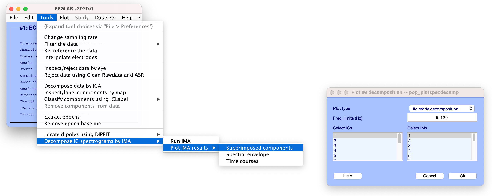 
In the resulting window (above right) we can specify: 

1. The type of plot (from the drop down menu)   
    - IM mode decomposition   
    - Superimposed IC modes  
    - Superimposed IM modes    
2. The frequency range to plot (must be within the frequencies for which IMA was computed)
3. The ICs and IMs to plot

**IM mode decomposition**   
Plots spectral templates separately for all IMs and ICs.   
On the command line enter: *pop_plotspecdecomp(EEG, 'plottype', 'comb')*  

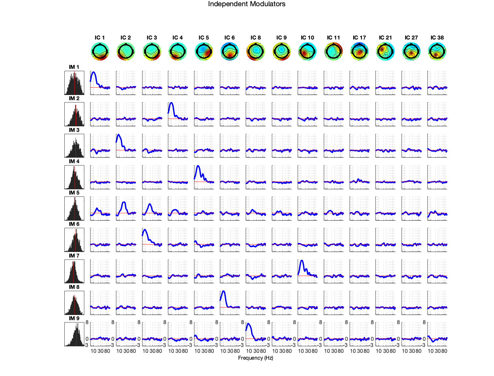 

**Superimposed IC modes**   
Plots superimposed IC spectral templates for each IM.  
On the command line enter: *pop_plotspecdecomp(EEG, 'plottype', 'ics', 'comps', [1:7], 'factors', [1:8])*  

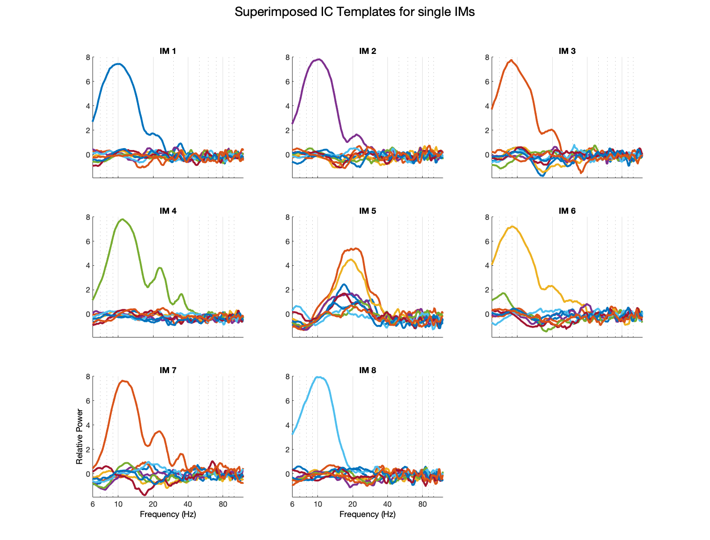 

**Superimposed IM modes**   
Plots superimposed spectral IM templates for each IC.  
On the command line enter: *pop_plotspecdecomp(EEG, 'plottype', 'ims', 'comps', [1:6 8], 'factors', [1:8])*

 

**2. Spectral envelope** (*pop\_plotspecenv*)

To visualize the contributions of IMs to the mean log spectrum of an IC, launch **Tools > Decompose spectograms by IMA > Plot IMA results > Spectral envelope**

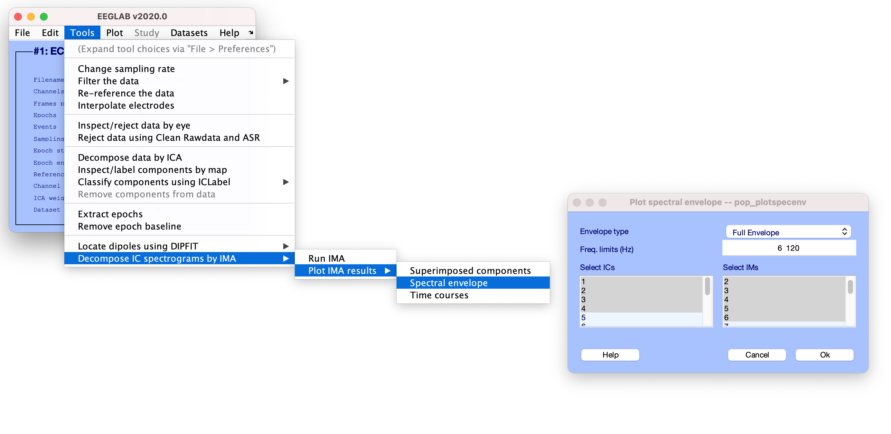
In the resulting window (above right) we can specify: 

1. The type of plot (from the drop down menu)   
    - Full envelope: plots the 1st and 99th percentiles of the IM spectral variation
    - Upper envelope: plots the 99th percentile of the IM spectral variation
    - Lower envelope: plots the 1st percentile of the IM spectral variation  
2. The frequency range to plot (must be within the frequencies for which IMA was computed)
3. Indices of the ICs and IMs to plot

On the command line enter:  
*pop\_plotspecenv(EEG,'comps', [1 2 5], 'factors', [1 2 3 6], 'frqlim', [6 120], 'plotenv', 'full');*

Here is an example of plotting IMs **Full envelope** of inflence on the IC power spectra. The IC mean log power spectrum is shown as a black trace. Outer light grey limits represent the 1st and 99th percentiles of IC spectral variation associated with the IM. Dark grey areas represent the 1st and 99th percentiles of the PCA-reduced spectral data used in the IMA analysis.

**3. Time courses** (*pop_plotIMtimecourse*)

To plot the activation of IMs over time, launch **Tools > Decompose spectograms by IMA > Plot IMA results > Time courses**

In the resulting window (above right) we can specify: 

1. The type of plot (from the drop down menu)   
    - IC spectogram   
    - Summed IM backprojection  
    - Combined IC-IM spectogram
    - IM timecourse    
2. The frequency range to plot (must be within the frequencies for which IMA was computed)
3. The ICs and IMs to plot

**IC spectogram**   
Plots the normalized (mean log spectrum removed) IC spectograms.  
On the command line enter: *pop_plotIMtimecourse(EEG, 'comps', [1 2 6], 'frqlim', [6 120], 'plotICtf', 'on')* 
 
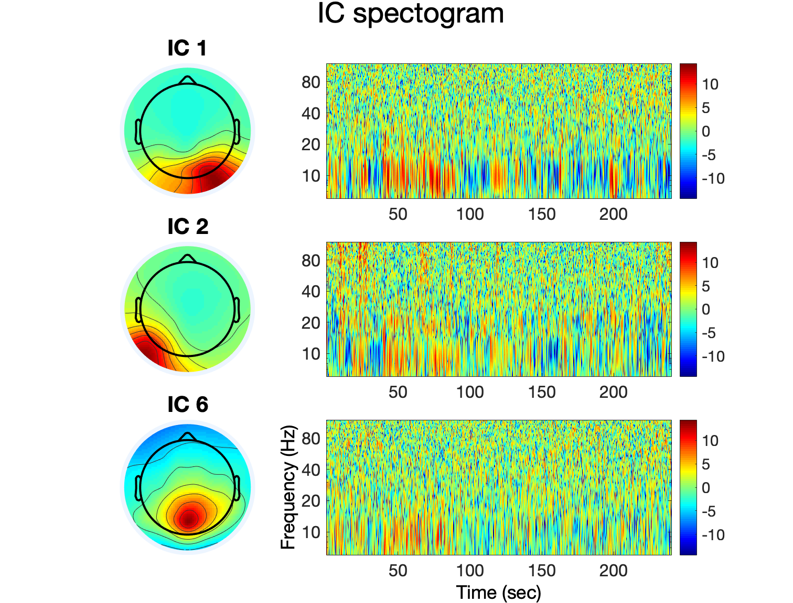

**Summed IM backprojection**  
Plots the PCA reduced normalized (mean log spectrum removed) IC spectograms on which IMA was computed.    
To visualize the combined effects of IMs on ICs 1, 2, and 6, on the command line enter: *pop_plotIMtimecourse(EEG, 'comps', [1 2 6], 'frqlim', [6 120], 'plotPCtf', 'on')*
 
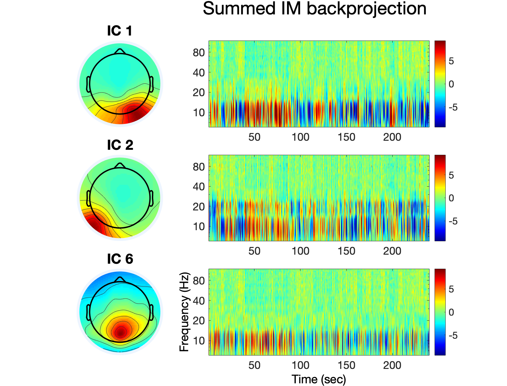

**Combined IC-IM spectogram**  
Plots the backprojections of single IM spectral weights across time for single ICs.    
To visualize the combined effect of IM 1 on ICs 1, 2, and 6, on the command line enter: *pop_plotIMtimecourse(EEG, 'comps', [1 2 6], 'frqlim', [6 120], 'factors', [1], 'plotIMtf', 'on')*

**IM timecourse**  
Plots the IM activations across time.  
To visualize the timecourse of IM 1, 2 and 3, on the command line enter: *pop_plotIMtimecourse(EEG, 'frqlim', [6 120], 'factors', [1 2 3], 'smoothing', 40, 'plotIMtime', 'on')*

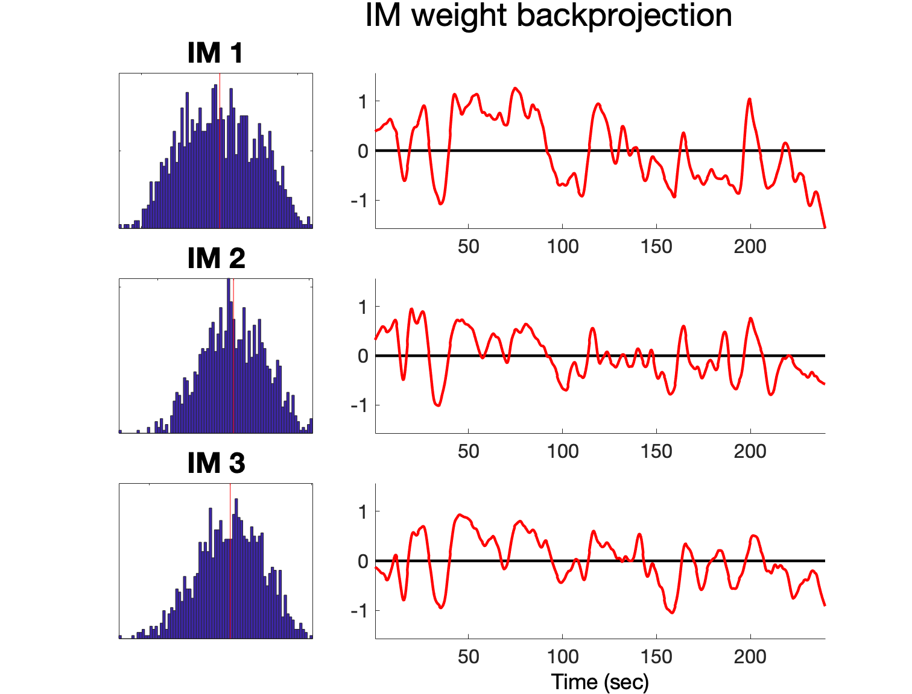

## Multiple conditions and group analysis 

## Running IMAT 

Before running IMAT on multiple conditions or for group analysis, you need to build a STUDY in EEGLAB. You can find information on how to create a STUDY in the [eeglab wiki] (https://sccn.ucsd.edu/wiki/Chapter_02:_STUDY_Creation). For multiple conditions, you will need to create a separate .set file for each condition. E.g., if you want to run IMA on EEG data recorded in two conditions (say, Eyes_open and Eyes_closed), you need to create one EEG file for *Eyes_open* and one EEG file for *Eyes_closed* before creating the STUDY. 

Before running IMAT, start EEGLAB and load the STUDY set.

To run IMAT on the loaded STUDY, launch the Run IMA (*pop\_runIMA_study*) window, either by typing *pop\_runIMA_study* on the MATLAB command line or by calling it from the EEGLAB menu by selecting **STUDY > STUDY IMA > Run STUDY IMA**  as highlighted in the figure below. This will run a separate IMA decomposition for each subject in the study. That is, a joint IMA is computed over all the conditions for each single subject in the STUDY.

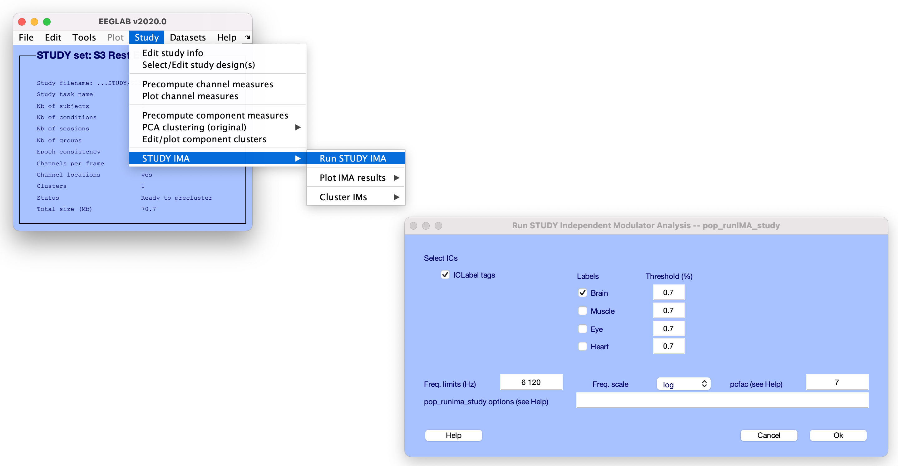 
In the resulting window (above right) we can specify:

1. We can choose to use ICLabel to automatically classify ICs into several categories (**ICLabel tags**). To select ICs in specified categories, IMAT allows you to set individual likelihood thresholds for the different categories. Otherwise IMAt will use the ICs specified for analysis when the STUDY was created.
2. Which frequency range to compute IMA on (**Freq. limits (Hz)**).
3. The frequency scaling (**Freq scale**), linear or log. 
4. A factor to regulate dimensionality reduction on the time windows of the spectral data using PCA before spectrogram ICA decomposition (**pcfac**) - the smaller the pcfac, the more dimensions will be retained *ndims = (freqsxICs)/pcfac* where *freqs* is the number of frequencies estimated and *ICs* is the number of ICs (default is 7)
5. Other IMA options (**pop\_runima_study options**) – e.g., which ICA algorithm to use (see *pop_runima_study* help for more details)

**Running IMA from the command line**

*[STUDY] = pop\_runIMA_study(STUDY, ALLEEG, 'freqscale', 'log','frqlim', [6 120],
                                          'pcfac', 7,
                                          'cycles', [6 0.5],
                                          'selectICs', {'brain'},
                                          'icatype', 'amica');*
                                          
Here we are computing IMA on the subject data contained in the STUDY set; a separate IMA decomposition is run on the data of each subject. We are selecting Brain ICs using ICLabel with parameters for the time-frequency decomposition: log frequency scaling, frequency limits: 6 to 120 Hz, wavelet cycles [6 0.5], reducing the dimensions of time windows of the tf decomposition using pfac 7, and using AMICA for the IMA decomposition

## The IMA structure in the STUDY environment
  
*pop\_runIMA_study* saves the IMA results in the IMA structure which is associated with the subject-specific EEG files and saved in the same folder as the EEG files it is run on. 
 
The filenames of the subject-specific IMA files are saved in:

*STUDY.etc.IMA*
   
     subjfilename: {{1×2 cell}}
     subjfilepath: {{1×2 cell}}
      imafilename: {'S3_S3_RestECEO.ima'}
      imafilepath: {'/Volumes/ExtremeSSD/IMAT_project/IM/PreSTUDY/S03'}
          subject: {'S3'}
         clustidx: [15×4 double]
         distance: [15×3 double]
     
 
The subject-specific IMA file can be loaded using   

*IMA = load([ STUDY.etc.IMA.imafilepath{subjectindex} filesep STUDY.etc.IMA.imafilename{subjectindex}], '-mat' );*
   

**IMA structure**

The IMA structure has the following fields:

              wts: [21×21 double]
              sph: [21×21 double]
          meanpwr: [14×229 double]
          freqvec: [1×229 double]
          timevec: [2430×1 double]
     timevec_cond: {[30×42 double]  [30×39 double]}
        freqscale: 'log'
          freqlim: [6 120]
             npcs: 21
         complist: [1 2 3 4 5 6 8 9 10 11 17 21 27 38]
            srate: 500
          ntrials: [42 39]
       ntw_trials: 30
          winsize: 0.5000
      epochlength: 6
           eigvec: [2430×21 double]
               pc: [21×3206 double]
         timefreq: [2430×3206 double]
      meanpwrCond: [2×14×229 double]
      timepntCond: {[1×1260 double]  [1×1170 double]}
        condition: {'EC'  'EO'}
        STUDYname: 'RestECEO.study'
    STUDYfilepath: '/Volumes/IM/PreSTUDY/S03'
             subj: {'S3'}
     subjfilename: {'RestEC_S03_ContAMICAdip.set'  'RestEO_S03_ContAMICAdip.set'}
     subjfilepath: {'/Volumes/IM/PreSTUDY/S03'  '/Volumes/IM/PreSTUDY/S03'}
         filename: 'S3_RestECEO.ima'
       precluster: [1×1 struct]

In this example the IMA file is associated with two EEG files (two conditions for the same subject) since a joint IMA is run over multiple conditions (saved in separate EEG.set files) for a single subject.

**Detailed description of IMA outputs:**

*IMA.wts - IMA decomposition wtx unmixing matrix*  
*IMA.sph - IMA decomposition sphere unmixing matrix*  
*IMA.meanpwr - single IC mean power spectra*  
*IMA.timevec - vector of times*  
*IMA.freqvec - vector of frequencies*  
*IMA.freqscale - frequency scaling of computed spectra ('log' or 'linear')*  
*IMA.freqlim - spectral frequency limits*  
*IMA.npcs - number of dimensions to which the data have been reduced before IMA decomposition*  
*IMA.complist - component indices on which IMA was run*  
*IMA.srate - original sampling rate of the EEG data used to compute the spectra*  
*IMA.ntrials - number of trials used to compute the time-frequency decomposition*  
*IMA.ntw_trials - number of time windows per trial*  
*IMA.winsize - window length used to compute spectra in the time-frequency decomposition*  
*IMA.epochlength - epoch length used to compute time-frequency decomposition in seconds*
*IMA.eigvec - pc backprojection in time*  
*IMA.pc - pc spectral backprojection*  
*IMA.timefreq - time-frequency decompositions (spectograms for each IC)*  
*IMA.timepntCond - total number of time points in the time-frequency
                  decomposition of each condition*  
*IMA.timevec_cond - vector of times for the full length (all conditions) time-frequency
                   decomposition for each condition*  
*IMA.meanpwrCond - mean power spectra for each IC and each condition*
*IMA.condition - names and order of conditions*  
*IMA.STUDYname - filename of the STUDY the IMA decomposition belongs to*  
*IMA.STUDYfilepath - filepath of the STUDY the IMA decomposition belongs to*  
*IMA.subj - subject the IMA decomposition has been comuted on*  
*IMA.subjfilename - filenames of the EEG data the IMA decomposition has been computed on*  
*IMA.subjfilepath - filepath of the EEG data the IMA has been computed on*  
*IMA.precluster - contains the collected spectral templates and the associated dipsources and scalpmaps collected during preclustering.*

## Visualizing IMAT results for single subjects in the STUDY and multiple conditions

There are three main plotting functions for visualizing IMAT results for single subjects in multiple STUDY conditions. These functions are very similar to the single-subject IMAT visualizations discussed above.

1. Superimposed components
2. Spectral envelope
3. Time courses

**1. Superimposed Components**  (*pop\_plotspecdecomp_study*)

To visualize the IM decomposition for single subjects in the study, launch **STUDY > STUDY IMA > Plot IMA results > Superimposed Components**

 
In the resulting window (above right) we can specify: 

1. The index of the subject whose IM decomposition you want to plot
2. The type of plot (from the drop down menu)   
    - IM mode decomposition   
    - Superimposed IC modes  
    - Superimposed IM modes    
3. The frequency range to plot (must be within the frequency range in which IMA was computed)
4. Indices of the ICs and IMs to plot

On the command line enter:   
*pop\_plotspecdecomp_study(STUDY, 'plottype', 'comb', 'subject', '3')*  
*pop\_plotspecdecomp_study(STUDY, 'plottype', 'ics', 'subject', '3')*  
*pop\_plotspecdecomp_study(STUDY, 'plottype', 'ims', 'subject', '3')*  

The type of plots are the same as for single subjects visualizations, please refer to the section above for more information. 

**2. Spectral envelope** (*pop\_plotspecenv_study*)

To visualize the contribution of IMs added to the mean log spectrum of an IC for a single subject launch **STUDY > STUDY IMA > Plot IMA results > Spectral envelope**

In the resulting window (above right) we can specify: 

1. The subject index
2. The type of plot (from the drop down menu)   
    - Full envelope: plots the 1st and 99th percentiles of IM spectral influence
    - Upper envelope: plots the 99th percentile of IM spectral influence
    - Lower envelope: plots the 1st percentile of IM spectral influence  
3. The frequency range to plot (must be within the frequency range in which IMA was computed)
4. Indices of the ICs and IMs to plot

The function plots separate spectral loadings for each condition. Here is an example plotting the **Full envelope** of IMs for two *Eyes_open* and *Eyes_closed* conditions separately. The IC mean log power spectrum is shown as a black trace. The outer light grey limits represent the 1st and 99th percentiles of variation in the IC log spectrum across time. Dark grey areas represent the 1st and 99th percentiles for the PCA-reduced IC spectral data that has been used in the IMA analysis.

On the command line enter:  
*pop\_plotspecenv_study(STUDY,'comps', [1 2 5], 'factors', [1 2 3 6], 'frqlim', [6 120],'plotcond', 'on', 'subject', '3');*

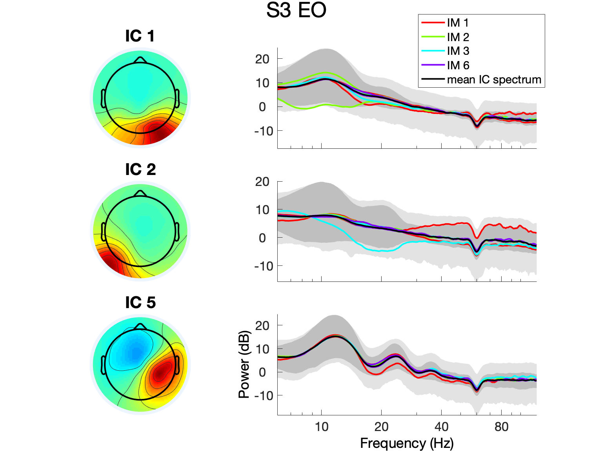

**3. Time courses** (*pop_plotIMtimecourse_study*)

To plot IM activations (strength across time) for a given subject, launch **STUDY > STUDY IMA > Plot IMA results > Time courses**

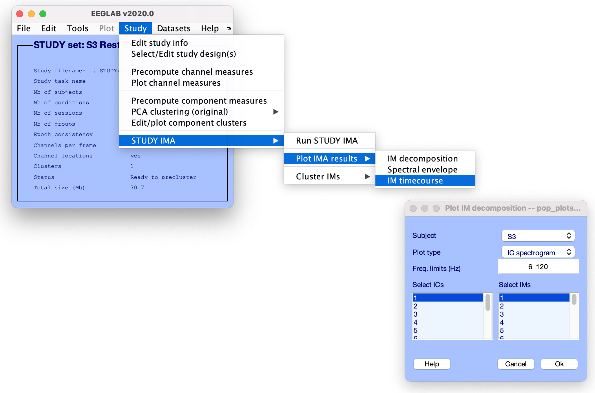
In the resulting window (above right) we can specify: 

1. The subject index
2. The type of plot (from the drop down menu)   
    - IC spectogram   
    - Summed IM backprojection  
    - Combined IC-IM spectogram
    - IM time course    
3. The frequency range to plot (must be within the frequency in which IMA was computed)
4. Indices of the ICs and IMs to plot

The function plots a black vertical line at the boundary between conditions

**IC spectogram**   
Plots the normalized (mean log spectrum removed) IC spectograms.    
On the command line enter:  *pop_plotIMtimecourse_study(STUDY, 'comps', [1 2 6], 'frqlim', [6 120], 'plotcond', 'on', 'plotICtf', 'on', 'subject', '3')*
 
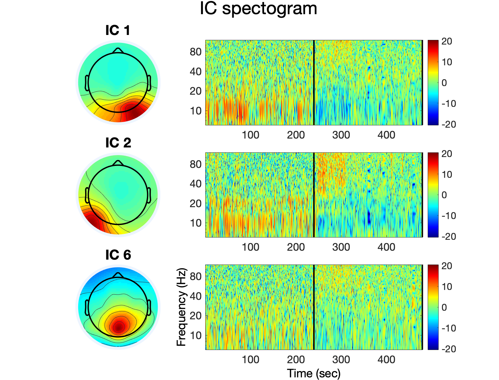

**Summed IM backprojection**  
Plots the PCA-reduced normalized (mean log spectrum removed) IC spectograms on which IMA was computed.    
On the command line enter:  *pop_plotIMtimecourse_study(STUDY, 'comps', [1 2 6], 'frqlim', [6 120], 'plotcond', 'on', 'plotPCtf', 'on', 'subject', '3')*
     

**Combined IC-IM spectogram** 
Plots the backprojection of single IM spectral weights across time for single ICs.
On the command line enter:  *pop_plotIMtimecourse_study(STUDY, 'comps', [1 2 6], 'factors', [1], 'frqlim', [6 120], 'plotcond', 'on', 
    'plotIMtf', 'on', 'subject', '3')*

**IM timecourse** 
Plots IM activations across time to visualize differences between conditions.  
On the command line enter:  *pop_plotIMtimecourse_study(STUDY, 'factors', [1 2 3], 'frqlim', [6 120], 'plotcond', 'on', 'smoothing', 40,
    'plotIMtime', 'on', 'subject', '3')*

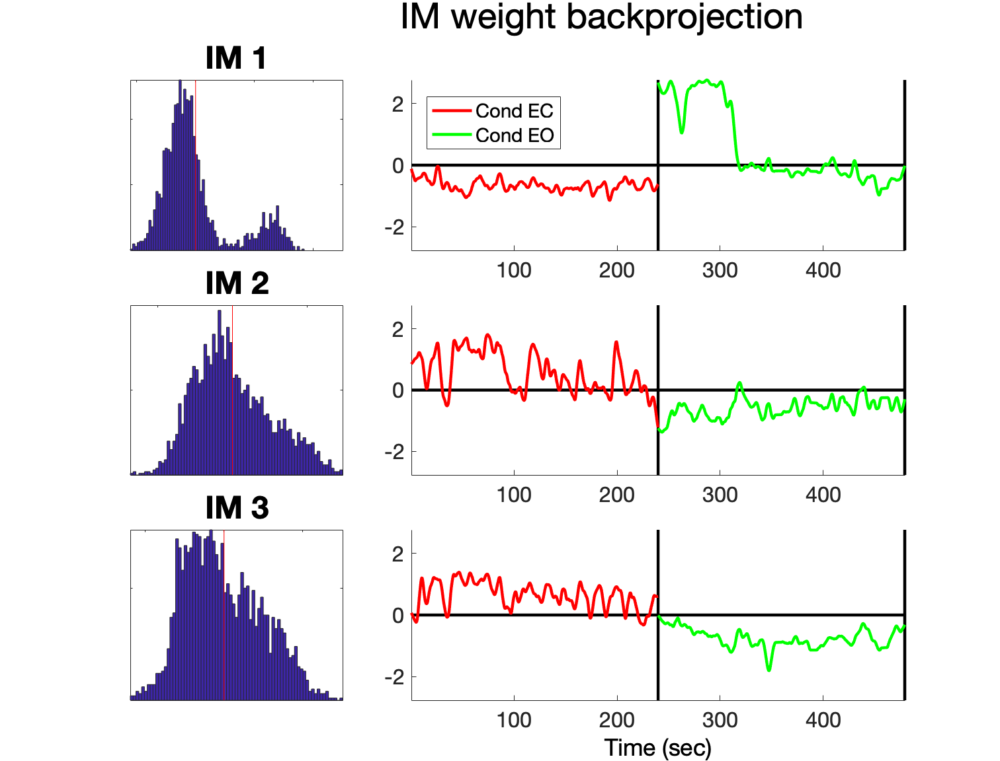

## Clustering IM spectral templates

There are three main steps in clustering IM spectral templates across subjects (or sessions)
1. Preclustering
2. Clustering
3. Plotting cluster results

**Preclustering**  

Before clustering we need to select the relevant spectral templates for clustering and ignore the spectral templates that are not active in the frequency range of interest. To select the spectral templates for clustering, launch **STUDY > STUDY IMA > Cluster IMs > Collect templates**

In the resulting window (above right) we can specify: 

1. **Freq range** The relevant frequency range: this includes only templates that have peaks in the specified frequency range. If empty templates (active in any frequency range) are chosen, templates with low activations are removed.
2. **Warp spectra** Whether or not the spectra should be warped to a given peak frequency: this linearly stretches or shrinks frequency templates peaking in the given frequency range (defined by 'Freq. range') to peak at the subject-specific median template peak frequency (within the band defined in 'Freq. range'). Use this function to stretch spectra to a predefined peak (as defined in 'Target peak freq'). Use with caution. Only recommended when a narrow enough frequency band is defined in 'Freq. range', e.g., 8-13 Hz alpha, or etc., though even here it may hide natural IM subclusters (low alpha vs. high alpha).         
3. **Target peak freq** The target peak frequency specifies the target frequency to stretch spectra to when the 'stretch_spectra' flag is 'on', if 'Target peak freq' is empty, uses the center frequency of the 'Freq. range'

On the command line enter: 
*pop\_collecttemplates(STUDY, 'peakrange', [8 12],
                                    'stretch_spectra', 'on',
                                    'targetpeakfreq', 10,
                                    'plot_templ', 'on');*  
                                    
Here we collect spectral templates for clustering that have a peak in the alpha frequency band [8 12] Hz, we are choosing to warp the spectra to a 'targetpeakfreq' at 10 Hz. We choose to plot the collected templates.

The collected spectral templates and the associated dipsources and scalpmaps are saved in the subject-specific IMA file in *IMA.precluster*. 

     templates: [15×229 double]
     IMICindex: [15×2 double]
    dipsources: [1×15 struct]
     scalpmaps: [15×67×67 double]
       
*IMA.precluster.IMICindex* contains the indices of the spectral templates collected for clustering. The first column are the IM indices, the second column the indices of ICs that have relevant spectral loadings on these IMs.  
       
       
**Cluster IM spectral templates** (*pop_clusterIMAtemplates*)

To cluster the IM spectral templates collected in the previous step, launch **STUDY > STUDY IMA > Cluster IMs > Cluster IMs**   

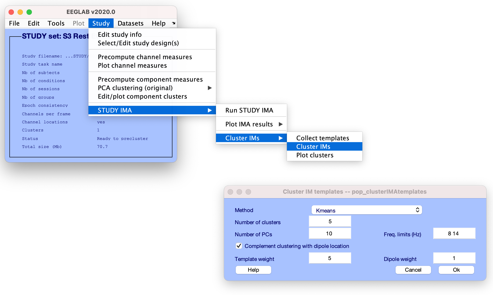  
In the resulting window (above right) we can specify: 

1. **Method** The clustering method; currently only k-means is implemented.
2. **Number of clusters** The number of clusters to compute          
3. **Number of PCs** The number of IM spectral template principal dimensions to retain for clustering
4. **Freq limits** The frequency limits to restrict clustering to (such as an alpha frequency range of [8 14] Hz). The default is the whole frequency range on which IMA was computed
5. **Complement clustering with dipole location** Use IC equivalent dipole location in addition to spectral template matching in clustering
6. **Template weight** The weight to assign to spectral templates for clustering when clustering on spectral templates and dipole locations. A number between 1 and 20, default is 1. A larger number will give more weight to spectral templates compared to dipole locations.
7. **Dipole weight**  The weight to assign to dipole locations for clustering when clustering on spectral templates and dipole locations. A number between 1 and 20, default is 1. A larger number will give more weight to dipole locations compared to spectral templates

On the command line enter: 
*[STUDY] = pop_clusterIMAtemplates(STUDY, ALLEEG, 'nclust', 5, 'pcs', 10, 'freqlim', [8 14],'dipole_locs', 'on', 'weightSP', 5, 'weightDP', 2);*

Here we are clustering the previously collected spectral templates into 5 clusters, retaining 10 IM spectral template principal dimensions for clustering. We are choosing to cluster on the frequency range 8-14 Hz. We also choose to implement clustering to include IC equivalent dipole location (meaning clustered IMs should be close both in frequency template and in brain location). Here we assign relative weighting 5 for spectral templates and  2 for dipole locations. 

The cluster indices and the distances (in the constructed clustering measure space) of the IM spectral templates from each cluster centroid are saved in *STUDY.etc.IMA*. 
   
     clustidx: [15×4 double]
     distance: [15×3 double]
     
*STUDY.etc.IMA.clustidx* has 4 columns: column 1 gives subject indices, column 2 IM indices, column 3 IC indices, and column 4 cluster indices - which cluster the IM spectral template was assigned to.
*STUDY.etc.IMA.distance* has as many columns as clusters. Each column contains the euclidean distances (in the constructed clustering space) of the spectral IM templates to the specific cluster centroid.

**Plotting cluster results**

To plot cluster results, launch **STUDY > STUDY IMA > Cluster IMs > Plot clusters**  

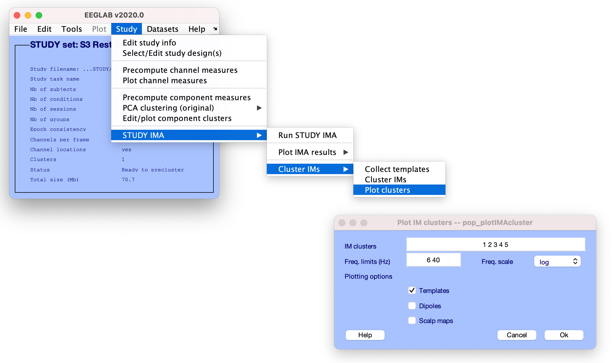  
In the resulting window (above right) we can specify: 

1. **IM clusters** Which clusters to plot
2. **Freq limits** Spectral template frequency range to plot (lo, hi)            
3. **Freq scale** The frequency scaling (linear or log) to use in plotting the spectral templates
4. **Templates** Spectral template clusters
5. **Dipoles** Flag plotting of dipole densities of spectral template clusters ('on', 'off')
6. **Scalp maps** Flag plotting of scalp maps of spectral template clusters ('on', 'off')

On the command line enter:   
*pop_plotIMAcluster(STUDY, 'clust', [1 2 3], 'freqlim', [6 40],'freqscale', 'log','plottemplates', 'on', 'plotscalpmaps', 'on', 'plotdipsources', 'on')*

**Templates**

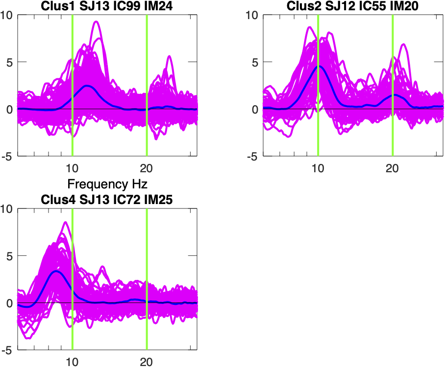  

**Dipoles**

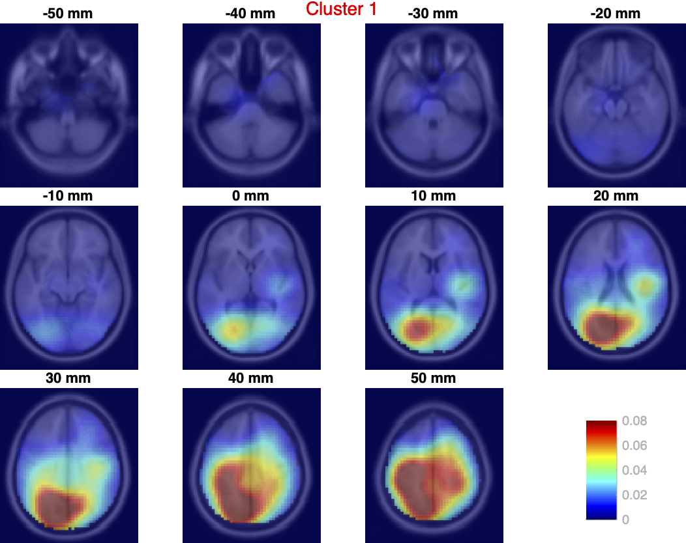

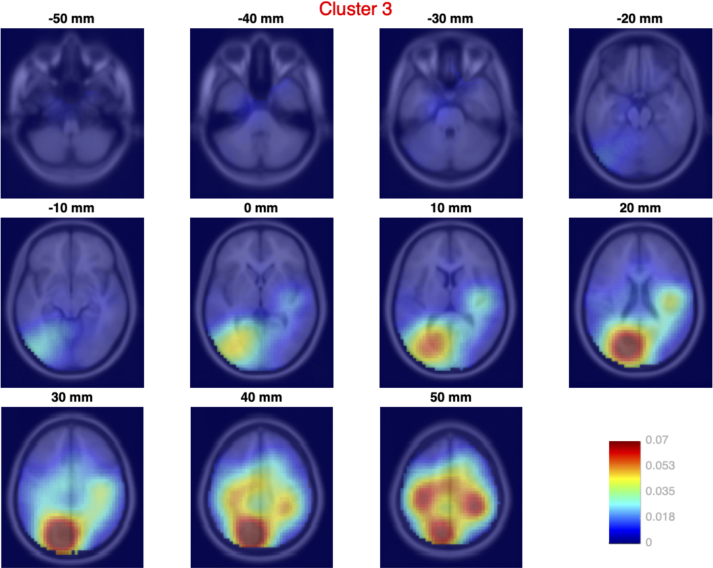

