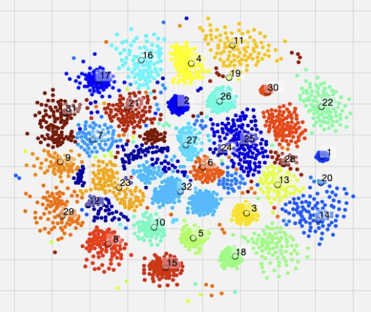
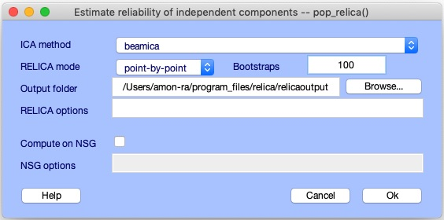
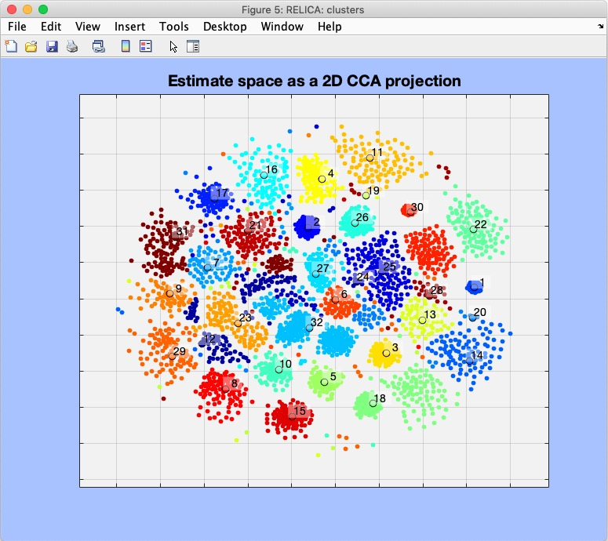
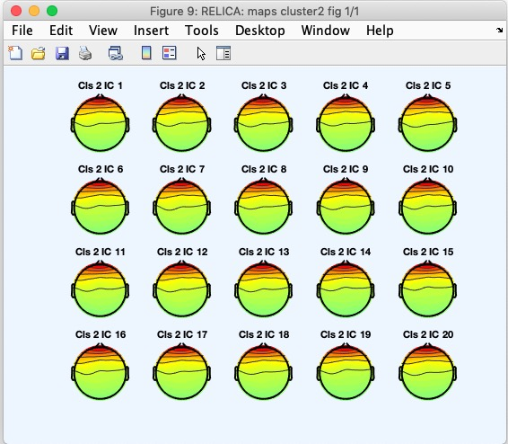

To view the plugin source code, please visit the plugin's [GitHub repository](https://github.com/sccn/relica).



# The RELICA EEGLAB plug-in

## What is RELICA?
Independent Component Analysis (ICA) is a widely applied data-driven method for parsing brain and non-brain EEG source signals, mixed by volume conduction to the scalp electrodes, into a set of maximally temporally and functionally independent component (IC) processes. Many ICs may be identified with a precise brain physiological (or non-brain) origin. However, this process is hindered by partial instability in ICA results that can arise from noisy, nonstationary, or insufficient data. Here we describe the use of an EEGLAB extension to perform RELICA (for ‘RELiable ICA’) decomposition, a novel method by Fiorenzo Artoni ([Artoni et al., 2014](https://www.sciencedirect.com/science/article/pii/S1053811914007526))for characterizing the statistical reliability within a data set of IC processes identified by its ICA decomposition. 

To enable RELICA decomposition of large datasets, we have now implemented an easy route, from the EEGLAB GUI or MATLAB command line, to optionally run the RELICA processing on the high-performance computing (HPC) resources of the U.S. XCEDE network via [The Neuroscience Gateway](https://www.nsgportal.org). See [Delorme et al., 2019](https://sccn.ucsd.edu/~scott/pdf/Delorme_Open_EEGLAB_Portal_NER18.pdf) for more details.

The goal of RELICA is to identify IC processes that are most stably separated from the decomposition data across many random bootstrap selections of its data frames or epochs. Results of RUNICA can be used to judge confidence in conclusions drawn about individual ICs or about the stability of between-subject IC clusters.

RELICA first computes a reference decomposition the data using an ICA algorithm of choice (the most powerful is AMICA). It then performs multiple decompositions of bootstrap surrogate versions of the input data (as many data frames or epochs as are in the training data, selected at random from the data with substitution). To speed the computation, the user may choose a faster (though somewhat less effective) ICA algorithm to use for these decompositions.

Next, for each IC in each decomposition, RELICA computes the dipolarity of the IC scalp map, a measure of physiological plausibility ([Delorme et al., 2012](https://journals.plos.org/plosone/article?id=10.1371/journal.pone.0030135)). It then clusters the separated ICs from the surrogate decompositions based on correlations between their time courses. The number of clusters is the number of computed ICs (typically the number of input channels). When a bootstrap dataset contributes two or more ICs to one cluster, that bootstrap decomposition is removed from the computation as it likely failed to converge. Each cluster can then be identified with an exemplar IC, selected as the IC nearest to the cluster centroid in the clustering measure space. A measure, QLc, of the compactness of the bootstrap IC clusters provides a within-subject measure of IC reliability for each IC. RELICA can also return informative visualizations of its results. 

## Installing the RELICA plug-in in EEGLAB
All plug-ins in EEGLAB, including RELICA, can be installed in two ways. To install RELICA:

1. **From the EEGLAB Plug-in Manager:** Launch EEGLAB and select menu item **File > Manage EEGLAB Extensions** in the main EEGLAB window. A plug-in manager window will pop up. Look for and select the RELICA plug-in, then press **Install/Update**.

2. **From the web:** Download the RELICA plug-in zip file either from [this](https://github.com/sccn/relica) GitHub page (select ‘Download Zip‘) or from [this EEGLAB wiki plug-ins page](https://sccn.ucsd.edu/wiki/Plugin_list_all) (select **RELICA**). Decompress the zip file in the plug-ins folder in the main eeglab folder (*../eeglab/plugins/*).

Restart EEGLAB. If the installation is successful, a menu item to call RELICA, **Tools > Run RELICA**, will appear in the EEGLAB menu.

## Running RELICA
Before running RELICA, start EEGLAB and load an EEG dataset. Here we will use the sample EEGLAB dataset,  *.../eeglab/sample\_data/eeglab\_data\_epochs\_ica.set*.

### Running RELICA locally on your computer
To run RELICA on the loaded dataset, first launch the main RELICA (*pop\_relica*) window, either by typing *relica* on the MATLAB command line or by calling it from the EEGLAB menu by selecting **Tools > RELICA > Run RELICA**,  as highlighted in the figure below.


From the resulting RELICA main window (above right) we can specify:

1. The ICA decomposition algorithm to use (**ICA Method**) – the default is EEGLAB 'runica' which implements extended Infomax ICA; other, quicker (though somewhat less effective) decomposition approaches are also supported.
2. How RELICA performs the bootstrapping (**RELICA mode**) – frame-by-frame or trial-by-trial 
3. The number of bootstrap versions to decompose (**Bootstraps**) – the default is 50
4. The pathname of the folder in which to save the RELICA results (**Output folder**)
5. Other RELICA options (**RELICA options**) – e.g., ICA options for the selected method (see *pop_relica* help for more details)

The other interface elements will be introduced in the next section.

### Running RELICA on high-performance computing resources using The Neuroscience Gateway (NSGportal.org)
To run the RELICA computation on an XSEDE network supercomputer via the Open EEGLAB Portal to the Neuroscience Gateway (NSGportal.org), **you must first obtain a free NSG user credential** and have the EEGLAB plug-in [nsgportal](https://github.com/sccn/nsgportal/) installed in your computer. For how to do this, [see this page](https://github.com/sccn/nsgportal/wiki).

Then, from the RELICA main window shown above:

1. Select the RELICA window checkbox (**Compute on NSG**) – note: this is not the RELICA default.
2. Specify any optional NSG parameters (‘NSG options‘) – see *pop\_nsg* help. 

The RELICA window **Help** button will display the RELICA (*pop\_relica.m)* function help message, which lists all available options.

### Example 1: Running RELICA locally. 
In the test case example (shown below), we select  ICA method BEAMICA (implementing non-extended Infomax, but quite fast) and set the number of bootstrap decompositions to 100. We set the RELICA results folder to be the data folder (*../eeglab/sample_data/*) and leave the other selections to use their default values.



### Example 2: Running RELICA via NSG. 
The lengthiest step in RELICA is performing the reference and then the repeated bootstrap ICA decompositions. If the dataset is large (and/or the number of bootstraps specified is large), this process may be lengthy. We have included *nsgportal* code in RELICA to allow users to submit a RELICA computation for processing at XSEDE HPC resources via NSG. This processing is managed from the same *pop\_relica* window shown above. Using the HPC resources of the XSEDE network, this section of the process is parallelized, likely producing a many fold speed up compared to sequential processing.

To perform RELICA computation in NSG **you must have an NSG account** and have the EEGLAB plug-in *nsgportal* already installed in your computer. See the [*nsgportal* wiki](https://github.com/sccn/nsgportal/wiki) for more details. Once the *nsgportal* plug-in is installed on your computer, and the NSG credentials and settings are set, you can easily perform the RELICA bootstrap decompositions via NSG by checking the *pop\_relica* window checkbox **Compute on NSG**. Additional NSG parameters, including requested maximum run time (<=48 hours) and custom *jobID* name, can be set in the edit window **NSG options**. For more options, see the *pop\_relica* help message (using **Help**). To run RELICA with the selected settings, press  **OK**. 
If no custom *jobID* is provided as an NSG option, *pop\_relica* will assign a jobID consisting on the prefix '*relicansg\_*' followed by six random digits (such as: *relicansg\_123456*). You may also assign a custom jobname if you wish. The jobID will be shown in the MATLAB command window when the NSG job is issued. To track the status of the job, see the *pop\_nsg* window; locate your job there using the jobID assigned to your RELICA job.

## Retrieving RELICA results
There are three ways to access the RELICA output:

1.***Following local computation:*** In the same EEGLAB session in which RELICA was run, RELICA results will be stored in the EEG structure subfield *EEG.etc.RELICA*.
2. *Loading the RELICA results:* To load RELICA results file information into the EEG structure of the currently loaded dataset, select EEGLAB menu item **Tools > RELICA > Load RELICA from disk** and then select the *RELICA.mat* file corresponding to the loaded dataset.
3. ***Following NSG-assisted computation:*** If the **Compute on NSG** option was selected in the RELICA window and the resulting NSG job its complete (learn how to check its status [here](https://github.com/sccn/nsgportal/wiki/nsgportal-graphical-user-interface:-pop_nsg)), use the *jobID* of your RELICA job to retrieve its results. For example, if the selected (custom) RELICA *jobID* were *relicatest_data* you may execute the following code from the MATLAB command window.  
```>> EEG = pop_relica('relicatest_data');```
After performing any of these steps, the RELICA results of your job will be stored in the EEG data structure subfield *EEG.etc.RELICA*.

## Visualizing RELICA results
Once the RELICA run is complete and its results retrieved, we can visualize the results by selecting the EEGLAB submenu item ‘**Tools > Run RELICA > Plot Results**‘. Selecting this menu will launch the *pop\_relica\_plots* window (shown in the figure below, right). Here specify the type of plot in the *pop\_relica\_plots* window. Three RELICA plot types are available:


#### Plot type 1: Bootstrap IC clusters.
This will generate a plot showing the relative compactness of, and relationships between clusters of similar ICs returned by the bootstrap decompositions, with inter-IC distances visualized in 2-D using Curvilinear Component Analysis ([Himberg et al., 2004](https://www.sciencedirect.com/science/article/pii/S1053811904001661)). Select the **Plot type** option **Bootstrap IC clusters** from the *pop\_relica\_results* window (above right) and press **Plot**. A figure similar to that below will be displayed. This figure shows the 2-D CCA projection of IC distances in clustering space, in particular highlighting the differences in quality (compactness, stability, reproducibility) of the IC clusters.



In the figure above, the colored dots are individual bootstrap ICs. Here dot color represents the cluster they belong to. Cluster centroids are represented by dots of the same color, but have a black border, the cluster number indicated next to it. Note the difference in cluster compactness (i.e., IC reproducibility across bootstrap decompositions) of Cluster 2 (center) versus Cluster 14 (right). 

#### Plot type 2: Cluster exemplar maps
Select the option **Cluster exemplar maps** from the **Plot type** menu in the *pop\_relica_results* window, then press **Plot**. A figure like the one below will be displayed.


Above, the title of each plot panel shows the cluster number and the component stability index from [Himberg et al. 2004](https://www.sciencedirect.com/science/article/pii/S1053811904001661) (heuristic measure of the quality of the estimates, ideally 100%) for each IC cluster.

#### Plot type 3: Cluster scalp maps
To plot the scalp maps of the ICs in a single IC cluster, select option **Cluster scalp maps** and then specify the cluster number to plot (**Cluster to plot**), using the cluster numbers shown in the **Bootstrap IC clusters** or **Cluster exemplar maps** plots (cluster 2 above). Specify the maximum number of IC scalp maps from the cluster to plot (**Max number of maps**). Pressing **Plot** displays the figure below.

 

Above, each figure panel shows the scalp map for a member of the selected IC cluster (Cluster 2), beginning with the first bootstrap. When the number of cluster ICs (and bootstraps) is large, only the requested number are shown (default: one page of 20 maps).

## Running and visualizing RELICA from the MATLAB command line
Running RELICA, either locally or using NSG, and retrieving and visualizing the results can also be performed from the MATLAB command line or by a MATLAB script. For syntax of these calls, refer to the help messages for the functions *pop\_relica.m*  and *pop\_relica_results.m*.

## References

1) Artoni, F., Menicucci, D., Delorme, A., Makeig, S., & Micera, S. (2014). *RELICA: a method for estimating the reliability of independent components*. NeuroImage, 103, 391-400.          

2) Artoni, F., Delorme A., Makeig S. (2018) *Applying dimension reduction to EEG data by Principal Component Analysis reduces the quality of its subsequent Independent Component decomposition*, Neuroimage 175 176-187

3) Delorme, A., Palmer, J., Onton, J., Oostenveld, R. and Makeig, S., 2012. *Independent EEG sources are dipolar.* PloS One, 7(2), p.e30135.

4) Delorme, A., Majumdar, A., Sivagnanam, S., Martinez-Cancino, R., Yoshimoto, K. and Makeig, S., 2019, March. *The Open EEGLAB portal*. In: 2019 9th International IEEE/EMBS Conference on Neural Engineering (NER) (pp. 1142-1145). IEEE.

## Acknowledgments

Author:  Dr. Fiorenzo Artoni, 2019

This project was in part supported by the European Union's Horizon 2020 research and innovation programme under Marie Sklodowska-Curie Action agreement no. 750947 (BIREHAB)

Acknowledgments to Ramon Martinez-Cancino (SCCN/INC/UCSD 2019) for parallelizing the RELICA code and implementing its extension for computation on NSG HPC resources, for including other ICA algorithms, reworking all the GUIs, and generating the online documentation with Scott Makeig.

Acknowledgments also to Prof. Arnaud Delorme and Prof. Scott Makeig (SCCN/INC/UCSD 2019) for input and ideas to perfect the project.

EEGLAB [https://sccn.ucsd.edu/eeglab/] and many of its plug-in packages were created and are maintained at the Swartz Center for Computational Neuroscience, UCSD [https://sccn.ucsd.edu] directed by Scott Makeig. Arnaud Delorme is the chief EEGLAB software architect.

Clustering and relative visualization within RELICA makes use of  modified  routines from J. Himberg's open source FastICA - ICASSO package

Beamica is part of C. Kothe's  open source BCILAB toolbox 

