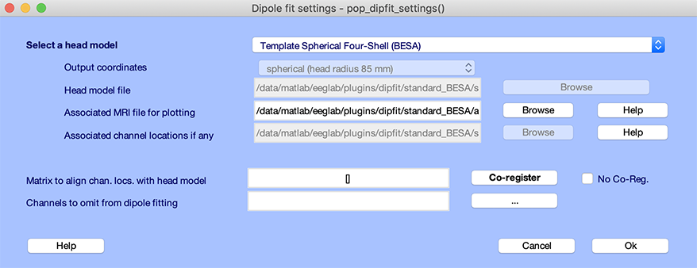
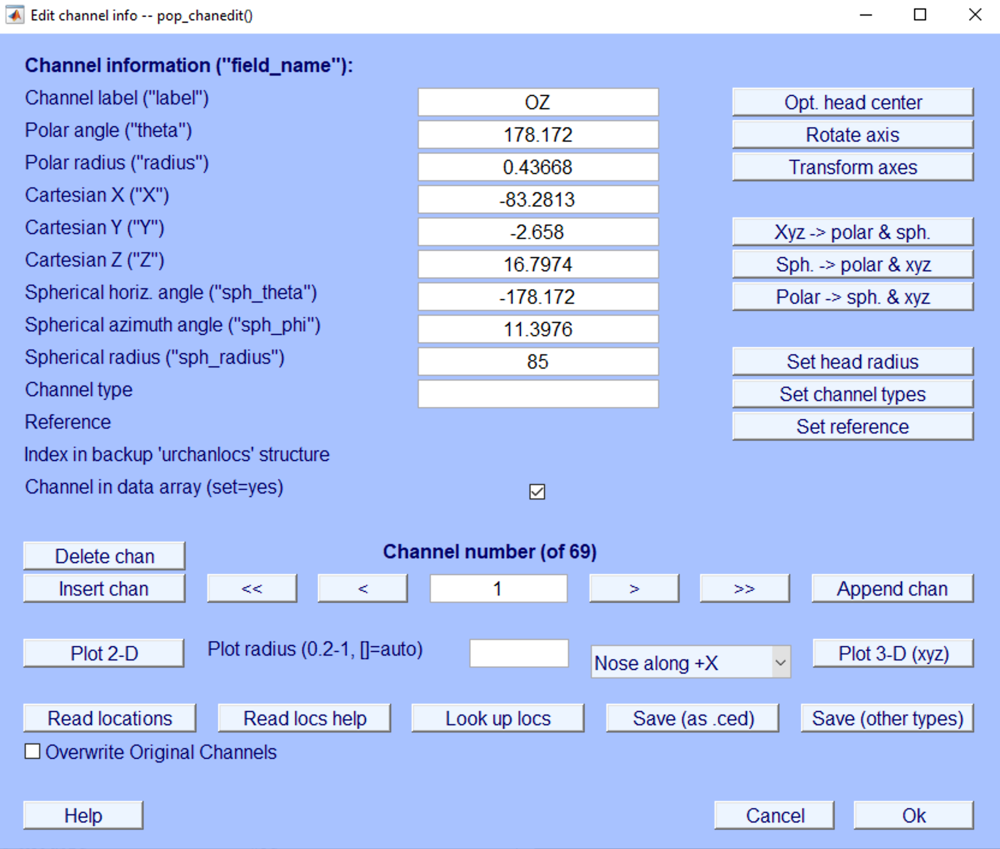
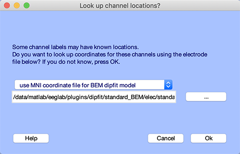
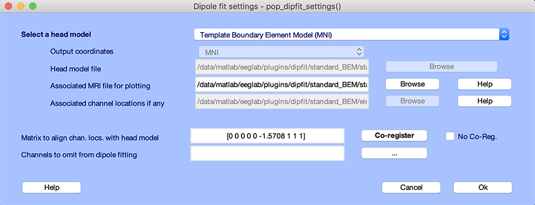
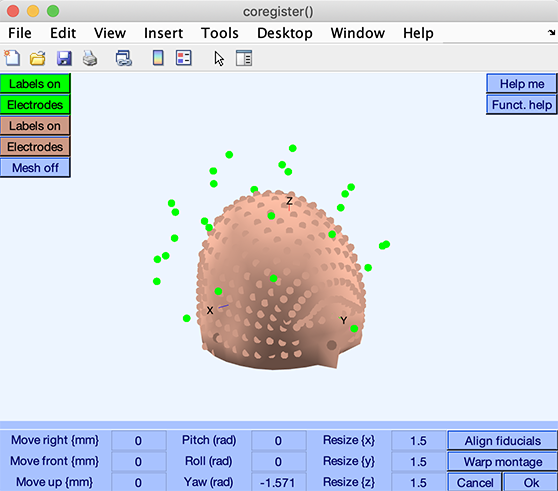
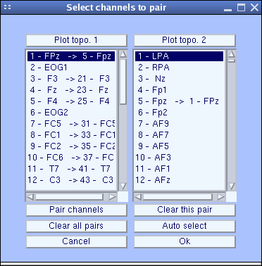
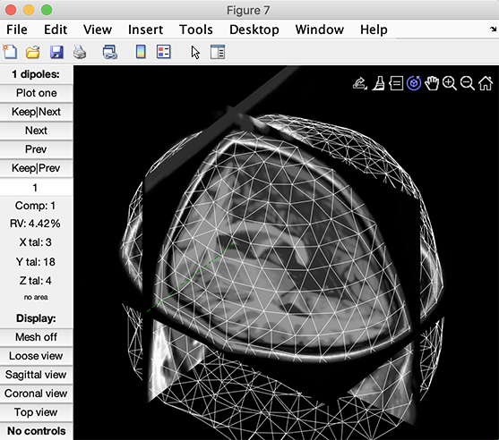

  

    Table of contents
  

  {: .text-delta }
- TOC
{:toc}

# Back to the basics

To perform source localization, one needs

1. A **head model** describing how electrical or magnetic fields propagate through the head
     * It may be a simple model made of spheres having different conductances
     * It may be a more complex model made of geometrical 3-D mesh describing the cortex surface, skull, skin, as well as change in conductance at the interface of these surfaces.
     * It may be a volumetric model (Finite Element Model, FEM) describing how the current flows in each voxel. FEM models are, in theory, more precise, although they take longer to compute.
2. A **source model** describing the position of the source generating these fields
     * It may be a single dipole. 
     * It may be dipoles distributed in a 3-D grid (i.e., volumetric source model for distributed source localization such as in [eLoreta](https://doi.org/10.1098/rsta.2011.0081)).
     * It may be dipoles distributed on a surface. For example, we may force dipoles to be on the cortical surface.
3. The EEG or MEG **sensor positions** and a way to align them with both the head model and source model

Once we have all three, we need an algorithm to find the activity of the sources. Unfortunately, there is often an infinite number of solutions that can generate the observed activity at the surface of the scalp, so we need to impose constraints on the sources. The constraints may be:

* Force to model the scalp activity with a single dipole. In this way, there is usually a unique optimal solution.
* Force sources to be smooth, so the activity of the neighboring sources are correlated. This is the eLoreta solution.
* Force the activity of neighboring sources to be uncorrelated using linearly constrained minimum variance (LCMV) also known as [Beamforming](https://doi.org/10.1109/10.623056).
* Any other constraint on the activity of our sources...

The figure below illustrates the process described above. After aligning electrodes, head model and source model, we provide the information along with EEG data to the source reconstruction algorithm (single dipole, eLoreta, Beamforming, etc...). Based on the electrode positions, head model and source model, often, a transformation matrix is computed. This matrix indicates how a given source (described in the source model) influence the activity of individual EEG channels. Its size is *source x EEG channels*, and it is called the **Leadfield matrix**. Once we have this matrix, we can ignore the electrode position, head model and source model. The same Leadfield matrix may be used for single dipole, eLoreta, and Beamforming source reconstruction.

# Selecting a head model

The first step for source localization is choosing a head model, which defines different regions of conductivities. In this section we demonstrate the steps to choose a head model in EEGLAB and to align the head model with the electrode locations. Other steps are described in subsequent sections of the tutorial.
<!-- Second, choosing a source model: The source model is the type of source you will use. This may be a single dipole, which position you optimize. This could also be  -->
<!-- a distributed model, with one dipole per brain voxel, such as when using Loreta. The source model is independent of the head model. Third, you will perform inverse source localization and plot the source results. -->

## Setting up DIPFIT head model

In this section, we use the tutorial dataset after [extracting data epochs](/tutorials/07_Extract_epochs/Extracting_Data_Epochs.html). Select menu item File and press sub-menu item
Load existing dataset. Select the tutorial file "eeglab_data_epochs_ica.set" located in the "sample_data" folder of EEGLAB. Then press *Open*.

DIPFIT is a single (or couple) dipole fitting algorithm to attribute the signals at the channel level to one (or two) single source in the brain. EEGLAB historically has implemented DIPFIT as its main source localization algorithm, but support for beamforming and eLoreta are also available within EEGLAB. Here, we use DIPFIT GUI to select head model and align the electrode locations with the head model.

To access DIPFIT head model seetings, select the EEGLAB menu item  Tools → Source localization using DIPFIT → Head model and settings. This will pop up the window below:

The top edit box, *Model (click to select)*, specifies the type of head
model -- spherical model, template boundary element model (BEM), or custom model. 

The **template Spherical Four-Shell (BESA)** uses four spherical surfaces (skin, skull, CSF, cortex) to
model the head. The spherical head model is kept for backward compatibility purposes and should not be used for publication. The spherical model has been tested against versions of the BESA software and shown to return similar results as detailed [here](https://github.com/sccn/sccn.github.io/files/10201215/DIPFIT.vs.BESA.study.using.the.spherical.head.model.pdf).

The **template boundary element model** is composed of three 3-D surfaces (skin, skull, cortex) extracted from the MNI (Montreal Neurological Institute) canonical template brain is also used in Statistical Parametric Mapping (SPM). The BEM model is more realistic than the four concentric spheres model and will return more accurate results. The description of how the BEM model was generated is available [here](https://pubmed.ncbi.nlm.nih.gov/11222970/). Although it was first made available in DIPFIT, this standard BEM model is the same as the model in Fieldtrip when you type *ft_read_headmodel('standard_bem.mat');*. As authors of the original BEM head model [paper](https://pubmed.ncbi.nlm.nih.gov/11222970/) indicated: "This template consists of a high-quality anatomical MRI of a single representative subject, with a voxel size of 1 x 1 x 1 mm, created by the McConnell Brain Imaging Centre of the Montreal Neurological Institute. It was created by registering 27 T1-weighted scans of the same individual in stereotactic space, where they were subsampled, and intensity averaged. After the generation of this averaged MRI, an expert-guided semi-automatic segmentation was performed to identify the tissue type of each voxel. This segmentation of the averaged brain was used for the construction of a noiseless MRI of the brain using an MR simulator. This noiseless MRI is used in this paper for visualizing the results; the segmentation of the original MRI was used to create the realistically shaped volume conduction model of the head. The motivation for using this specific MRI was that it forms the template brain of the Statistical Parametric Mapping package (SPM, 1999)."

The **custom model and MRI files from Fieldtrip** allow users to take advantage of custom head models designed in Fieldtrip. The instructions to create a BEM head model from a subject MRI is described [here](https://www.fieldtriptoolbox.org/tutorial/headmodel_eeg_bem/). Once you have created a model, the electrode alignment may be performed in EEGLAB, so the second part of the Fieldtrip tutorial, regarding electrode alignment, may be skipped.

For this example, select *Boundary element model*. Clicking on the model name updates some fields below the dropdown menu:

* The entry *Head model file* contains the head model parameters (surface information, conductances, etc...). These are MATLAB files and may be edited. See the FieldTrip documentation for more information on the head model files. 
* The edit box *Matrix to align channel locations with head model* is automatically updated to align the current electrode coordinates with the current head model. We co-registered the MNI average brain MRI with landmark electrode positions. For the average MRI image, we used a publicly available average brain image (average of 152 T1-weighted stereotactic volumes made available by the ICBM project) from the MNI database (Montreal Neurological Institute (MNI), Quebec). Co-registration of the MNI brain and the standard EEG landmarks was accomplished automatically using fiducials and the Cz (vertex) electrode position, then slightly adjusted manually. Using template channel locations is not ideal, and it is better to use the actual electrode locations compatible with the head model (see next section). The automatic update of the transformation matrix is not always performed, and sometimes you may need to align electrode coordinates and the head model manually, as explained in a later section.
* The entry *Associated MRI file for plotting* contains the name of the MRI image to use for plotting. You may enter a custom or individual subject MR image file, assuming this file has first been normalized to the MNI brain. The [SPM software](https://www.fil.ion.ucl.ac.uk/spm/) will take a raw subject MRI as input and normalize it to the MNI brain template.
* The entry *Associated channel locations if any* contains the name of the template channel location file associated with the head model. This information is critical, as your dataset channel location file may be different from the template. If so, a co-registration transform is required to align your channel locations using the template locations associated with the model.
* Edit box *Channel to omit channels from dipole fitting*. By pressing "*...*", a list of channels appears that allows users to exclude eye channels (or other, possibly non-head channels) from the dipole fitting procedure. For example, non-scalp channels should be removed prior to running dipole fitting. We advise excluding peri-ocular channel values from inverse source models because of poor conductance model geometry at the front of the head.

## Co-registration of head model and electrode locations

Next is the co-registration, which is aligning the electrode locations with the head model. Co-registration will be slightly different if you have the electrode locations for each individual, based on the previously "**digitized**" electrode locations. Here, we first explain the co-registration process for the "**template**" electrode locations.

<!-- ### The default headmodels

The first default head model for Fieldtrip is a spherical head model. This is the  -->

### Co-registration by choosing appropriate *template* channel locations

It is ideal if the channel locations are the same as the ones associated with the head model. In the dataset we are using here, the channel locations are in the spherical coordinate system, while we want to use a BEM head model. If all the electrode locations are within the International 10-20 System (which is the case here), you may use the standard channel coordinates associated with the head model. Close the current head model settings window and go to the channel editing window
(select menu item Edit → Channel location). The resulting channel editor window is shown below:

Press the *Look up locs* to look up your channel locations (by matching the channel labels) in the template channel location file. Select *Use MNI coordinate file for the BEM DIPFIT model*.

Press *Ok* on the window above and the channel editor window. Then go back to the head model settings using the  Tools → Source localization using DIPFIT → Head model and settings menu item. The window below will pop up. You can see that the matrix to align the electrode coordinate to the head model (edit box *Matrix to align chan. locs with head model*) mainly contains -pi/2 (-1.5708), which correspond to a 90-degree rotation in the axial plane (also known as the transverse or horizontal plane). This is because EEGLAB assumes that the nose direction is along a specific axis, while the head model uses a different convention. The Talairach transformation matrix, a vector comprised of nine fields *\[shiftx shifty shiftz pitch roll yaw scalex scaley scalez\]*, is organized as follows:

* The first 3 numbers *\[shiftx shifty shiftz\]* are the offset (in millimeters) along the x, y, and z axes. When equal to 0, no shift is applied.
* The next 3 numbers *\[pitch roll yaw\]* are rotations along different planes in radian. *Yaw* means rotation in the horizontal plane around the z axis. *Pitch* and *Roll* are rotations around the x and y axes, respectively. When equal to 0, no rotation is applied.
* The last 3 numbers *\[scalex scaley scalez\]* are scaling factors along the x, y, and z axes. When equal to 1, no scaling is applied.

In this case, the only alignment required is a 90-degree rotation between the electrode coordinates and the coordinate system of the head model. In case no co-registration/alignment is required, you may also select the *No coreg* checkbox.

*Important note:* If you change your channel locations, make sure to go back to DIPFIT settings to update the coordinate transformation settings.

### Manual co-registration of the *template* channel locations

If you are using channel locations and/or labels *not* in the International 10-20 System -- for example, a commercial high-density electrode cap file -- you will need to align or co-register your electrode locations with the selected head model. The co-registration interface does not automatically allow you to align your electrode locations to the head model. Instead, it allows you to automatically align your electrode locations to matching template electrode locations associated with the head model.

Again, use the  Tools → Source localization using DIPFIT → Head model and settings menu item. Click on *Co-register* in the DIPFIT settings window. A window appears. Change the *resize* values to 1.5 for all axes to see the electrodes (we are undoing the alignment for illustrative purposes).

Here, the electrode locations are plotted on the head model. Each small red or green sphere indicates an electrode location, with fiducial locations (conventionally, the nasion and pre-auriculars) drawn as slightly bigger and darker spheres.

Use the *Warp* button to align and scale your electrode locations (green) so that it becomes best aligned with the template electrode locations (brown) associated with the head model.

A channel correspondence window will pop up:

The channel labels from your dataset electrode structure are shown in the right column, while the left column shows channel labels from the template channel file associated with the head model. Arrows in both columns indicate electrodes with the same labels in the other column. If your channels' labels do not correspond to the International 10-20 System labels used in the template montage, press the *Pair channels* button and choose the nearest channel to each of your dataset channels in the template montage.

When you press *Ok*, the function will perform the optimal linear 3-D warp (translation, rotation, and scaling) to align your channel montage to the template montage associated with the head model. The result will be shown in the channel montage window (see below). You may press the *Labels on* button to toggle the display of your channels' label (green) or the template channels associated with the head model (red). You may also restrict the display to subsets of channels using the *Electrodes* buttons.

<u>Manual fine-tuning:</u> To finely tune the alignment manually, repeatedly edit the values in the edit boxes, which correspond to the *\[shiftx shifty shiftz pitch roll yaw scalex scaley scalez\]* transformation mentioned previously. The resulting co-registration window should look something like this:

If you want to retain your modifications, press *Ok* to update the DIPFIT settings window. This will display the resulting Talairach transformation matrix in the edit box *Matrix to align chan. locs with head model*. In this specific case, you may press the *Cancel* button in the co-registration interface since no further alignment was necessary (we performed co-registration for illustrative purposes on a dataset that did not require further alignment). Then press *Ok* in the DIPFIT settings window and proceed to localization in the next section of the tutorial.

<u>Note about fiducials:</u> Your channel structure may contain standard fiducial locations (nasion and pre-auricular points). If you import a channel file with fiducial locations into the channel editor, give them the standard *fiducial* channel type *FID*, and they will be stored in the channel information structure, *EEG.chaninfo*. This will also be done automatically if your fiducials have the standard names, *Nz* (nasion), *LPA* (left pre-auricular point), and *RPA* (right pre-auricular point ). There is also considerable confusion about fiducials, and we have created new fiducial labels in an attempt to
disambiguate exact fiducial locations (see this [slide](https://sccn.ucsd.edu/eeglab/download/Fiducials.pdf)). Note that fiducial locations are stored outside the standard channel location structure, *EEG.chanlocs*, for compatibility with other EEGLAB plotting functions.

Thereafter, fiducial locations will appear in the channel co-registration window (above) and may be used (in place of location-matched scalp channels) to align your electrode montage to the template locations associated with the head model. Use the *Align fiducials* button to do this.

### Co-registration of *digitized* electrode locations

Individualized electrode locations significantly improves source localization accuracy [by as much as 40%](https://doi.org/10.3389/fnins.2019.01159), when the accuracy is defined as quantifying the correct Brodmann Area of the cortical activity. Using custom electrode locations for each individual requires a 3D digitization methods. Traditionally, [Polhemus](https://polhemus.com/scanning-digitizing/digitizing-products/) and [Zebris](https://www.zebris.de/en/) systems have been used to provide the relative 3D locations of the electrodes with respect to the fiducials. With the abundance of access to the infra-red 3D scanners and, including smartphone face unlock cameras, 3D scans with millimeter accuracy can be obtained from the head. The scan takes ~5 minutes of the subject's time and the digitization can be done afterwards using available toolboxes such as EEGLAB's [get_chanlocs](https://github.com/sccn/get_chanlocs/wiki). Using smartphones for scanning is the most affordable method for electrode digitization and requires and additional $50 investment to purchase the software application and 3D print a contraption for easier scanning. We will provide a detailed tutorial for a smartphone-based 3D scanner soon via the [get_chanlocs](https://github.com/sccn/get_chanlocs/wiki) wiki page.

Electrode locations for each individual are often saved as `.sfp` files, which can be easily imported to EEGLAB using `pop_chanedit` function, or from the GUI by selecting Edit → Channel location and selecting the *Read locations* button. Afterwards, a similair approach to the [manual co-registration process](#manual-co-registration-of-the-template-channel-locations) above should be performed, but with **only** using the **Align fiducials** option. Note that warping the montage will remove any subjectivity within the digitized electrode locations and forces the locations to match to the template electrode locations.

## Head model and custom MRI

When plotting dipole sources in the next [section of the tutorial](/tutorials/09_source/DIPFIT.html), you may plot the head model head surface and the MRI. 

In this case, we are using the tutorial data and the standard BEM model described in the previous sections. The BEM head model mesh was extracted from the average MRI used for plotting, so the alignment is perfect. When using participants' MRI and transformed them to MNI space (for example, using SPM), this allows checking the alignment between the MRI and the head model. 

It is also possible to compute extract 3-D meshes from your participants' MRI and use them to create head models as described in this [Fieldtrip tutorial](http://www.fieldtriptoolbox.org/workshop/baci2017/forwardproblem/). If you have a custom head model, use the dropdown menu *Custom model files from other template or individual subject* in the head model settings. A custom head model for MEG is also possible and described in the next section of the tutorial.
